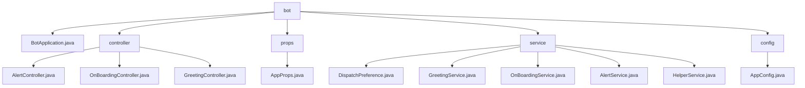

# 基础信息

|      |      |
|------|------|
| 名称 | xyz |
| 编码语言 | .java |
| 代码路径 | staffjoy/bot-svc/src/main/java/xyz |
| 包名 | staffjoy.docs.bot-svc.src.main.java.xyz |
| 概述说明 | Spring Boot机器人服务模块，含告警、入职、短信三个控制器，统一路径/v1，支持参数校验和标准化响应。 |

# 说明

## 概述  
该代码模块是`bot-svc`（机器人服务）项目的核心部分，基于Spring Boot框架构建的RESTful服务。模块主要功能包括告警管理、工人入职流程处理和短信问候服务，通过统一的`/v1`基础路径提供API接口。服务采用分层架构设计，包含控制器层、服务层和客户端集成层，支持参数校验、异步操作、日志记录和错误上报（如Sentry）。模块通过Feign客户端集成邮件、短信、公司和账户服务，并配置了专用的异步任务执行器。

## 主要业务场景  

1. **告警管理**  
   - 处理班次相关的五种操作（新增、批量新增、移除、批量移除、变更），通过`AlertController`接收POST请求并返回标准化响应。  
   - 依赖`AlertService`按用户偏好（短信/邮件）发送班次提醒通知，集成`CompanyClient`获取上下文信息。  

2. **工人入职流程**  
   - `OnBoardingController`处理入职请求，调用`OnBoardingService`发送包含公司名称和日历链接的通知。  
   - 通过`HelperService`统一处理账户/公司信息查询，支持异步发送入职通知。  

3. **短信问候服务**  
   - `GreetingController`接收用户ID，由`GreetingService`按偏好发送定制化问候（短信或邮件）。  
   - 无有效偏好时记录日志，通过`AccountClient`获取用户信息。  

4. **通信基础设施**  
   - 配置异步线程池（核心线程3，最大线程5）处理高并发请求，使用`ContextCopyingDecorator`保持上下文。  
   - 通过`AppProps`动态控制邮件偏好强制设置，集成`SmsClient`和`MailClient`实现消息派送。  

5. **辅助功能**  
   - `HelperService`提供通用工具方法：动态问候语生成、统一错误处理、异步任务封装等。  
   - 使用`DispatchPreference`枚举标准化通信渠道选择逻辑。

### 包内部结构视图

该流程图展示了bot模块的层级结构，根节点为bot目录，包含BotApplication.java主程序文件以及controller、props、service、config四个子目录。controller目录下包含三个控制器类文件，props目录包含应用属性配置文件，service目录包含五个服务类文件，config目录包含应用配置类文件。整体结构清晰，符合典型Spring Boot应用的项目布局。

# 文件列表 File List

| 名称   | 类型  | 说明 |
|-------|------|-------------|
| [staffjoy](staffjoy/_module.md) | package | Spring Boot机器人服务模块，含告警、入职、短信三个控制器，统一路径/v1，支持参数校验和标准化响应。 |

