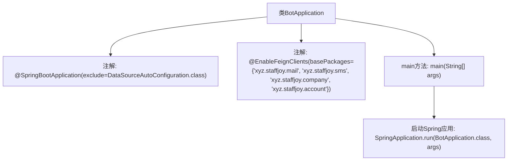

# 基础信息

|      |      |
|------|------|
| 名称 | BotApplication |
| 编码语言 | .java |
| 代码路径 | staffjoy/bot-svc/src/main/java/xyz/staffjoy/bot/BotApplication.java |
| 包名 | xyz.staffjoy.bot |
| 依赖项 | ['org.springframework.boot.SpringApplication', 'org.springframework.boot.autoconfigure.SpringBootApplication', 'org.springframework.boot.autoconfigure.jdbc.DataSourceAutoConfiguration', 'org.springframework.cloud.openfeign.EnableFeignClients'] |
| 概述说明 | SpringBoot应用排除数据源配置，启用Feign客户端。 |

# 说明

该代码片段定义了一个名为BotApplication的Spring Boot主类，使用@SpringBootApplication注解并排除了数据源自动配置。通过@EnableFeignClients注解启用了对四个指定基础包（mail、sms、company、account）的Feign客户端支持。主类包含标准的main方法，用于启动Spring应用。

# 类列表 Class Summary

| 名称   | 类型  | 说明 |
|-------|------|-------------|
| BotApplication | class | SpringBoot应用排除数据源配置，启用Feign客户端，启动Bot应用。 |


## 类 BotApplication

|      |      |
|------|------|
| 访问范围 | @SpringBootApplication(exclude={DataSourceAutoConfiguration.class});@EnableFeignClients(basePackages = {"xyz.staffjoy.mail", "xyz.staffjoy.sms", "xyz.staffjoy.company", "xyz.staffjoy.account"});public |
| 类型 | class |
| 名称 | BotApplication |
| 说明 | SpringBoot应用排除数据源配置，启用Feign客户端，启动Bot应用。 |


### UML类图

```mermaid
classDiagram
    class BotApplication {
        <<SpringBootApplication>>
        <<EnableFeignClients>>
        +main(String[] args) void
    }
    // BotApplication 使用 @SpringBootApplication 注解，排除了 DataSourceAutoConfiguration 自动配置
    // BotApplication 使用 @EnableFeignClients 注解，启用了对指定包下 Feign 客户端的支持
    // 该类是 Spring Boot 应用的启动入口，通过 main 方法启动应用
```

这段类图展示了一个基于Spring Boot的微服务应用启动类BotApplication。该类被@SpringBootApplication注解标记，排除了数据源自动配置，同时通过@EnableFeignClients启用了对多个服务包(xyz.staffjoy.mail/sms/company/account)中Feign客户端的支持。作为应用入口，其main方法通过SpringApplication.run()启动整个Spring Boot应用。该设计体现了微服务架构中服务间通过Feign客户端进行通信的典型模式。


### 内部方法调用关系图



该流程图展示了Spring Boot应用的启动类`BotApplication`的结构。顶部是主类声明，带有两个关键注解：`@SpringBootApplication`排除了数据源自动配置，`@EnableFeignClients`启用了对四个指定包路径的Feign客户端支持。程序入口是`main`方法，通过调用`SpringApplication.run()`启动整个Spring Boot应用。该设计表明这是一个微服务架构中的集成服务，可能负责协调邮件、短信、公司和账户等模块的通信。

### 字段列表 Field List

| 名称  | 类型  | 说明 |
|-------|-------|------|

### 方法列表 Method List

| 名称  | 类型  | 说明 |
|-------|-------|------|
| main | void | Java启动Spring应用的main方法。 |


