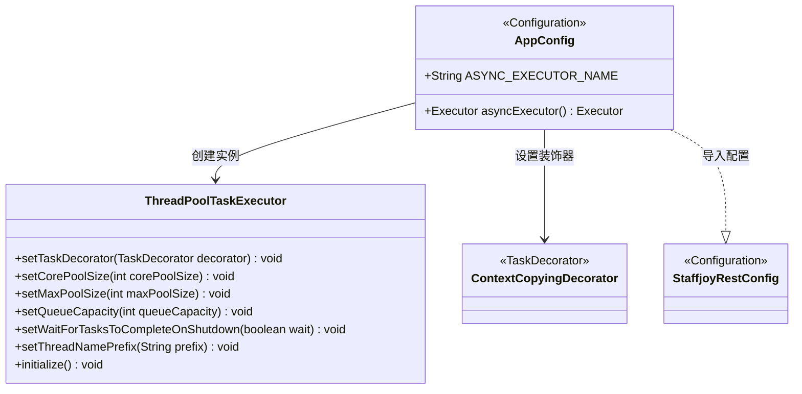
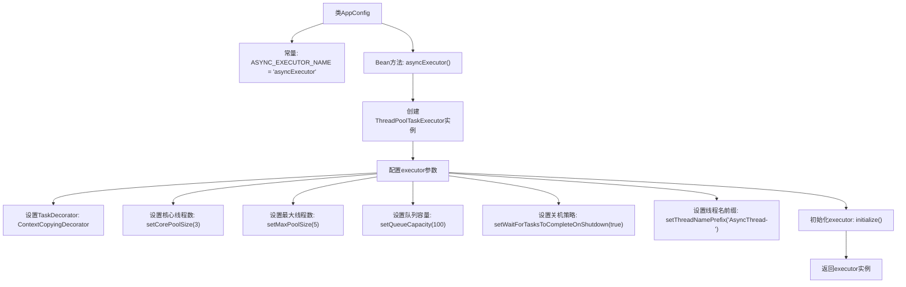

# 基础信息

|      |      |
|------|------|
| 名称 | AppConfig |
| 编码语言 | .java |
| 代码路径 | staffjoy/bot-svc/src/main/java/xyz/staffjoy/bot/config/AppConfig.java |
| 包名 | xyz.staffjoy.bot.config |
| 依赖项 | ['org.springframework.context.annotation.Bean', 'org.springframework.context.annotation.Configuration', 'org.springframework.context.annotation.Import', 'org.springframework.scheduling.annotation.EnableAsync', 'org.springframework.scheduling.concurrent.ThreadPoolTaskExecutor', 'xyz.staffjoy.common.async.ContextCopyingDecorator', 'xyz.staffjoy.common.config.StaffjoyRestConfig', 'java.util.concurrent.Executor'] |
| 概述说明 | Java配置类，启用异步并定义线程池执行器，核心3线程，最大5线程，队列100任务。 |

# 说明

这是一个名为AppConfig的Java配置类，用于配置异步任务执行器。该类使用了@Configuration和@EnableAsync注解，表明它是一个配置类并启用了异步功能。同时导入了StaffjoyRestConfig类。类中定义了一个名为asyncExecutor的线程池任务执行器，设置了核心线程数为3，最大线程数为5，队列容量为100，并配置了线程关闭时等待任务完成的属性。执行器还使用了ContextCopyingDecorator进行任务装饰，并为线程设置了名称前缀AsyncThread-。该执行器通过ASYNC_EXECUTOR_NAME常量进行标识。

# 类列表 Class Summary

| 名称   | 类型  | 说明 |
|-------|------|-------------|
| AppConfig | class | Java配置类，启用异步并定义线程池执行器，核心3最大5线程，队列100任务。 |

## 类 AppConfig

|      |      |
|------|------|
| 访问范围 | @Configuration;@EnableAsync;@Import(value = {StaffjoyRestConfig.class});@SuppressWarnings(value = "Duplicates");public |
| 类型 | class |
| 名称 | AppConfig |
| 说明 | Java配置类，启用异步并定义线程池执行器，核心3最大5线程，队列100任务。 |

### UML类图

这段代码展示了一个Spring配置类AppConfig，它通过@EnableAsync启用异步处理，并导入StaffjoyRestConfig配置。核心是创建名为asyncExecutor的线程池实例，使用ThreadPoolTaskExecutor配置核心/最大线程数、队列容量等参数，并通过ContextCopyingDecorator装饰器实现线程上下文传递。类图清晰地呈现了配置类与线程池组件的关系，以及通过注解实现的配置继承结构。

### 内部方法调用关系图

这段代码是Spring框架的配置类，主要功能是创建并配置一个异步任务执行器ThreadPoolTaskExecutor。流程图展示了从类定义到最终返回executor实例的完整过程，包括设置线程池核心参数（线程数、队列容量）、任务装饰器、关机策略等关键配置步骤。该配置类通过@EnableAsync启用异步支持，并通过@Bean注解将执行器注册到Spring容器，供其他组件调用异步方法时使用。

### 字段列表 Field List

| 名称  | 类型  | 说明 |
|-------|-------|------|
| ASYNC_EXECUTOR_NAME = "asyncExecutor" | String | 异步执行器名称定义为asyncExecutor。 |

### 方法列表 Method List

| 名称  | 类型  | 说明 |
|-------|-------|------|
| asyncExecutor | Executor | 创建异步线程池，核心3线程，最大5线程，队列100任务，关闭等待完成，线程名前缀AsyncThread-。 |

