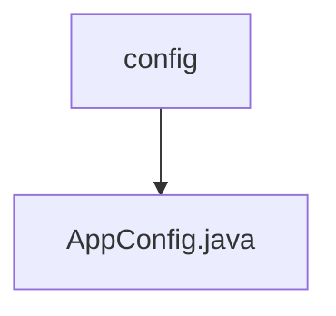

# 基础信息

|      |      |
|------|------|
| 名称 | config |
| 编码语言 | .java |
| 代码路径 | staffjoy/bot-svc/src/main/java/xyz/staffjoy/bot/config |
| 包名 | staffjoy.docs.bot-svc.src.main.java.xyz.staffjoy.bot.config |
| 概述说明 | Java配置类，启用异步并定义线程池执行器，核心3线程，最大5线程，队列100任务。 |

# 说明

这是一个名为AppConfig的Java配置类，用于配置异步任务执行器。该类使用了@Configuration和@EnableAsync注解，表明它是一个配置类并启用了异步功能。同时导入了StaffjoyRestConfig类。类中定义了一个名为asyncExecutor的线程池任务执行器，设置了核心线程数为3，最大线程数为5，队列容量为100，并配置了线程关闭时等待任务完成的属性。执行器还使用了ContextCopyingDecorator进行任务装饰，并为线程设置了名称前缀AsyncThread-。该执行器通过ASYNC_EXECUTOR_NAME常量进行标识。

### 包内部结构视图

该流程图展示了bot-svc项目中config目录与AppConfig.java文件之间的层级关系。config作为父目录节点，AppConfig.java作为其子节点，表示这是一个典型的Java项目配置文件结构，其中AppConfig.java位于config目录下用于存放应用配置相关代码。

# 文件列表 File List

| 名称   | 类型  | 说明 |
|-------|------|-------------|
| [AppConfig.java](AppConfig.md) | file | Java配置类，启用异步并定义线程池执行器，核心3线程，最大5线程，队列100任务。 |

