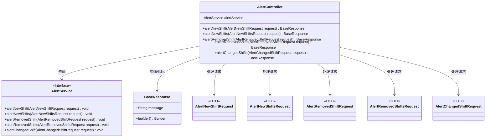
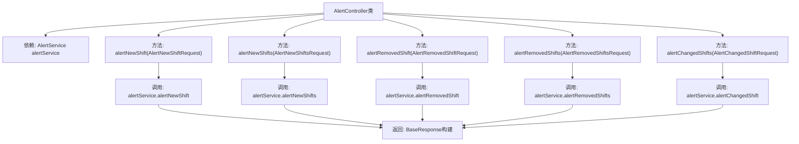

# 基础信息

|      |      |
|------|------|
| 名称 | AlertController |
| 编码语言 | .java |
| 代码路径 | staffjoy/bot-svc/src/main/java/xyz/staffjoy/bot/controller/AlertController.java |
| 包名 | xyz.staffjoy.bot.controller |
| 依赖项 | ['org.springframework.beans.factory.annotation.Autowired', 'org.springframework.validation.annotation.Validated', 'org.springframework.web.bind.annotation.PostMapping', 'org.springframework.web.bind.annotation.RequestBody', 'org.springframework.web.bind.annotation.RequestMapping', 'org.springframework.web.bind.annotation.RestController', 'xyz.staffjoy.bot.dto', 'xyz.staffjoy.bot.service.AlertService', 'xyz.staffjoy.common.api.BaseResponse'] |
| 概述说明 | AlertController处理班次变更通知，包含新增、删除和修改班次的API。 |

# 说明

AlertController是一个基于Spring框架的REST控制器，映射到/v1路径，并启用了参数校验功能。它通过AlertService处理五种不同的告警请求：新增单个班次、新增多个班次、移除单个班次、移除多个班次以及变更班次信息。每个请求方法都接收对应的校验请求体，调用服务层处理逻辑，并返回包含操作结果消息的基础响应对象。所有接口均采用POST请求方式，路径分别为alert_new_shift、alert_new_shifts、alert_removed_shift、alert_removed_shifts和alert_changed_shifts。

# 类列表 Class Summary

| 名称   | 类型  | 说明 |
|-------|------|-------------|
| AlertController | class | AlertController提供五个API，处理班次的新增、删除和变更通知。 |

## 类 AlertController

|      |      |
|------|------|
| 访问范围 | @RestController;@RequestMapping(value = "/v1");@Validated;public |
| 类型 | class |
| 名称 | AlertController |
| 说明 | AlertController提供五个API，处理班次的新增、删除和变更通知。 |

### UML类图

这段类图描述了一个Spring Boot的REST控制器AlertController，它通过AlertService接口处理五种不同类型的班次变更通知请求。控制器接收包含不同请求参数的DTO对象（如AlertNewShiftRequest），调用相应的服务方法，最后返回统一的BaseResponse响应。AlertService作为接口定义了五种业务方法，实现了业务逻辑的解耦。整个设计遵循了RESTful风格和分层架构原则，通过依赖注入和参数校验确保系统的健壮性。

### 内部方法调用关系图

该流程图展示了Spring Boot控制器AlertController的核心结构，包含5个POST端点方法，均遵循"接收请求→调用服务→返回响应"的模式。每个方法都依赖AlertService执行具体业务逻辑，最终通过Builder模式构造包含操作结果的BaseResponse响应对象。控制器类通过@Autowired自动注入AlertService实例，所有方法都使用@Validated注解实现请求体参数的自动验证。

### 字段列表 Field List

| 名称  | 类型  | 说明 |
|-------|-------|------|
| alertService | AlertService | 自动注入AlertService实例。 |

### 方法列表 Method List

| 名称  | 类型  | 说明 |
|-------|-------|------|
| alertRemovedShift | BaseResponse | 后端接口：处理移除班次提醒请求，调用服务并返回成功响应。 |
| alertRemovedShifts | BaseResponse | 后端接口：处理删除班次提醒请求，返回成功消息。 |
| alertNewShifts | BaseResponse | 后端接口：接收请求并调用服务处理新班次提醒，返回成功消息。 |
| alertNewShift | BaseResponse | 接口alertNewShift接收请求并调用服务处理，返回成功消息。 |
| alertChangedShifts | BaseResponse | 接口处理班次变更提醒，接收请求并调用服务，返回成功响应。 |

