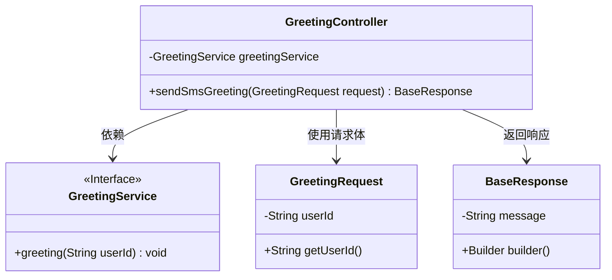
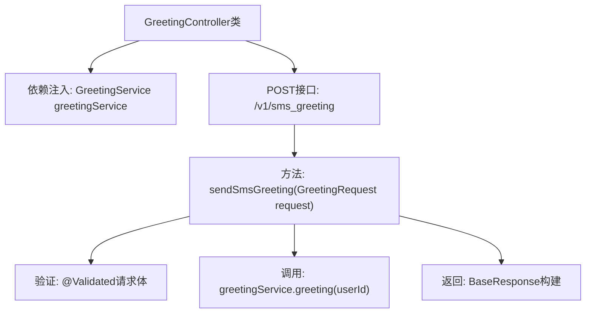

# 基础信息

|      |      |
|------|------|
| 名称 | GreetingController |
| 编码语言 | .java |
| 代码路径 | staffjoy/bot-svc/src/main/java/xyz/staffjoy/bot/controller/GreetingController.java |
| 包名 | xyz.staffjoy.bot.controller |
| 依赖项 | ['org.springframework.beans.factory.annotation.Autowired', 'org.springframework.validation.annotation.Validated', 'org.springframework.web.bind.annotation.PostMapping', 'org.springframework.web.bind.annotation.RequestBody', 'org.springframework.web.bind.annotation.RequestMapping', 'org.springframework.web.bind.annotation.RestController', 'xyz.staffjoy.bot.dto.GreetingRequest', 'xyz.staffjoy.bot.service.GreetingService', 'xyz.staffjoy.common.api.BaseResponse'] |
| 概述说明 | Spring控制器，处理短信问候请求，调用服务并返回响应。 |

# 说明

这是一个名为GreetingController的Spring Boot控制器类，使用@RestController注解标记为RESTful服务端点。类级别注解@RequestMapping定义了基础路径为/v1，@Validated启用了参数校验功能。控制器通过@Autowired自动注入了一个GreetingService服务实例。其中定义了一个POST方法sendSmsGreeting，路径为/sms_greeting，接收经过校验的GreetingRequest请求体，调用greetingService的greeting方法处理用户ID后，返回包含成功消息的基础响应对象。

# 类列表 Class Summary

| 名称   | 类型  | 说明 |
|-------|------|-------------|
| GreetingController | class | Spring控制器类，提供短信问候接口，调用服务处理请求并返回响应。 |

## 类 GreetingController

|      |      |
|------|------|
| 访问范围 | @RestController;@RequestMapping(value = "/v1");@Validated;public |
| 类型 | class |
| 名称 | GreetingController |
| 说明 | Spring控制器类，提供短信问候接口，调用服务处理请求并返回响应。 |

### UML类图

这段代码展示了一个Spring Boot控制器GreetingController，它通过REST API接收短信问候请求。控制器依赖GreetingService接口处理业务逻辑，使用GreetingRequest作为请求体参数，并返回BaseResponse作为统一响应格式。类图清晰地呈现了控制器与服务的依赖关系、请求/响应数据结构，体现了典型的分层架构设计模式。

### 内部方法调用关系图

这段代码是一个Spring Boot的REST控制器，主要处理短信问候的发送请求。流程图展示了从控制器类开始，通过依赖注入GreetingService，定义POST接口接收验证过的请求体，调用服务层方法处理用户ID，最后返回构建好的响应对象。整个过程体现了Spring MVC的典型请求处理流程和分层设计模式。

### 字段列表 Field List

| 名称  | 类型  | 说明 |
|-------|-------|------|
| greetingService | GreetingService | 自动注入GreetingService实例。 |

### 方法列表 Method List

| 名称  | 类型  | 说明 |
|-------|-------|------|
| sendSmsGreeting | BaseResponse | 发送短信问候接口，接收请求并调用服务，返回成功响应。 |

