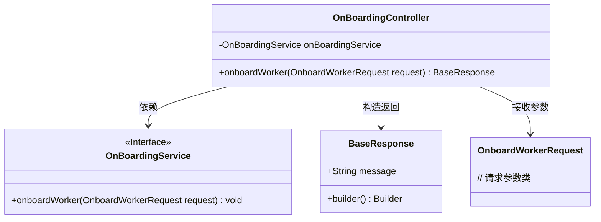
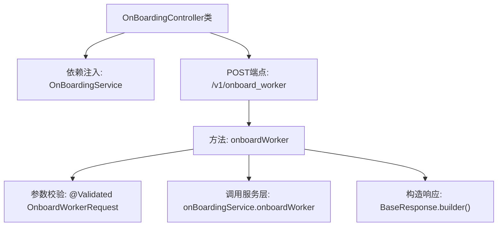

# 基础信息

|      |      |
|------|------|
| 名称 | OnBoardingController |
| 编码语言 | .java |
| 代码路径 | staffjoy/bot-svc/src/main/java/xyz/staffjoy/bot/controller/OnBoardingController.java |
| 包名 | xyz.staffjoy.bot.controller |
| 依赖项 | ['org.springframework.beans.factory.annotation.Autowired', 'org.springframework.validation.annotation.Validated', 'org.springframework.web.bind.annotation.PostMapping', 'org.springframework.web.bind.annotation.RequestBody', 'org.springframework.web.bind.annotation.RequestMapping', 'org.springframework.web.bind.annotation.RestController', 'xyz.staffjoy.bot.dto.OnboardWorkerRequest', 'xyz.staffjoy.bot.service.OnBoardingService', 'xyz.staffjoy.common.api.BaseResponse'] |
| 概述说明 | REST控制器，处理/v1/onboard_worker的POST请求，调用服务完成入职操作。 |

# 说明

这是一个名为OnBoardingController的Spring Boot控制器类，使用RestController注解标记为REST API端点。类级别配置了根路径/v1和参数校验功能。它通过Autowired自动注入OnBoardingService服务。包含一个POST方法onboard_worker，路径为/v1/onboard_worker，接收经过校验的OnboardWorkerRequest请求体，调用服务层方法处理请求后返回包含成功消息的BaseResponse响应对象。整个控制器专注于处理工人入职相关的API请求。

# 类列表 Class Summary

| 名称   | 类型  | 说明 |
|-------|------|-------------|
| OnBoardingController | class | Spring控制器，处理/v1/onboard_worker的POST请求，调用服务注册工人并返回响应。 |

## 类 OnBoardingController

|      |      |
|------|------|
| 访问范围 | @RestController;@RequestMapping(value = "/v1");@Validated;public |
| 类型 | class |
| 名称 | OnBoardingController |
| 说明 | Spring控制器，处理/v1/onboard_worker的POST请求，调用服务注册工人并返回响应。 |

### UML类图

这段代码展示了一个Spring Boot控制器类`OnBoardingController`，它通过REST接口`/v1/onboard_worker`处理工人入职请求。控制器依赖`OnBoardingService`接口实现业务逻辑，接收`OnboardWorkerRequest`参数对象并返回`BaseResponse`响应。类图清晰地呈现了控制器与服务的依赖关系、请求/响应数据流，以及各组件间的协作方式，体现了典型的MVC分层架构设计。

### 内部方法调用关系图

这段代码展示了一个Spring Boot控制器类，通过@RestController注解提供REST API端点。核心流程是：当POST请求/v1/onboard_worker时，会校验请求体参数，调用服务层处理入职逻辑，最后返回包含成功消息的基础响应对象。流程图清晰呈现了从请求入口到响应返回的完整调用链，突出了参数校验和服务层调用的关键步骤。

### 字段列表 Field List

| 名称  | 类型  | 说明 |
|-------|-------|------|
| onBoardingService | OnBoardingService | 自动注入OnBoardingService实例 |

### 方法列表 Method List

| 名称  | 类型  | 说明 |
|-------|-------|------|
| onboardWorker | BaseResponse | 接口onboard_worker处理工人入职请求，调用服务并返回成功信息。 |

