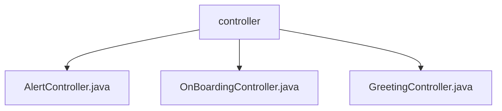

# 基础信息

|      |      |
|------|------|
| 名称 | controller |
| 编码语言 | .java |
| 代码路径 | staffjoy/bot-svc/src/main/java/xyz/staffjoy/bot/controller |
| 包名 | staffjoy.docs.bot-svc.src.main.java.xyz.staffjoy.bot.controller |
| 概述说明 | AlertController处理五种告警请求。OnBoardingController处理工人入职。GreetingController发送短信问候。 |

# 说明

## 概述
该代码模块是一个基于Spring Boot框架的RESTful服务模块，属于`bot-svc`（机器人服务）项目。模块包含三个主要控制器，分别处理不同类型的业务请求：告警管理、工人入职流程和短信问候服务。所有控制器都统一使用`/v1`作为基础路径，并启用了参数校验功能，通过调用各自的服务层完成业务逻辑处理，最终返回标准化的响应对象。

## 主要业务场景
1. **告警管理**（`AlertController`）
   - 处理班次相关的五种告警操作：
     - 新增单个班次（`alert_new_shift`）
     - 批量新增班次（`alert_new_shifts`）
     - 移除单个班次（`alert_removed_shift`）
     - 批量移除班次（`alert_removed_shifts`）
     - 变更班次信息（`alert_changed_shifts`）
   - 所有操作均通过POST请求触发，返回包含操作结果的基础响应

2. **工人入职流程**（`OnBoardingController`）
   - 专门处理工人入职相关的API请求
   - 提供`onboard_worker`端点（POST方法）
   - 接收工人入职请求数据，处理后返回成功响应

3. **短信问候服务**（`GreetingController`）
   - 提供短信问候功能
   - 通过`sendSmsGreeting`端点（POST方法）接收问候请求
   - 根据用户ID发送定制化问候短信
   - 返回包含操作结果的基础响应

### 包内部结构视图

该流程图展示了bot-svc项目中controller目录下的三个Java控制器文件：AlertController、OnBoardingController和GreetingController。这三个文件都直接隶属于controller目录，没有更深层次的嵌套结构。图表清晰地呈现了这些控制器文件在项目中的平级关系，每个节点仅显示文件名称而不包含完整路径信息。

# 文件列表 File List

| 名称   | 类型  | 说明 |
|-------|------|-------------|
| [AlertController.java](AlertController.md) | file | AlertController处理班次变更通知，包含新增、删除和修改班次的API。 |
| [GreetingController.java](GreetingController.md) | file | Spring控制器，处理短信问候请求，调用服务并返回响应。 |
| [OnBoardingController.java](OnBoardingController.md) | file | REST控制器，处理/v1/onboard_worker的POST请求，调用服务完成入职操作。 |

