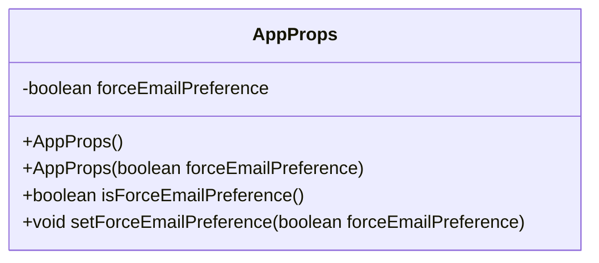
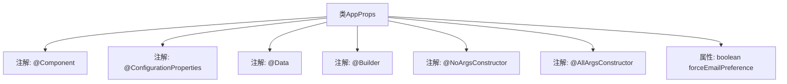

# 基础信息

|      |      |
|------|------|
| 名称 | AppProps |
| 编码语言 | .java |
| 代码路径 | staffjoy/bot-svc/src/main/java/xyz/staffjoy/bot/props/AppProps.java |
| 包名 | xyz.staffjoy.bot.props |
| 依赖项 | ['lombok.AllArgsConstructor', 'lombok.Builder', 'lombok.Data', 'lombok.NoArgsConstructor', 'org.springframework.boot.context.properties.ConfigurationProperties', 'org.springframework.stereotype.Component', 'javax.validation.constraints.NotNull'] |
| 概述说明 | Java配置类AppProps，使用@ConfigurationProperties绑定staffjoy前缀，含forceEmailPreference布尔属性。 |

# 说明

该内容描述了一个名为AppProps的Java类，使用了多个注解进行配置。类上标注了@Component和@ConfigurationProperties注解，后者指定了前缀为"staffjoy"。类还使用了Lombok库的@Data、@Builder、@NoArgsConstructor和@AllArgsConstructor注解，用于自动生成getter/setter方法、构建器模式和无参/全参构造函数。类中包含一个布尔类型的属性forceEmailPreference，用于控制邮件偏好设置。

# 类列表 Class Summary

| 名称   | 类型  | 说明 |
|-------|------|-------------|
| AppProps | class | Java配置类AppProps，含forceEmailPreference布尔属性，支持构建器模式。 |

## 类 AppProps

|      |      |
|------|------|
| 访问范围 | @Component;@ConfigurationProperties(prefix="staffjoy");@Data;@Builder;@NoArgsConstructor;@AllArgsConstructor;public |
| 类型 | class |
| 名称 | AppProps |
| 说明 | Java配置类AppProps，含forceEmailPreference布尔属性，支持构建器模式。 |

### UML类图

这段代码展示了一个Spring Boot配置属性类AppProps，使用Lombok注解简化了代码。该类包含一个布尔类型的forceEmailPreference属性，用于控制是否强制使用电子邮件偏好设置。通过@Data注解自动生成getter/setter方法，@Builder提供建造者模式，@NoArgsConstructor和@AllArgsConstructor分别生成无参和全参构造函数。该类被标记为@Component和@ConfigurationProperties，表明它是一个Spring组件且绑定staffjoy前缀的配置属性。

### 内部方法调用关系图

这段代码定义了一个名为AppProps的Spring配置类，通过注解实现了多种功能。@Component将其声明为Spring组件，@ConfigurationProperties用于绑定配置文件前缀为"staffjoy"的属性，@Data自动生成getter/setter等方法，@Builder提供建造者模式支持，@NoArgsConstructor和@AllArgsConstructor分别生成无参和全参构造函数。类中唯一的属性forceEmailPreference用于控制邮件偏好设置。该设计通过注解简化了配置类的开发，适合在Spring Boot项目中集中管理应用配置属性。

### 字段列表 Field List

| 名称  | 类型  | 说明 |
|-------|-------|------|
| forceEmailPreference | boolean | 强制邮箱偏好设置 |

### 方法列表 Method List

| 名称  | 类型  | 说明 |
|-------|-------|------|

