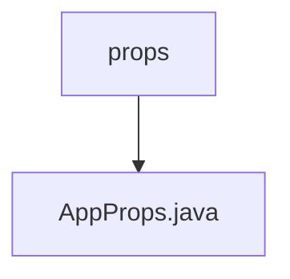

# 基础信息

|      |      |
|------|------|
| 名称 | props |
| 编码语言 | .java |
| 代码路径 | staffjoy/bot-svc/src/main/java/xyz/staffjoy/bot/props |
| 包名 | staffjoy.docs.bot-svc.src.main.java.xyz.staffjoy.bot.props |
| 概述说明 | Java配置类AppProps，使用@ConfigurationProperties绑定staffjoy前缀，含forceEmailPreference布尔属性。 |

# 说明

该内容描述了一个名为AppProps的Java类，使用了多个注解进行配置。类上标注了@Component和@ConfigurationProperties注解，后者指定了前缀为"staffjoy"。类还使用了Lombok库的@Data、@Builder、@NoArgsConstructor和@AllArgsConstructor注解，用于自动生成getter/setter方法、构建器模式和无参/全参构造函数。类中包含一个布尔类型的属性forceEmailPreference，用于控制邮件偏好设置。

### 包内部结构视图

该流程图展示了bot-svc项目中props目录的层级结构。顶层节点为props文件夹，其下级包含一个AppProps.java文件。整个结构简洁明了，仅包含一个目录和一个配置文件，体现了典型的Java项目配置文件的存放方式。这种结构有助于保持项目配置的集中管理和清晰的组织方式。

# 文件列表 File List

| 名称   | 类型  | 说明 |
|-------|------|-------------|
| [AppProps.java](AppProps.md) | file | Java配置类AppProps，使用@ConfigurationProperties绑定staffjoy前缀，含forceEmailPreference布尔属性。 |

