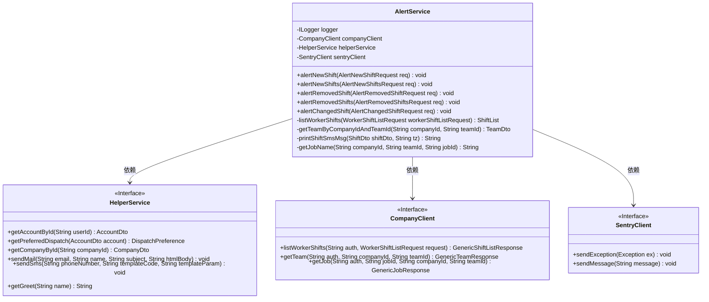
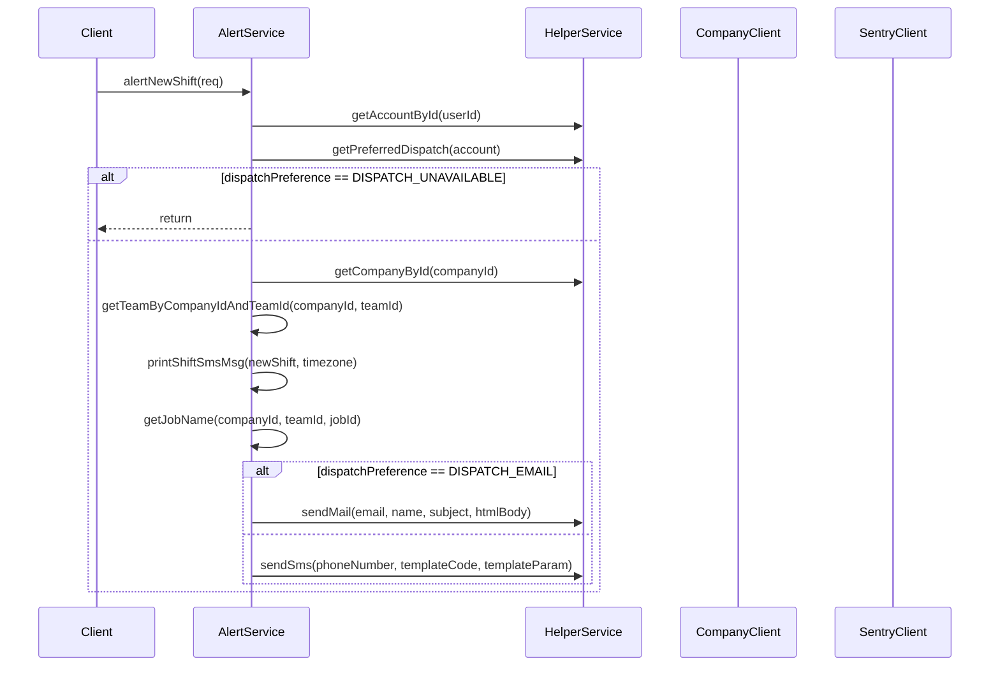

# 基础信息

|      |      |
|------|------|
| 名称 | AlertService |
| 编码语言 | .java |
| 代码路径 | staffjoy/bot-svc/src/main/java/xyz/staffjoy/bot/service/AlertService.java |
| 包名 | xyz.staffjoy.bot.service |
| 依赖项 | ['com.github.structlog4j.ILogger', 'com.github.structlog4j.SLoggerFactory', 'io.sentry.SentryClient', 'org.springframework.beans.factory.annotation.Autowired', 'org.springframework.stereotype.Service', 'org.springframework.util.StringUtils', 'xyz.staffjoy.account.dto.AccountDto', 'xyz.staffjoy.bot.BotConstant', 'xyz.staffjoy.bot.dto', 'xyz.staffjoy.common.api.ResultCode', 'xyz.staffjoy.common.auth.AuthConstant', 'xyz.staffjoy.common.error.ServiceException', 'xyz.staffjoy.company.client.CompanyClient', 'xyz.staffjoy.company.dto', 'javax.json.Json', 'java.time.Instant', 'java.time.ZoneId', 'java.time.format.DateTimeFormatter', 'java.time.temporal.ChronoUnit', 'java.util.List'] |
| 概述说明 | AlertService处理班次变更通知，支持邮件和短信发送。 |

# 说明

AlertService是一个处理班次提醒的服务类，包含多个方法用于发送新班次、取消班次和变更班次的提醒通知。它通过CompanyClient和HelperService获取公司、团队和账户信息，根据用户的偏好（邮件或短信）发送格式化后的提醒内容。服务还包含辅助方法，如获取班次信息、格式化消息和处理异常。所有操作都记录日志并通过SentryClient上报错误。

# 类列表 Class Summary

| 名称   | 类型  | 说明 |
|-------|------|-------------|
| AlertService | class | AlertService处理班次变更通知，支持邮件和短信发送。 |

## 类 AlertService

|      |      |
|------|------|
| 访问范围 | @SuppressWarnings("Duplicates");@Service;public |
| 类型 | class |
| 名称 | AlertService |
| 说明 | AlertService处理班次变更通知，支持邮件和短信发送。 |

### UML类图

这段代码展示了一个AlertService类，它负责处理不同类型的班次提醒通知，包括新班次、被移除的班次和变更的班次。AlertService依赖于HelperService、CompanyClient和SentryClient来完成其功能。HelperService提供了获取账户信息、发送邮件和短信等辅助功能；CompanyClient用于获取班次、团队和工作信息；SentryClient用于错误报告。AlertService根据用户的偏好（邮件或短信）发送格式化的通知消息。

### 内部方法调用关系图

```mermaid
graph TD
    A["类AlertService"]
    B["属性: ILogger logger"]
    C["属性: CompanyClient companyClient"]
    D["属性: HelperService helperService"]
    E["属性: SentryClient sentryClient"]
    F["方法: alertNewShift(AlertNewShiftRequest req)"]
    G["方法: alertNewShifts(AlertNewShiftsRequest req)"]
    H["方法: alertRemovedShift(AlertRemovedShiftRequest req)"]
    I["方法: alertRemovedShifts(AlertRemovedShiftsRequest req)"]
    J["方法: alertChangedShift(AlertChangedShiftRequest req)"]
    K["私有方法: listWorkerShifts(WorkerShiftListRequest)"]
    L["私有方法: getTeamByCompanyIdAndTeamId(String, String)"]
    M["私有方法: printShiftSmsMsg(ShiftDto, String)"]
    N["私有方法: getJobName(String, String, String)"]

    A --> B
    A --> C
    A --> D
    A --> E
    A --> F
    A --> G
    A --> H
    A --> I
    A --> J
    A -.-> K
    A -.-> L
    A -.-> M
    A -.-> N
```

这段代码实现了一个告警服务(AlertService)，主要用于处理不同类型的班次变更通知。服务包含5个主要公共方法，分别处理新增单个班次、新增多个班次、移除单个班次、移除多个班次和变更班次的通知逻辑。代码通过HelperService获取账户信息和派送偏好，根据不同的派送方式(邮件或短信)格式化消息内容并发送通知。私有方法包括获取班次列表、获取团队信息、格式化班次消息和获取职位名称等辅助功能。整个服务结构清晰，通过依赖注入的方式使用其他服务组件，并包含完善的错误处理和日志记录。

### 字段列表 Field List

| 名称  | 类型  | 说明 |
|-------|-------|------|
| logger = SLoggerFactory.getLogger(AlertService.class) | ILogger | 静态日志记录器实例，用于AlertService类。 |
| sentryClient | SentryClient | 自动注入SentryClient实例。 |
| helperService | HelperService | 自动注入HelperService实例。 |
| companyClient | CompanyClient | 自动注入公司客户端实例 |

### 方法列表 Method List

| 名称  | 类型  | 说明 |
|-------|-------|------|
| alertRemovedShift | void | 方法处理移除班次通知，根据用户偏好发送邮件或短信，包含新班次信息。 |
| alertRemovedShifts | void | 方法处理移除班次请求，验证参数后根据用户偏好发送邮件或短信通知新班次信息。 |
| alertChangedShift | void | 方法处理班次变更通知，根据用户偏好发送邮件或短信，包含新旧班次详情。 |
| alertNewShift | void | 方法处理新班次通知，根据用户偏好发送邮件或短信，包含班次详情和问候。 |
| alertNewShifts | void | 方法处理新班次通知，检查请求有效性后，根据用户偏好发送邮件或短信。 |
| listWorkerShifts | ShiftList | 私有方法：查询员工班次列表，处理异常和错误响应。 |
| getTeamByCompanyIdAndTeamId | TeamDto | 通过公司ID和团队ID获取团队信息，异常时记录日志并抛出错误。 |
| printShiftSmsMsg | String | 方法根据时区格式化班次起止时间并返回短信内容。 |
| getJobName | String | 通过公司ID、团队ID和职位ID获取职位名称，失败时记录错误并抛出异常。 |

