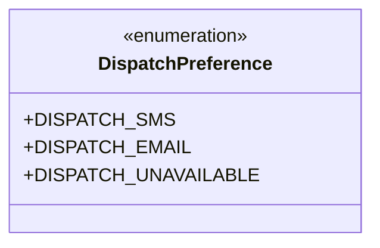
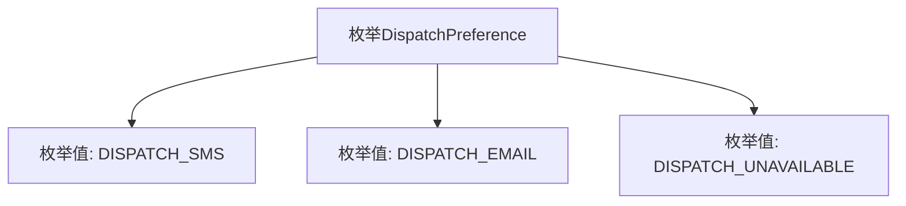

# 基础信息

|      |      |
|------|------|
| 名称 | DispatchPreference |
| 编码语言 | .java |
| 代码路径 | staffjoy/bot-svc/src/main/java/xyz/staffjoy/bot/service/DispatchPreference.java |
| 包名 | xyz.staffjoy.bot.service |
| 依赖项 | [] |
| 概述说明 | 调度偏好：短信、邮件、不可用 |

# 说明

这是一个枚举类型定义，名为DispatchPreference，包含三个预定义的常量值。第一个常量DISPATCH_SMS表示短信派送方式，第二个常量DISPATCH_EMAIL表示电子邮件派送方式，第三个常量DISPATCH_UNAVAILABLE表示派送方式不可用。该枚举用于表示不同的派送偏好选项。

# 类列表 Class Summary

| 名称   | 类型  | 说明 |
|-------|------|-------------|
| DispatchPreference | enum | 调度偏好：短信、邮件、不可用 |

## 类 DispatchPreference

|      |      |
|------|------|
| 访问范围 | None |
| 类型 | enum |
| 名称 | DispatchPreference |
| 说明 | 调度偏好：短信、邮件、不可用 |

### UML类图

该枚举类`DispatchPreference`定义了三种消息派发偏好类型：短信（SMS）、邮件（EMAIL）和不可用（UNAVAILABLE）。作为枚举类型，其成员均为公有静态常量，用于表示有限且固定的选项集合，适用于需要严格约束取值范围的场景，如配置管理或状态标识。枚举类通过`<<enumeration>>`标记明确其类型特征，所有枚举值以大写形式展示，符合Java枚举的命名规范。

### 内部方法调用关系图

该流程图展示了DispatchPreference枚举的结构，包含三个预定义枚举值：DISPATCH_SMS表示短信派发方式，DISPATCH_EMAIL表示邮件派发方式，DISPATCH_UNAVAILABLE表示不可用状态。每个枚举值通过箭头与父枚举类型连接，形成清晰的层级关系，这种设计常用于表示系统支持的派送方式选项或状态标记。

### 字段列表 Field List

| 名称  | 类型  | 说明 |
|-------|-------|------|

### 方法列表 Method List

| 名称  | 类型  | 说明 |
|-------|-------|------|

