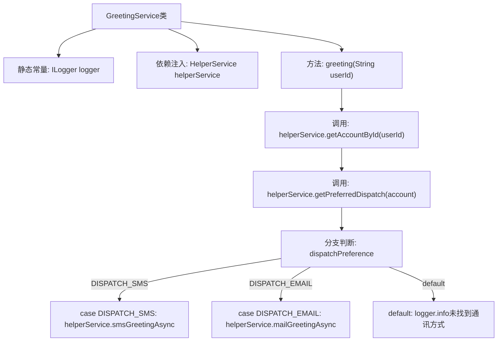

# 基础信息

|      |      |
|------|------|
| 名称 | GreetingService |
| 编码语言 | .java |
| 代码路径 | staffjoy/bot-svc/src/main/java/xyz/staffjoy/bot/service/GreetingService.java |
| 包名 | xyz.staffjoy.bot.service |
| 依赖项 | ['com.github.structlog4j.ILogger', 'com.github.structlog4j.SLoggerFactory', 'org.springframework.beans.factory.annotation.Autowired', 'org.springframework.stereotype.Service', 'xyz.staffjoy.account.dto.AccountDto'] |
| 概述说明 | GreetingService根据用户偏好通过短信或邮件发送问候，无偏好则记录日志。 |

# 说明

GreetingService是一个使用依赖注入的Spring服务类，通过HelperService处理用户问候发送。类中包含静态日志记录器和自动注入的HelperService实例。greeting方法接收用户ID，首先获取账户信息，再根据账户的通信偏好（短信或邮件）异步发送问候。若未找到有效通信方式，则记录日志提示无法发送。整个过程实现了根据不同偏好分发问候消息的功能。

# 类列表 Class Summary

| 名称   | 类型  | 说明 |
|-------|------|-------------|
| GreetingService | class | GreetingService根据用户偏好发送问候短信或邮件。 |


## 类 GreetingService

|      |      |
|------|------|
| 访问范围 | @Service;public |
| 类型 | class |
| 名称 | GreetingService |
| 说明 | GreetingService根据用户偏好发送问候短信或邮件。 |


### UML类图

```mermaid
classDiagram
    class GreetingService {
        -ILogger logger
        -HelperService helperService
        +greeting(String userId) void
    }

    class HelperService {
        <<Interface>>
        +getAccountById(String userId) AccountDto
        +getPreferredDispatch(AccountDto account) DispatchPreference
        +smsGreetingAsync(String phoneNumber) void
        +mailGreetingAsync(AccountDto account) void
    }

    class AccountDto {
        +String phoneNumber
        // 其他账户属性
    }

    enum DispatchPreference {
        DISPATCH_SMS
        DISPATCH_EMAIL
    }

    GreetingService --> HelperService : 依赖\n(调用服务方法)
    GreetingService --> AccountDto : 使用\n(处理账户数据)
    GreetingService --> DispatchPreference : 使用\n(判断发送方式)
    HelperService --> AccountDto : 返回\n(获取账户信息)
    HelperService --> DispatchPreference : 返回\n(获取偏好设置)
```

这段代码展示了一个问候服务系统，其中GreetingService通过HelperService接口获取用户账户信息和通信偏好，根据不同的DispatchPreference枚举值选择短信或邮件方式异步发送问候。类图清晰地呈现了服务间的依赖关系、数据传输对象和枚举类型的交互，体现了策略模式的应用。GreetingService作为核心类，协调各个组件完成动态消息分发功能，同时处理异常情况。


### 内部方法调用关系图



这段流程图描述了GreetingService的工作流程：首先通过HelperService获取用户账户信息，然后根据用户的通讯偏好（短信或邮件）异步发送问候消息。若未找到有效通讯方式，则记录日志。图中清晰展示了从方法调用到分支处理的完整路径，包括三个可能的分支走向，体现了服务类与辅助服务的协作关系。

### 字段列表 Field List

| 名称  | 类型  | 说明 |
|-------|-------|------|
| helperService | HelperService | 自动注入HelperService实例。 |
| logger = SLoggerFactory.getLogger(GreetingService.class) | ILogger | 静态日志记录器实例，用于GreetingService类。 |

### 方法列表 Method List

| 名称  | 类型  | 说明 |
|-------|-------|------|
| greeting | void | 根据用户偏好发送问候短信或邮件，无偏好则记录日志。 |


