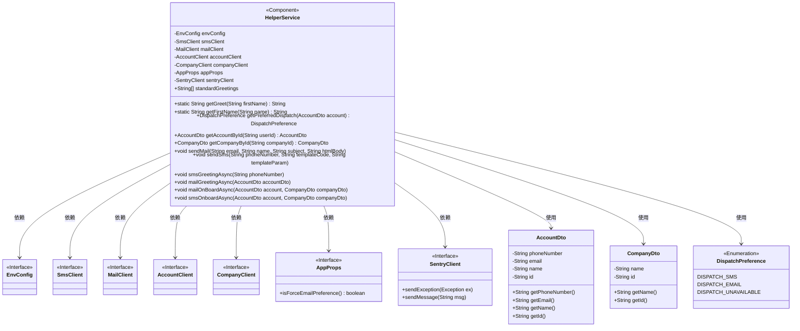

# 基础信息

|      |      |
|------|------|
| 名称 | HelperService |
| 编码语言 | .java |
| 代码路径 | staffjoy/bot-svc/src/main/java/xyz/staffjoy/bot/service/HelperService.java |
| 包名 | xyz.staffjoy.bot.service |
| 依赖项 | ['com.github.structlog4j.ILogger', 'com.github.structlog4j.SLoggerFactory', 'io.sentry.SentryClient', 'org.springframework.beans.factory.annotation.Autowired', 'org.springframework.scheduling.annotation.Async', 'org.springframework.stereotype.Component', 'org.springframework.util.StringUtils', 'xyz.staffjoy.account.client.AccountClient', 'xyz.staffjoy.account.dto.AccountDto', 'xyz.staffjoy.account.dto.GenericAccountResponse', 'xyz.staffjoy.bot.BotConstant', 'xyz.staffjoy.bot.config.AppConfig', 'xyz.staffjoy.bot.props.AppProps', 'xyz.staffjoy.common.api.BaseResponse', 'xyz.staffjoy.common.auth.AuthConstant', 'xyz.staffjoy.common.env.EnvConfig', 'xyz.staffjoy.common.error.ServiceException', 'xyz.staffjoy.company.client.CompanyClient', 'xyz.staffjoy.company.dto.CompanyDto', 'xyz.staffjoy.company.dto.GenericCompanyResponse', 'xyz.staffjoy.mail.client.MailClient', 'xyz.staffjoy.mail.dto.EmailRequest', 'xyz.staffjoy.sms.client.SmsClient', 'xyz.staffjoy.sms.dto.SmsRequest', 'javax.json.Json', 'java.net.URI', 'java.net.URISyntaxException', 'java.util.HashMap', 'java.util.Map', 'java.util.Random', 'java.util.concurrent.TimeUnit'] |
| 概述说明 | HelperService提供账户管理、邮件短信发送及入职处理功能，包含异步操作和错误日志记录。 |

# 说明

HelperService是一个Spring组件类，提供多种辅助功能。它包含静态问候语数组和获取问候语的方法，以及从全名提取名字的功能。类中注入了多个客户端（SmsClient、MailClient等）和配置对象。主要功能包括：根据账户信息确定首选通知方式（短信或邮件）、通过ID获取账户和公司信息、发送邮件和短信（包含错误处理和日志记录）。还提供异步方法发送问候和入职通知，入职通知包含公司名称和日历链接。所有操作都记录日志并通过Sentry上报异常。

# 类列表 Class Summary

| 名称   | 类型  | 说明 |
|-------|------|-------------|
| HelperService | class | HelperService提供账户管理、邮件短信发送及入职通知功能，包含异步处理和错误日志。 |

## 类 HelperService

|      |      |
|------|------|
| 访问范围 | @SuppressWarnings("Duplicates");@Component;public |
| 类型 | class |
| 名称 | HelperService |
| 说明 | HelperService提供账户管理、邮件短信发送及入职通知功能，包含异步处理和错误日志。 |

### UML类图

这段代码描述了一个名为HelperService的Spring组件类，它提供了多种辅助功能，包括获取账户和公司信息、发送邮件和短信、处理问候语和入职流程等。该类依赖于多个客户端接口（如SmsClient、MailClient）和配置类（如EnvConfig、AppProps），并通过SentryClient进行错误监控。它使用AccountDto和CompanyDto作为数据传输对象，并通过枚举DispatchPreference管理消息发送偏好。类中包含了静态工具方法和异步任务处理方法，整体设计为高内聚的服务类。

### 内部方法调用关系图

```mermaid
graph TD
    A["类HelperService"]
    B["静态常量: ILogger logger"]
    C["自动注入: EnvConfig envConfig"]
    D["自动注入: SmsClient smsClient"]
    E["自动注入: MailClient mailClient"]
    F["自动注入: AccountClient accountClient"]
    G["自动注入: CompanyClient companyClient"]
    H["自动注入: AppProps appProps"]
    I["自动注入: SentryClient sentryClient"]
    J["静态数组: standardGreetings"]
    K["静态方法: getGreet(String firstName)"]
    L["静态方法: getFirstName(String name)"]
    M["方法: getPreferredDispatch(AccountDto account)"]
    N["方法: getAccountById(String userId)"]
    O["方法: getCompanyById(String companyId)"]
    P["方法: sendMail(String email, String name, String subject, String htmlBody)"]
    Q["方法: sendSms(String phoneNumber, String templateCode, String templateParam)"]
    R["异步方法: smsGreetingAsync(String phoneNumber)"]
    S["异步方法: mailGreetingAsync(AccountDto accountDto)"]
    T["异步方法: mailOnBoardAsync(AccountDto account, CompanyDto companyDto)"]
    U["异步方法: smsOnboardAsync(AccountDto account, CompanyDto companyDto)"]

    A --> B
    A --> C
    A --> D
    A --> E
    A --> F
    A --> G
    A --> H
    A --> I
    A --> J
    A --> K
    A --> L
    A --> M
    A --> N
    A --> O
    A --> P
    A --> Q
    A --> R
    A --> S
    A --> T
    A --> U
```

这段代码定义了一个名为HelperService的Spring组件类，主要用于处理账户和公司的相关操作，包括获取账户信息、公司信息、发送邮件和短信等。类中包含多个自动注入的客户端和服务配置，以及静态工具方法和异步任务方法。主要功能包括根据账户信息选择发送方式、获取账户和公司详细信息、发送邮件和短信通知等。异步方法用于处理问候和入职通知的发送，支持邮件和短信两种方式。整个类设计用于处理与用户通知相关的业务逻辑，具有完善的错误处理和日志记录功能。

### 字段列表 Field List

| 名称  | 类型  | 说明 |
|-------|-------|------|
| mailClient | MailClient | 自动注入邮件客户端实例。 |
| logger = SLoggerFactory.getLogger(HelperService.class) | ILogger | 静态日志记录器初始化，用于HelperService类。 |
| sentryClient | SentryClient | 自动注入SentryClient实例 |
| appProps | AppProps | 自动注入AppProps配置属性 |
| smsClient | SmsClient | 自动注入短信客户端实例 |
| envConfig | EnvConfig | 自动注入EnvConfig配置对象 |
| companyClient | CompanyClient | 自动注入公司客户端实例。 |
| standardGreetings = {            "Hi %s!",            "Hey %s -",            "Hello %s.",            "Hey, %s!"    } | String[] | 定义字符串数组存储标准问候语模板。 |
| accountClient | AccountClient | 自动注入AccountClient实例 |

### 方法列表 Method List

| 名称  | 类型  | 说明 |
|-------|-------|------|
| getAccountById | AccountDto | 根据ID获取账户信息，失败记录日志并抛出异常。 |
| smsGreetingAsync | void | 异步发送问候短信，使用指定模板和空参数。 |
| mailGreetingAsync | void | 异步发送问候邮件给用户 |
| getCompanyById | CompanyDto | 通过ID获取公司信息，异常时记录日志并抛出错误。 |
| mailOnBoardAsync | void | 异步发送入职邮件，包含问候、公司名和日历链接。 |
| getFirstName | String | 静态方法：按空格分割字符串，返回第一部分，空则返回"there"。 |
| sendMail | void | 发送邮件的Java方法，处理异常和失败响应。 |
| getPreferredDispatch | DispatchPreference | 方法根据配置和账户信息返回发送偏好，优先短信，其次邮件，无则不可用。 |
| getGreet | String | 随机选择问候语并插入名字。 |
| sendSms | void | 发送短信方法：构建请求，调用客户端发送，处理异常和失败响应。 |
| smsOnboardAsync | void | 异步发送入职短信，包含问候、公司名和日历链接，分条发送间隔4秒。 |

