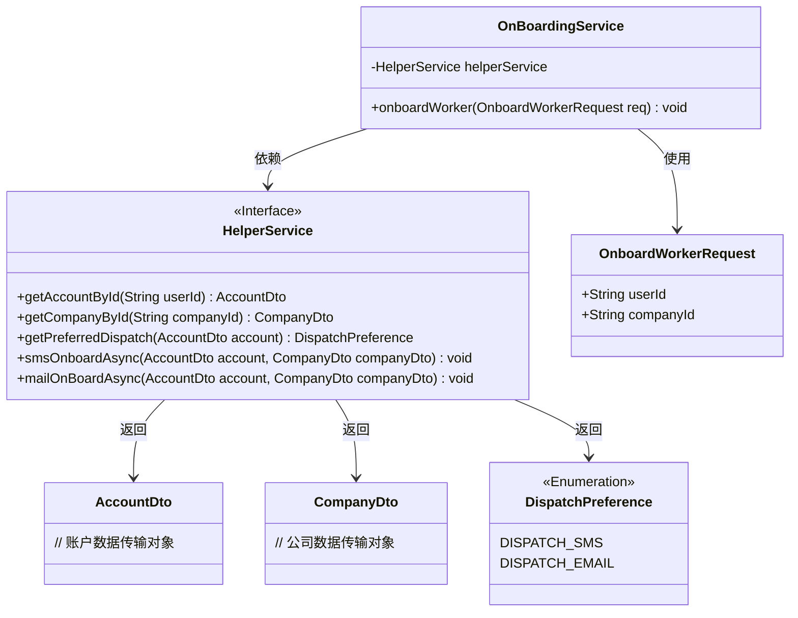
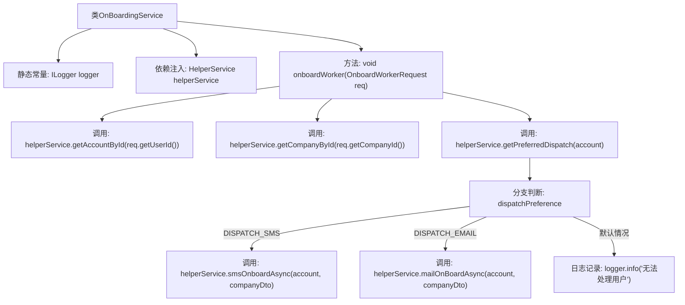

# 基础信息

|      |      |
|------|------|
| 名称 | OnBoardingService |
| 编码语言 | .java |
| 代码路径 | staffjoy/bot-svc/src/main/java/xyz/staffjoy/bot/service/OnBoardingService.java |
| 包名 | xyz.staffjoy.bot.service |
| 依赖项 | ['com.github.structlog4j.ILogger', 'com.github.structlog4j.SLoggerFactory', 'org.springframework.beans.factory.annotation.Autowired', 'org.springframework.stereotype.Service', 'xyz.staffjoy.account.dto.AccountDto', 'xyz.staffjoy.bot.dto.OnboardWorkerRequest', 'xyz.staffjoy.company.dto.CompanyDto'] |
| 概述说明 | 服务类处理员工入职，按偏好选择短信或邮件通知。 |

# 说明

这是一个名为OnBoardingService的Spring服务类，用于处理员工入职流程。该类包含一个核心方法onboardWorker，接收OnboardWorkerRequest请求参数。方法首先通过HelperService获取用户账户和公司信息，然后根据用户的通信偏好（短信或邮件）执行异步入职通知操作。若未找到有效通信方式，则记录日志提示无法完成入职。整个流程依赖HelperService提供的辅助功能，包括数据查询和通信方法调用。

# 类列表 Class Summary

| 名称   | 类型  | 说明 |
|-------|------|-------------|
| OnBoardingService | class | 服务类处理员工入职，按偏好选择短信或邮件通知。 |

## 类 OnBoardingService

|      |      |
|------|------|
| 访问范围 | @Service;public |
| 类型 | class |
| 名称 | OnBoardingService |
| 说明 | 服务类处理员工入职，按偏好选择短信或邮件通知。 |

### UML类图

这段代码展示了一个员工入职服务系统，核心是OnBoardingService类通过依赖HelperService接口完成员工入职流程。系统根据DispatchPreference枚举值选择短信或邮件异步通知方式，包含账户验证、公司信息获取和通信渠道选择等步骤。类图清晰地呈现了服务间的依赖关系和数据流转路径，体现了策略模式的应用。

### 内部方法调用关系图

这段流程图展示了OnBoardingService类的核心处理逻辑。该服务通过HelperService获取账户和公司信息，根据用户的派送偏好(DISPATCH_SMS或DISPATCH_EMAIL)选择不同的异步处理方式(smsOnboardAsync或mailOnBoardAsync)，若无匹配选项则记录日志。整个过程体现了清晰的依赖注入和分支控制结构，展示了服务类处理用户入职流程的完整逻辑链。

### 字段列表 Field List

| 名称  | 类型  | 说明 |
|-------|-------|------|
| logger = SLoggerFactory.getLogger(OnBoardingService.class) | ILogger | 静态日志记录器初始化，用于OnBoardingService类。 |
| helperService | HelperService | 自动注入HelperService实例 |

### 方法列表 Method List

| 名称  | 类型  | 说明 |
|-------|-------|------|
| onboardWorker | void | 方法根据用户偏好通过短信或邮件进行入职处理，无偏好时记录日志。 |

