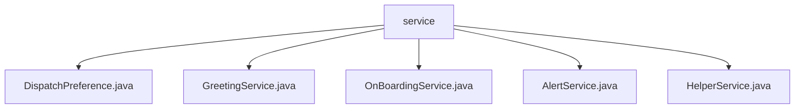

# 基础信息

|      |      |
|------|------|
| 名称 | service |
| 编码语言 | .java |
| 代码路径 | staffjoy/bot-svc/src/main/java/xyz/staffjoy/bot/service |
| 包名 | staffjoy.docs.bot-svc.src.main.java.xyz.staffjoy.bot.service |
| 概述说明 | 枚举DispatchPreference定义派送方式。GreetingService根据偏好发送问候。OnBoardingService处理入职通知。AlertService发送班次提醒。HelperService提供辅助功能。 |

# 说明

## 概述  
该代码模块是一个基于Spring框架的机器人服务（`bot-svc`），主要用于处理与用户通信相关的业务逻辑。模块核心功能包括：根据用户偏好（短信或邮件）发送问候、入职通知、班次提醒等消息。服务通过依赖注入的方式集成多个客户端（如`SmsClient`、`MailClient`）和工具类，支持异步操作，并包含完善的日志记录和错误上报机制（如Sentry）。

## 主要业务场景  
1. **通信偏好管理**  
   - 通过`DispatchPreference`枚举定义派送方式（短信、邮件、不可用），为其他服务提供标准化选项。

2. **用户问候发送**  
   - `GreetingService`根据用户ID获取账户信息，按偏好异步发送问候消息（短信或邮件），无有效偏好时记录日志。

3. **员工入职流程**  
   - `OnBoardingService`处理入职请求，获取用户和公司信息后，按偏好发送入职通知（含公司名称和日历链接），失败时记录日志。

4. **班次提醒通知**  
   - `AlertService`管理班次相关提醒（新班次、取消、变更），通过`CompanyClient`和`HelperService`获取上下文信息，按偏好格式化并发送通知。

5. **辅助功能集成**  
   - `HelperService`作为核心工具类，提供以下支持：  
     - 动态获取问候语和用户名字。  
     - 统一处理账户/公司信息查询。  
     - 封装短信/邮件发送逻辑（含错误处理）。  
     - 异步执行问候和入职通知发送。

### 包内部结构视图

该流程图展示了bot-svc项目中service目录下的文件结构。根节点为service文件夹，包含5个Java服务类文件：DispatchPreference、GreetingService、OnBoardingService、AlertService和HelperService。这些服务类文件属于同一层级，直接隶属于service目录，没有更深层次的嵌套关系。

# 文件列表 File List

| 名称   | 类型  | 说明 |
|-------|------|-------------|
| [HelperService.java](HelperService.md) | file | HelperService提供账户管理、邮件短信发送及入职处理功能，包含异步操作和错误日志记录。 |
| [AlertService.java](AlertService.md) | file | AlertService处理班次变更通知，支持邮件和短信发送。 |
| [OnBoardingService.java](OnBoardingService.md) | file | 服务类处理员工入职，按偏好选择短信或邮件通知。 |
| [GreetingService.java](GreetingService.md) | file | GreetingService根据用户偏好通过短信或邮件发送问候，无偏好则记录日志。 |
| [DispatchPreference.java](DispatchPreference.md) | file | 调度偏好：短信、邮件、不可用 |

