# 基础信息

|      |      |
|------|------|
| 名称 | common |
| 编码语言 | .java |
| 代码路径 | staffjoy/common-lib/src/main/java/xyz/staffjoy/common |
| 包名 | staffjoy.docs.common-lib.src.main.java.xyz.staffjoy.common |
| 概述说明 | 代码模块管理应用运行环境配置，区分开发、测试、生产环境并提供相应参数。包含EnvConstant和EnvConfig类。 |

# 说明

# Staffjoy Common Lib 模块总结

## 概述
Staffjoy Common Lib 是一个Java基础库模块，为Staffjoy项目提供了一系列通用的功能组件和工具类。该模块采用Spring框架构建，包含了环境管理、安全认证、异常处理、数据验证、日志审计等核心功能，为微服务架构提供了统一的基础设施支持。模块采用分层设计，各子模块职责明确，通过标准化接口和注解驱动的方式实现功能扩展。

## 主要业务场景

### 1. 环境管理与配置
- **多环境支持**：通过`EnvConstant`和`EnvConfig`管理开发、测试、UAT和生产环境配置
- **全局配置**：`StaffjoyConfig`统一初始化对象映射、环境配置和错误监控组件
- **属性管理**：`StaffjoyProps`绑定以"staffjoy.common"为前缀的配置属性

### 2. 安全认证与授权
- **身份验证**：`AuthContext`处理HTTP请求头中的用户身份信息
- **权限控制**：`AuthorizeInterceptor`实现基于`@Authorize`注解的细粒度权限拦截
- **会话管理**：`Sessions`类提供用户登录和令牌生成功能
- **加密签名**：`Sign`类处理JWT令牌生成验证，`Hash`类提供HmacSHA256消息认证

### 3. 异常处理与监控
- **自定义异常**：`ServiceException`封装业务错误，优化堆栈性能
- **全局拦截**：`GlobalExceptionTranslator`捕获多种异常并返回标准化响应
- **错误监控**：集成Sentry系统，`SentryClientAspect`实现调试模式拦截

### 4. 数据验证与处理
- **格式验证**：提供电话号码、时区、星期名称等验证器及对应注解
- **分组校验**：通过`Group1`和`Group2`接口支持分场景验证规则
- **HTTP响应**：`ResultCode`和`BaseResponse`标准化HTTP状态码和响应结构

### 5. 服务管理与工具
- **服务目录**：`ServiceDirectory`维护9个核心服务的静态映射表
- **安全级别**：`SecurityConstant`定义公开/认证/管理员三级访问控制
- **异步处理**：`ContextCopyingDecorator`实现多线程请求上下文复制
- **头像生成**：通过Gravatar服务根据邮箱自动生成用户头像

### 6. 日志与审计
- **审计日志**：`LogEntry`结构化记录用户操作变更详情
- **日志切面**：`SentryClientAspect`实现方法调用的调试日志记录

该模块作为基础架构层，为Staffjoy项目提供了标准化、可复用的解决方案，确保各微服务在环境管理、安全认证、异常处理等方面的一致性，同时通过灵活的配置和注解机制支持业务定制需求。

### 包内部结构视图

```mermaid
graph TD
    common --> env
    common --> async
    common --> aop
    common --> auditlog
    common --> validation
    common --> api
    common --> config
    common --> error
    common --> services
    common --> auth
    common --> utils
    common --> crypto
    env --> EnvConstant.java
    env --> EnvConfig.java
    async --> ContextCopyingDecorator.java
    aop --> SentryClientAspect.java
    auditlog --> LogEntry.java
    validation --> PhoneNumberValidator.java
    validation --> Group2.java
    validation --> TimezoneValidator.java
    validation --> DayOfWeekValidator.java
    validation --> PhoneNumber.java
    validation --> Timezone.java
    validation --> Group1.java
    validation --> DayOfWeek.java
    api --> ResultCode.java
    api --> BaseResponse.java
    config --> StaffjoyConfig.java
    config --> StaffjoyWebConfig.java
    config --> StaffjoyProps.java
    config --> StaffjoyRestConfig.java
    error --> ServiceException.java
    error --> GlobalExceptionTranslator.java
    services --> SecurityConstant.java
    services --> Service.java
    services --> ServiceDirectory.java
    auth --> AuthContext.java
    auth --> AuthorizeInterceptor.java
    auth --> AuthConstant.java
    auth --> Sessions.java
    auth --> PermissionDeniedException.java
    auth --> Authorize.java
    auth --> FeignRequestHeaderInterceptor.java
    utils --> Helper.java
    utils --> MD5Util.java
    crypto --> Sign.java
    crypto --> Hash.java
```

该流程图展示了staffjoy/common-lib项目的模块结构，以common为根节点，下分12个子模块（如env、async等）。每个子模块包含具体实现类，例如env模块包含EnvConfig.java和EnvConstant.java，validation模块包含多种验证器和相关类。整体结构清晰展现了项目分层设计，各模块职责分明，便于维护和扩展。

# 文件列表 File List

| 名称   | 类型  | 说明 |
|-------|------|-------------|
| [crypto](crypto/_module.md) | package | Sign类处理JWT令牌生成验证，含声明字段和线程安全缓存。Hash类提供HmacSHA256加密方法。 |
| [utils](utils/_module.md) | package | Helper类含静态方法generateGravatarUrl，通过MD5Util将邮箱转为哈希并拼接URL生成400像素Gravatar头像链接。MD5Util提供MD5哈希功能，处理异常返回null。 |
| [auth](auth/_module.md) | package | AuthContext类获取请求头信息。AuthorizeInterceptor实现权限验证。AuthConstant定义认证常量。Sessions管理会话。PermissionDeniedException自定义异常。Authorize注解控制方法权限。FeignRequestHeaderInterceptor添加用户ID头。 |
| [services](services/_module.md) | package | SecurityConstant类定义安全级别常量。Service类配置服务属性。ServiceDirectory类创建服务映射表。 |
| [error](error/_module.md) | package | ServiceException是自定义运行时异常，含错误码和消息。GlobalExceptionTranslator捕获多种异常并返回统一错误响应。 |
| [config](config/_module.md) | package | Spring配置类StaffjoyConfig初始化全局配置，定义多个Bean并配置拦截器。StaffjoyWebConfig、StaffjoyRestConfig整合配置组件。StaffjoyProps包含Sentry和环境属性。 |
| [api](api/_module.md) | package | ResultCode枚举定义HTTP状态码和消息，BaseResponse类封装响应结构，含code和message字段。 |
| [validation](validation/_module.md) | package | PhoneNumberValidator验证电话号码格式；Group2为空接口；TimezoneValidator验证时区；DayOfWeekValidator验证星期几；PhoneNumber、Timezone、DayOfWeek为对应注解；Group1为空接口。 |
| [auditlog](auditlog/_module.md) | package | 日志记录类，包含用户、公司、团队、授权及目标信息，实现日志转换方法。 |
| [aop](aop/_module.md) | package | 调试模式下禁用Sentry日志记录切面类 |
| [async](async/_module.md) | package | Java类实现线程上下文复制装饰器，确保异步任务继承当前请求属性。 |
| [env](env/_module.md) | package | EnvConstant类定义四种环境常量。EnvConfig类管理各环境配置，含协议、域名等字段，提供按环境获取配置方法。 |

