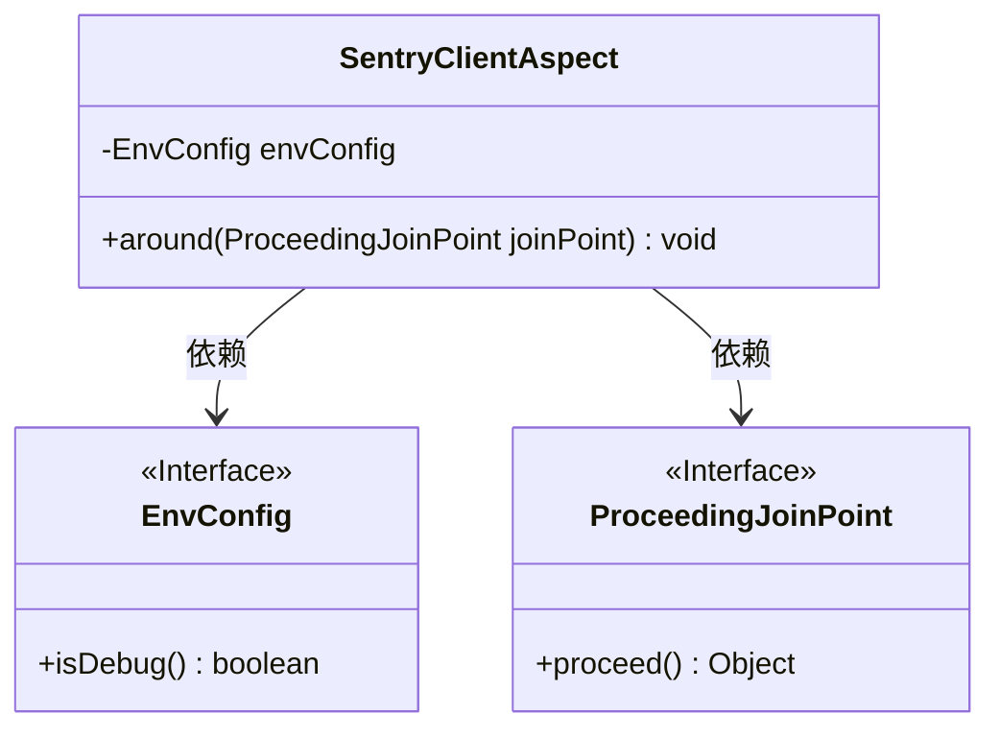
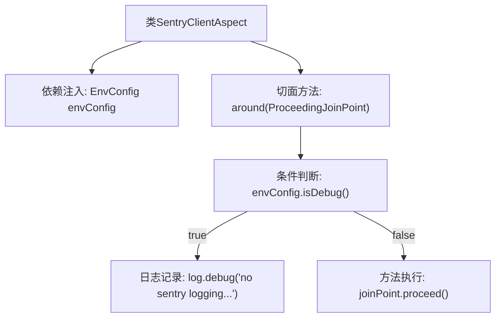

# 基础信息

|      |      |
|------|------|
| 名称 | SentryClientAspect |
| 编码语言 | .java |
| 代码路径 | staffjoy/common-lib/src/main/java/xyz/staffjoy/common/aop/SentryClientAspect.java |
| 包名 | xyz.staffjoy.common.aop |
| 依赖项 | ['lombok.extern.slf4j.Slf4j', 'org.aspectj.lang.ProceedingJoinPoint', 'org.aspectj.lang.annotation.Around', 'org.aspectj.lang.annotation.Aspect', 'org.springframework.beans.factory.annotation.Autowired', 'org.springframework.context.annotation.Configuration', 'org.springframework.stereotype.Component', 'xyz.staffjoy.common.env.EnvConfig'] |
| 概述说明 | 调试模式下禁用Sentry日志记录切面类 |

# 说明

这是一个名为SentryClientAspect的切面类，使用@Aspect注解标记。它包含一个环绕通知方法around，通过@Around注解拦截SentryClient类中所有以send开头的方法调用。在调试模式下（通过envConfig.isDebug()判断），切面会记录调试日志并直接返回，不执行原始方法；否则正常执行被拦截的方法。类中还注入了EnvConfig配置对象用于环境判断，并使用@Slf4j注解提供日志功能。

# 类列表 Class Summary

| 名称   | 类型  | 说明 |
|-------|------|-------------|
| SentryClientAspect | class | 调试模式下禁用Sentry日志记录 |

## 类 SentryClientAspect

|      |      |
|------|------|
| 访问范围 | @Aspect;@Slf4j;public |
| 类型 | class |
| 名称 | SentryClientAspect |
| 说明 | 调试模式下禁用Sentry日志记录 |

### UML类图

这段代码展示了一个使用Spring AOP的切面类SentryClientAspect，主要用于控制SentryClient的send方法调用。当系统处于调试模式时（通过EnvConfig.isDebug()判断），会跳过Sentry日志记录并直接返回；否则正常执行原方法。该切面通过@Around注解拦截所有SentryClient.send*方法调用，体现了AOP的环绕通知模式，实现了调试环境下的日志发送抑制功能。EnvConfig和ProceedingJoinPoint作为依赖接口被注入使用。

### 内部方法调用关系图

该流程图展示了SentryClientAspect切面类的核心处理逻辑。首先通过@Autowired注入EnvConfig配置对象，在@Around切面方法中首先检查是否处于debug模式。若为debug模式则记录日志并直接返回，否则继续执行原方法。整个流程清晰体现了AOP的拦截机制和条件控制逻辑，箭头方向准确反映了程序执行路径的分支选择。

### 字段列表 Field List

| 名称  | 类型  | 说明 |
|-------|-------|------|
| envConfig | EnvConfig | 自动注入EnvConfig配置实例 |

### 方法列表 Method List

| 名称  | 类型  | 说明 |
|-------|-------|------|
| around | void | 调试模式下禁用Sentry日志记录 |

