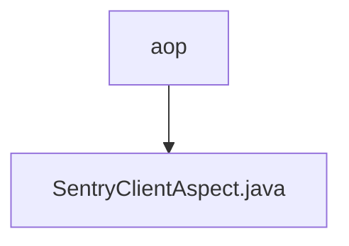

# 基础信息

|      |      |
|------|------|
| 名称 | aop |
| 编码语言 | .java |
| 代码路径 | staffjoy/common-lib/src/main/java/xyz/staffjoy/common/aop |
| 包名 | staffjoy.docs.common-lib.src.main.java.xyz.staffjoy.common.aop |
| 概述说明 | 调试模式下禁用Sentry日志记录切面类 |

# 说明

这是一个名为SentryClientAspect的切面类，使用@Aspect注解标记。它包含一个环绕通知方法around，通过@Around注解拦截SentryClient类中所有以send开头的方法调用。在调试模式下（通过envConfig.isDebug()判断），切面会记录调试日志并直接返回，不执行原始方法；否则正常执行被拦截的方法。类中还注入了EnvConfig配置对象用于环境判断，并使用@Slf4j注解提供日志功能。

### 包内部结构视图

该流程图展示了StaffJoy项目中common-lib模块下的AOP切面结构。根节点"aop"表示切面编程的基础包路径，其下包含具体的切面实现类"SentryClientAspect.java"，这个类主要用于集成Sentry错误监控系统的客户端切面处理。整个结构清晰地反映了项目中异常监控模块的简单层级关系。

# 文件列表 File List

| 名称   | 类型  | 说明 |
|-------|------|-------------|
| [SentryClientAspect.java](SentryClientAspect.md) | file | 调试模式下禁用Sentry日志记录切面类 |

