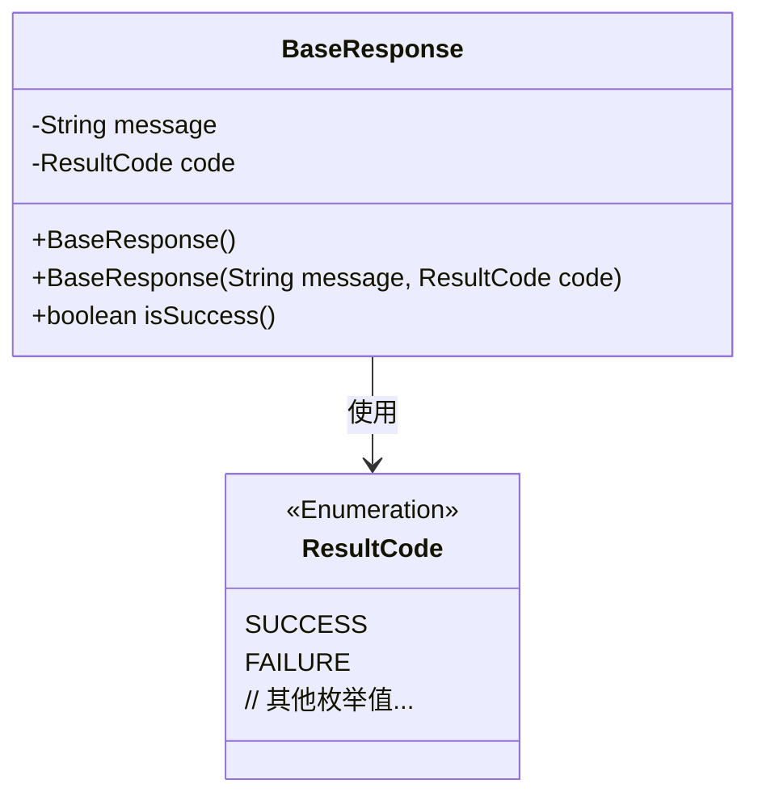
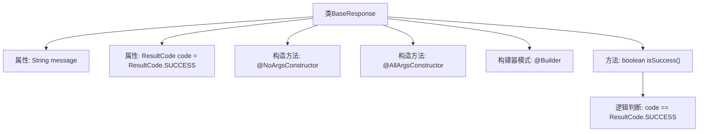

# 基础信息

|      |      |
|------|------|
| 名称 | BaseResponse |
| 编码语言 | .java |
| 代码路径 | staffjoy/common-lib/src/main/java/xyz/staffjoy/common/api/BaseResponse.java |
| 包名 | xyz.staffjoy.common.api |
| 依赖项 | ['lombok.AllArgsConstructor', 'lombok.Builder', 'lombok.Data', 'lombok.NoArgsConstructor'] |
| 概述说明 | BaseResponse类包含message和code字段，提供无参、全参构造和构建器，默认code为SUCCESS，含成功判断方法。 |

# 说明

这是一个名为BaseResponse的Java类，用于表示基础响应结构。类中包含两个主要字段：message（字符串类型，用于存储响应消息）和code（ResultCode枚举类型，默认值为ResultCode.SUCCESS）。类提供了三个构造方法：无参构造、全参构造以及通过Builder模式创建的构造方法。此外，还包含一个isSuccess()方法，用于判断当前响应是否成功（即code是否为SUCCESS状态）。整个类通过Lombok注解实现了简洁的构造方法和Builder模式支持。

# 类列表 Class Summary

| 名称   | 类型  | 说明 |
|-------|------|-------------|
| BaseResponse | class | BaseResponse类：含message、code字段，默认SUCCESS，提供isSuccess方法。 |

## 类 BaseResponse

|      |      |
|------|------|
| 访问范围 | @Data;@NoArgsConstructor;@AllArgsConstructor;@Builder;public |
| 类型 | class |
| 名称 | BaseResponse |
| 说明 | BaseResponse类：含message、code字段，默认SUCCESS，提供isSuccess方法。 |

### UML类图

这段代码定义了一个通用的基础响应类BaseResponse，使用Lombok注解简化了代码结构。类中包含消息内容和结果状态码两个私有字段，其中状态码使用枚举类型ResultCode，默认值为SUCCESS。提供了全参构造和无参构造，并通过isSuccess()方法判断响应是否成功。类图清晰地展示了BaseResponse与ResultCode枚举之间的依赖关系，体现了响应状态的可扩展性设计。

### 内部方法调用关系图

这段代码定义了一个使用Lombok注解的BaseResponse类，包含message和code两个属性，其中code默认值为ResultCode.SUCCESS。类提供了无参构造、全参构造和构建器模式，并通过isSuccess()方法判断当前响应是否成功。流程图展示了类的属性、构造方法、构建器模式以及核心方法的调用关系，重点突出了isSuccess()方法对枚举值的比较逻辑。

### 字段列表 Field List

| 名称  | 类型  | 说明 |
|-------|-------|------|
| message | String | 私有字符串变量message |
| code = ResultCode.SUCCESS | ResultCode | 默认设置code为ResultCode.SUCCESS。 |

### 方法列表 Method List

| 名称  | 类型  | 说明 |
|-------|-------|------|
| isSuccess | boolean | 检查code是否为成功状态。 |

