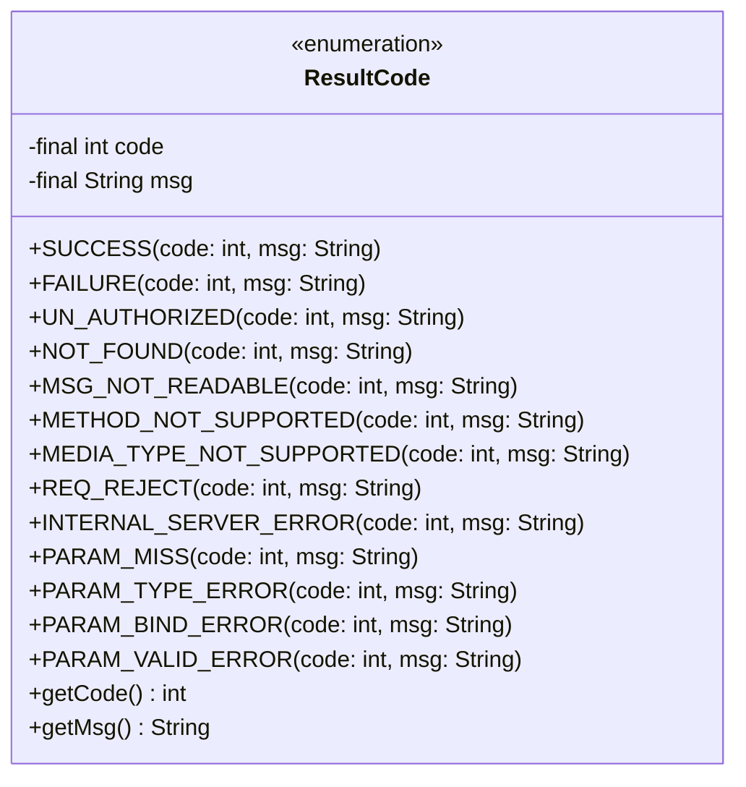

# 基础信息

|      |      |
|------|------|
| 名称 | ResultCode |
| 编码语言 | .java |
| 代码路径 | staffjoy/common-lib/src/main/java/xyz/staffjoy/common/api/ResultCode.java |
| 包名 | xyz.staffjoy.common.api |
| 依赖项 | ['lombok.AllArgsConstructor', 'lombok.Getter', 'javax.servlet.http.HttpServletResponse'] |
| 概述说明 | 枚举定义HTTP状态码和消息，包括成功、失败、未授权等常见错误类型。 |

# 说明

这是一个枚举类ResultCode，定义了多种HTTP响应状态码和对应的消息描述。包含成功、失败、未授权、资源未找到、消息不可读、方法不支持、媒体类型不支持、请求被拒绝、服务器内部错误、参数缺失、参数类型错误、参数绑定错误和参数验证错误等状态。每个枚举项都有code和msg两个字段，分别表示状态码和消息内容。

# 类列表 Class Summary

| 名称   | 类型  | 说明 |
|-------|------|-------------|
| ResultCode | enum | 枚举定义HTTP状态码和消息，包括成功、失败、未授权等常见响应类型。 |

## 类 ResultCode

|      |      |
|------|------|
| 访问范围 | @Getter;@AllArgsConstructor;public |
| 类型 | enum |
| 名称 | ResultCode |
| 说明 | 枚举定义HTTP状态码和消息，包括成功、失败、未授权等常见响应类型。 |

### UML类图

该代码定义了一个枚举类`ResultCode`，用于表示HTTP请求的不同结果状态码和对应消息。每个枚举实例包含两个不可变字段：`code`（HTTP状态码）和`msg`（描述信息），并通过Lombok注解自动生成getter方法和全参构造函数。枚举覆盖了常见HTTP错误场景（如404、403、500等）和参数校验错误类型，适用于统一处理Web请求的响应状态。

### 内部方法调用关系图

```mermaid
graph TD
    A["枚举类ResultCode"]
    B["属性: final int code"]
    C["属性: final String msg"]
    D["枚举值: SUCCESS(200, 'Operation is Successful')"]
    E["枚举值: FAILURE(400, 'Biz Exception')"]
    F["枚举值: UN_AUTHORIZED(401, 'Request Unauthorized')"]
    G["枚举值: NOT_FOUND(404, '404 Not Found')"]
    H["枚举值: MSG_NOT_READABLE(400, 'Message Can't be Read')"]
    I["枚举值: METHOD_NOT_SUPPORTED(405, 'Method Not Supported')"]
    J["枚举值: MEDIA_TYPE_NOT_SUPPORTED(415, 'Media Type Not Supported')"]
    K["枚举值: REQ_REJECT(403, 'Request Rejected')"]
    L["枚举值: INTERNAL_SERVER_ERROR(500, 'Internal Server Error')"]
    M["枚举值: PARAM_MISS(400, 'Missing Required Parameter')"]
    N["枚举值: PARAM_TYPE_ERROR(400, 'Parameter Type Mismatch')"]
    O["枚举值: PARAM_BIND_ERROR(400, 'Parameter Binding Error')"]
    P["枚举值: PARAM_VALID_ERROR(400, 'Parameter Validation Error')"]

    A --> B
    A --> C
    A --> D
    A --> E
    A --> F
    A --> G
    A --> H
    A --> I
    A --> J
    A --> K
    A --> L
    A --> M
    A --> N
    A --> O
    A --> P
```

该流程图展示了ResultCode枚举类的结构，包含两个final属性(code和msg)以及12个预定义的枚举值，每个枚举值都关联了特定的HTTP状态码和描述信息。通过Lombok注解@Getter和@AllArgsConstructor自动生成getter方法和全参构造函数，这些枚举值用于统一管理系统中各种操作结果的状态码和提示信息，覆盖了成功、失败、权限错误、参数错误等常见业务场景。

### 字段列表 Field List

| 名称  | 类型  | 说明 |
|-------|-------|------|

### 方法列表 Method List

| 名称  | 类型  | 说明 |
|-------|-------|------|

