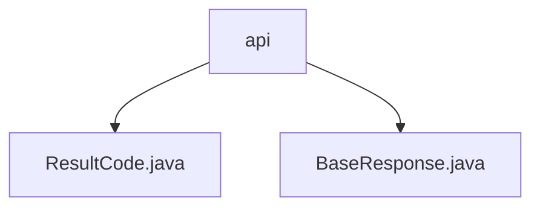

# 基础信息

|      |      |
|------|------|
| 名称 | api |
| 编码语言 | .java |
| 代码路径 | staffjoy/common-lib/src/main/java/xyz/staffjoy/common/api |
| 包名 | staffjoy.docs.common-lib.src.main.java.xyz.staffjoy.common.api |
| 概述说明 | ResultCode枚举定义HTTP状态码和消息，BaseResponse类封装响应结构，含code和message字段。 |

# 说明

## 概述
该代码模块是一个通用的HTTP响应处理模块，主要用于定义和封装HTTP响应状态码及基础响应结构。模块包含两个核心文件：`ResultCode`枚举类和`BaseResponse`类。`ResultCode`定义了多种HTTP响应状态码及其对应的消息描述，涵盖了常见的成功、失败、参数错误等场景。`BaseResponse`则提供了一个基础响应结构，用于统一封装响应消息和状态码，并支持通过Builder模式创建响应对象。

## 主要业务场景
1. **HTTP响应状态码管理**：通过`ResultCode`枚举类，模块提供了标准化的HTTP状态码和消息描述，便于在业务逻辑中快速引用和返回统一的错误码。
2. **基础响应封装**：`BaseResponse`类用于构建统一的响应结构，支持通过Builder模式创建响应对象，简化了响应对象的构造过程。
3. **响应状态判断**：通过`isSuccess()`方法，可以快速判断当前响应是否成功（即状态码是否为`SUCCESS`），便于业务逻辑中对响应结果的处理。
4. **错误处理**：模块支持多种错误场景的封装，包括参数缺失、参数类型错误、服务器内部错误等，帮助开发者快速定位和返回错误信息。

### 包内部结构视图

该流程图展示了staffjoy/common-lib项目中的common/api目录结构，包含两个Java文件：ResultCode.java和BaseResponse.java。这两个文件都直接位于api目录下，没有更深层次的子目录结构。ResultCode.java可能定义了系统使用的状态码枚举，BaseResponse.java则可能是所有API响应的基础父类。这种扁平化的目录结构适用于小型公共库的核心组件。

# 文件列表 File List

| 名称   | 类型  | 说明 |
|-------|------|-------------|
| [BaseResponse.java](BaseResponse.md) | file | BaseResponse类包含message和code字段，提供无参、全参构造和构建器，默认code为SUCCESS，含成功判断方法。 |
| [ResultCode.java](ResultCode.md) | file | 枚举定义HTTP状态码和消息，包括成功、失败、未授权等常见错误类型。 |

