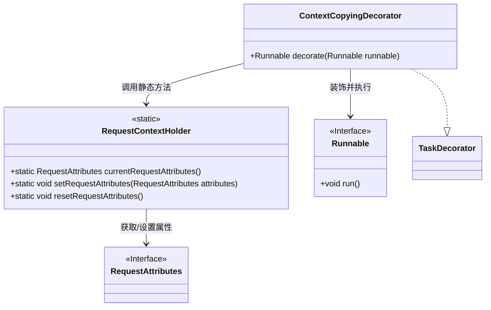
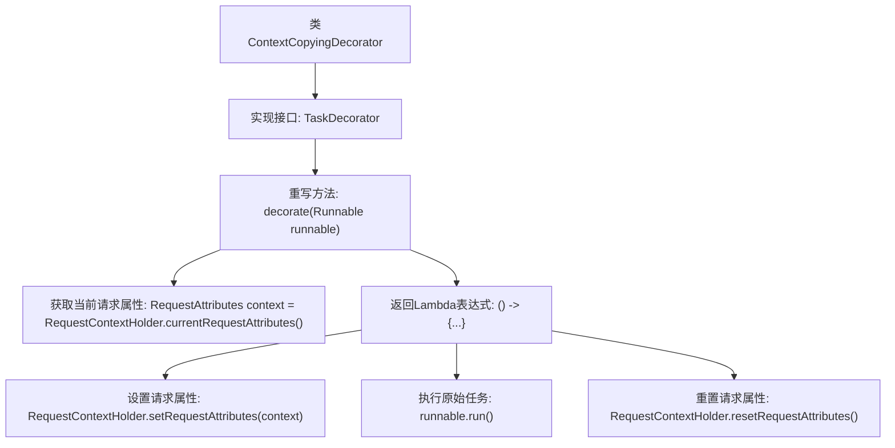

# 基础信息

|      |      |
|------|------|
| 名称 | ContextCopyingDecorator |
| 编码语言 | .java |
| 代码路径 | staffjoy/common-lib/src/main/java/xyz/staffjoy/common/async/ContextCopyingDecorator.java |
| 包名 | xyz.staffjoy.common.async |
| 依赖项 | ['org.springframework.core.task.TaskDecorator', 'org.springframework.web.context.request.RequestAttributes', 'org.springframework.web.context.request.RequestContextHolder'] |
| 概述说明 | Java类实现线程上下文复制装饰器，确保异步任务继承当前请求属性。 |

# 说明

这段内容描述了一个名为ContextCopyingDecorator的类，实现了TaskDecorator接口。它的核心功能是在多线程环境中复制请求上下文。具体实现是通过重写decorate方法，先获取当前线程的请求属性，然后在新的Runnable任务执行前设置这些属性，任务完成后重置属性。这确保了异步任务能访问原始请求的上下文信息。

# 类列表 Class Summary

| 名称   | 类型  | 说明 |
|-------|------|-------------|
| ContextCopyingDecorator | class | 上下文复制装饰器，实现任务装饰接口，复制请求属性并在执行后重置。 |

## 类 ContextCopyingDecorator

|      |      |
|------|------|
| 访问范围 | public |
| 类型 | class |
| 名称 | ContextCopyingDecorator |
| 说明 | 上下文复制装饰器，实现任务装饰接口，复制请求属性并在执行后重置。 |

### UML类图

这段代码展示了一个上下文复制装饰器模式实现，其中ContextCopyingDecorator实现了TaskDecorator接口，用于包装Runnable任务。核心功能是通过RequestContextHolder捕获当前线程的请求属性（RequestAttributes），在异步任务执行时临时恢复上下文，确保线程安全。类图清晰地呈现了静态工具类RequestContextHolder与接口RequestAttributes、Runnable的协作关系，以及装饰器模式的结构特征。

### 内部方法调用关系图

这段代码展示了一个上下文复制装饰器，用于在多线程环境中传递请求上下文。核心流程是：获取当前线程的请求属性，创建新Runnable时先设置该属性，执行原始任务后重置属性。通过finally块确保属性始终被清理，避免内存泄漏。该设计常用于异步任务处理场景，如Spring的@Async方法调用。

### 字段列表 Field List

| 名称  | 类型  | 说明 |
|-------|-------|------|

### 方法列表 Method List

| 名称  | 类型  | 说明 |
|-------|-------|------|
| decorate | Runnable | 重写Runnable装饰器，保存并恢复请求上下文。 |

