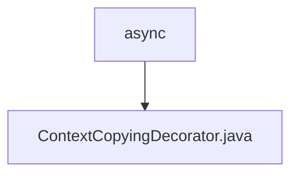

# 基础信息

|      |      |
|------|------|
| 名称 | async |
| 编码语言 | .java |
| 代码路径 | staffjoy/common-lib/src/main/java/xyz/staffjoy/common/async |
| 包名 | staffjoy.docs.common-lib.src.main.java.xyz.staffjoy.common.async |
| 概述说明 | Java类实现线程上下文复制装饰器，确保异步任务继承当前请求属性。 |

# 说明

这段内容描述了一个名为ContextCopyingDecorator的类，实现了TaskDecorator接口。它的核心功能是在多线程环境中复制请求上下文。具体实现是通过重写decorate方法，先获取当前线程的请求属性，然后在新的Runnable任务执行前设置这些属性，任务完成后重置属性。这确保了异步任务能访问原始请求的上下文信息。

### 包内部结构视图

该流程图展示了`staffjoy/common-lib`项目中`common/async`目录的层级结构。顶层节点为`async`文件夹，其下包含一个Java文件`ContextCopyingDecorator.java`。这种结构表明该目录可能用于存放异步处理相关的工具类，而`ContextCopyingDecorator.java`很可能是实现线程上下文传递功能的核心组件。整个结构简洁清晰，符合常见Java库的模块化组织方式。

# 文件列表 File List

| 名称   | 类型  | 说明 |
|-------|------|-------------|
| [ContextCopyingDecorator.java](ContextCopyingDecorator.md) | file | Java类实现线程上下文复制装饰器，确保异步任务继承当前请求属性。 |

