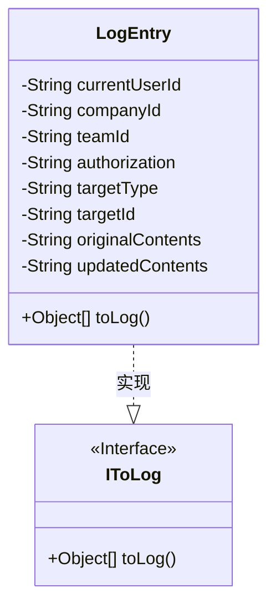
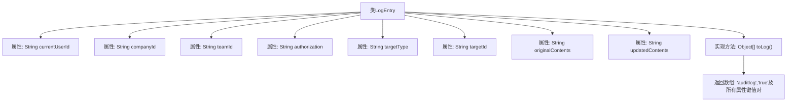

# 基础信息

|      |      |
|------|------|
| 名称 | LogEntry |
| 编码语言 | .java |
| 代码路径 | staffjoy/common-lib/src/main/java/xyz/staffjoy/common/auditlog/LogEntry.java |
| 包名 | xyz.staffjoy.common.auditlog |
| 依赖项 | ['com.github.structlog4j.IToLog', 'lombok.Builder', 'lombok.Data'] |
| 概述说明 | 日志记录类，包含用户、公司、团队、授权及目标信息，实现日志转换方法。 |

# 说明

该内容定义了一个名为LogEntry的Java类，用于记录审计日志信息。类使用了@Data和@Builder注解，实现了IToLog接口。包含的字段有当前用户ID、公司ID、团队ID、授权信息、目标类型、目标ID、原始内容和更新内容。重写的toLog方法将这些字段转换为键值对数组返回，其中第一个键值对固定为"auditlog"和"true"。整个类设计用于结构化地记录系统操作变更的详细信息。

# 类列表 Class Summary

| 名称   | 类型  | 说明 |
|-------|------|-------------|
| LogEntry | class | LogEntry类记录审计日志，包含用户、公司、团队、授权、目标类型和内容变更信息。 |

## 类 LogEntry

|      |      |
|------|------|
| 访问范围 | @Data;@Builder;public |
| 类型 | class |
| 名称 | LogEntry |
| 说明 | LogEntry类记录审计日志，包含用户、公司、团队、授权、目标类型和内容变更信息。 |

### UML类图

该类图展示了一个日志记录系统核心结构，其中LogEntry类实现了IToLog接口。LogEntry包含8个私有字符串字段，用于存储用户ID、公司/团队ID、授权信息、操作目标类型/ID以及内容变更前后的数据。核心方法toLog()将字段值转换为键值对数组，便于生成结构化日志。通过Builder模式构建对象，符合审计日志场景需要灵活构造的需求。

### 内部方法调用关系图

该流程图展示了LogEntry类的结构，包含8个String类型属性和一个实现IToLog接口的toLog方法。toLog方法返回包含固定审计标记和所有属性键值对的Object数组，用于日志记录。类使用Lombok的@Data和@Builder注解，暗示其具有自动生成的getter/setter和建造者模式功能。整个设计专注于审计日志数据的结构化存储和标准化输出。

### 字段列表 Field List

| 名称  | 类型  | 说明 |
|-------|-------|------|
| updatedContents | String | 更新后的内容字符串 |
| originalContents | String | 私有字符串变量originalContents |
| currentUserId | String | 私有字符串变量currentUserId。 |
| teamId | String | 私有字符串变量teamId |
| targetType | String | 私有字符串变量targetType |
| targetId | String | 私有字符串变量targetId |
| companyId | String | 私有字符串变量companyId |
| authorization | String | 私有授权字符串变量。 |

### 方法列表 Method List

| 名称  | 类型  | 说明 |
|-------|-------|------|
| toLog | Object[] | 审计日志方法，记录用户、公司、团队及操作内容等关键信息。 |

