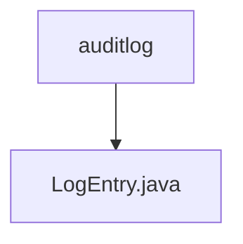

# 基础信息

|      |      |
|------|------|
| 名称 | auditlog |
| 编码语言 | .java |
| 代码路径 | staffjoy/common-lib/src/main/java/xyz/staffjoy/common/auditlog |
| 包名 | staffjoy.docs.common-lib.src.main.java.xyz.staffjoy.common.auditlog |
| 概述说明 | 日志记录类，包含用户、公司、团队、授权及目标信息，实现日志转换方法。 |

# 说明

该内容定义了一个名为LogEntry的Java类，用于记录审计日志信息。类使用了@Data和@Builder注解，实现了IToLog接口。包含的字段有当前用户ID、公司ID、团队ID、授权信息、目标类型、目标ID、原始内容和更新内容。重写的toLog方法将这些字段转换为键值对数组返回，其中第一个键值对固定为"auditlog"和"true"。整个类设计用于结构化地记录系统操作变更的详细信息。

### 包内部结构视图

该流程图展示了common-lib项目中auditlog包与LogEntry.java文件之间的层级关系。auditlog作为父级目录，包含一个具体的Java类文件LogEntry.java，这种结构是典型的企业级项目中用于存放审计日志相关代码的组织方式，体现了清晰的代码分层设计思想。

# 文件列表 File List

| 名称   | 类型  | 说明 |
|-------|------|-------------|
| [LogEntry.java](LogEntry.md) | file | 日志记录类，包含用户、公司、团队、授权及目标信息，实现日志转换方法。 |

