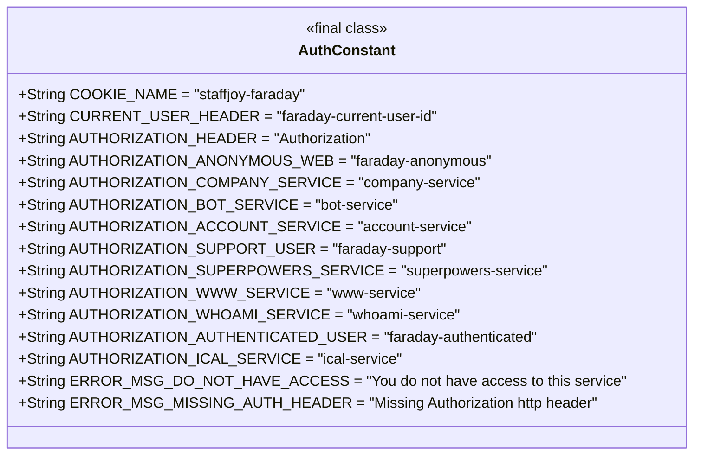

# 基础信息

|      |      |
|------|------|
| 名称 | AuthConstant |
| 编码语言 | .java |
| 代码路径 | staffjoy/common-lib/src/main/java/xyz/staffjoy/common/auth/AuthConstant.java |
| 包名 | xyz.staffjoy.common.auth |
| 依赖项 | [] |
| 概述说明 | 认证常量类，定义Cookie名、用户ID头、授权头及各类服务认证标识和错误信息。 |

# 说明

AuthConstant类定义了多个认证相关的常量，包括Cookie名称、HTTP请求头标识和错误消息。关键常量包括用于内部用户ID的CURRENT_USER_HEADER、授权请求头AUTHORIZATION_HEADER，以及不同服务（如公司服务、账户服务、机器人服务等）的特定授权标识。还包含匿名用户、认证用户和支持团队成员的标识符。错误消息涉及无访问权限和缺少授权头的情况。这些常量用于系统内部的身份验证和授权管理。

# 类列表 Class Summary

| 名称   | 类型  | 说明 |
|-------|------|-------------|
| AuthConstant | class | 认证常量类，定义Cookie名、用户ID头、授权头及服务标识，包含错误消息。 |

## 类 AuthConstant

|      |      |
|------|------|
| 访问范围 | public |
| 类型 | class |
| 名称 | AuthConstant |
| 说明 | 认证常量类，定义Cookie名、用户ID头、授权头及服务标识，包含错误消息。 |

### UML类图

AuthConstant 是一个包含常量的 final 类，主要用于存储与认证相关的 HTTP 头部字段、Cookie 名称以及错误消息。这些常量定义了不同服务（如公司服务、机器人服务、账户服务等）的认证标识，以及匿名用户、认证用户和支持团队成员的标识。此外，还包含了认证错误时的提示信息，如缺少认证头部或无访问权限的错误消息。该类不包含任何方法，仅作为静态常量的容器使用。

### 内部方法调用关系图

```mermaid
graph TD
    A["类AuthConstant"]
    B["常量: COOKIE_NAME = 'staffjoy-faraday'"]
    C["常量: CURRENT_USER_HEADER = 'faraday-current-user-id'"]
    D["常量: AUTHORIZATION_HEADER = 'Authorization'"]
    E["常量: AUTHORIZATION_ANONYMOUS_WEB = 'faraday-anonymous'"]
    F["常量: AUTHORIZATION_COMPANY_SERVICE = 'company-service'"]
    G["常量: AUTHORIZATION_BOT_SERVICE = 'bot-service'"]
    H["常量: AUTHORIZATION_ACCOUNT_SERVICE = 'account-service'"]
    I["常量: AUTHORIZATION_SUPPORT_USER = 'faraday-support'"]
    J["常量: AUTHORIZATION_SUPERPOWERS_SERVICE = 'superpowers-service'"]
    K["常量: AUTHORIZATION_WWW_SERVICE = 'www-service'"]
    L["常量: AUTHORIZATION_WHOAMI_SERVICE = 'whoami-service'"]
    M["常量: AUTHORIZATION_AUTHENTICATED_USER = 'faraday-authenticated'"]
    N["常量: AUTHORIZATION_ICAL_SERVICE = 'ical-service'"]
    O["常量: ERROR_MSG_DO_NOT_HAVE_ACCESS = 'You do not have access to this service'"]
    P["常量: ERROR_MSG_MISSING_AUTH_HEADER = 'Missing Authorization http header'"]

    A --> B
    A --> C
    A --> D
    A --> E
    A --> F
    A --> G
    A --> H
    A --> I
    A --> J
    A --> K
    A --> L
    A --> M
    A --> N
    A --> O
    A --> P
```

这段代码定义了一个名为AuthConstant的类，其中包含了一系列与认证相关的静态常量字符串。这些常量主要用于设置HTTP请求头、标识不同类型的用户和服务，以及定义错误消息。例如，COOKIE_NAME定义了cookie的名称，CURRENT_USER_HEADER用于标识当前用户ID的请求头，而AUTHORIZATION_HEADER则用于授权请求头。此外，代码还定义了各种服务的授权标识，如公司服务、机器人服务、账户服务等，以及相应的错误消息。这些常量为系统的认证和授权机制提供了统一的配置和错误处理。

### 字段列表 Field List

| 名称  | 类型  | 说明 |
|-------|-------|------|
| CURRENT_USER_HEADER = "faraday-current-user-id" | String | 常量CURRENT_USER_HEADER存储当前用户ID的HTTP头字段名。 |
| AUTHORIZATION_WWW_SERVICE = "www-service" | String | 定义常量AUTHORIZATION_WWW_SERVICE，值为"www-service"。 |
| ERROR_MSG_DO_NOT_HAVE_ACCESS = "You do not have access to this service" | String | 无权限访问此服务 |
| AUTHORIZATION_ACCOUNT_SERVICE = "account-service" | String | 定义常量AUTHORIZATION_ACCOUNT_SERVICE值为account-service。 |
| AUTHORIZATION_SUPERPOWERS_SERVICE = "superpowers-service" | String | 定义常量字符串AUTHORIZATION_SUPERPOWERS_SERVICE，值为"superpowers-service"。 |
| AUTHORIZATION_HEADER = "Authorization" | String | 定义常量字符串"AUTHORIZATION_HEADER"，值为"Authorization"。 |
| AUTHORIZATION_SUPPORT_USER = "faraday-support" | String | 常量AUTHORIZATION_SUPPORT_USER值为faraday-support |
| AUTHORIZATION_ICAL_SERVICE = "ical-service" | String | 授权服务标识为ical-service |
| AUTHORIZATION_COMPANY_SERVICE = "company-service" | String | 常量AUTHORIZATION_COMPANY_SERVICE值为"company-service"。 |
| COOKIE_NAME = "staffjoy-faraday" | String | 静态常量字符串，定义cookie名称为staffjoy-faraday。 |
| AUTHORIZATION_AUTHENTICATED_USER = "faraday-authenticated" | String | 常量定义认证用户标识为"faraday-authenticated"。 |
| AUTHORIZATION_BOT_SERVICE = "bot-service" | String | 定义常量字符串AUTHORIZATION_BOT_SERVICE值为"bot-service"。 |
| AUTHORIZATION_ANONYMOUS_WEB = "faraday-anonymous" | String | 匿名网页授权标识符。 |
| AUTHORIZATION_WHOAMI_SERVICE = "whoami-service" | String | 定义常量AUTHORIZATION_WHOAMI_SERVICE值为"whoami-service"。 |
| ERROR_MSG_MISSING_AUTH_HEADER = "Missing Authorization http header" | String | 缺少Authorization请求头 |

### 方法列表 Method List

| 名称  | 类型  | 说明 |
|-------|-------|------|

