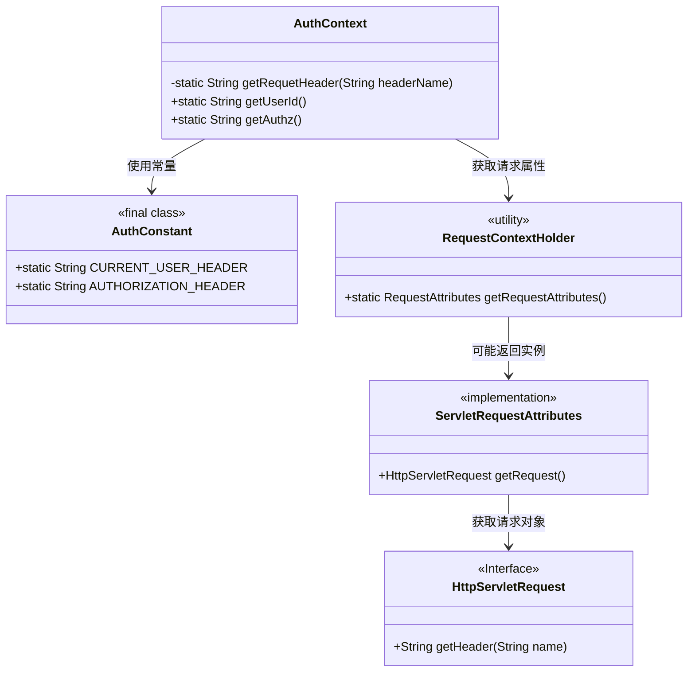
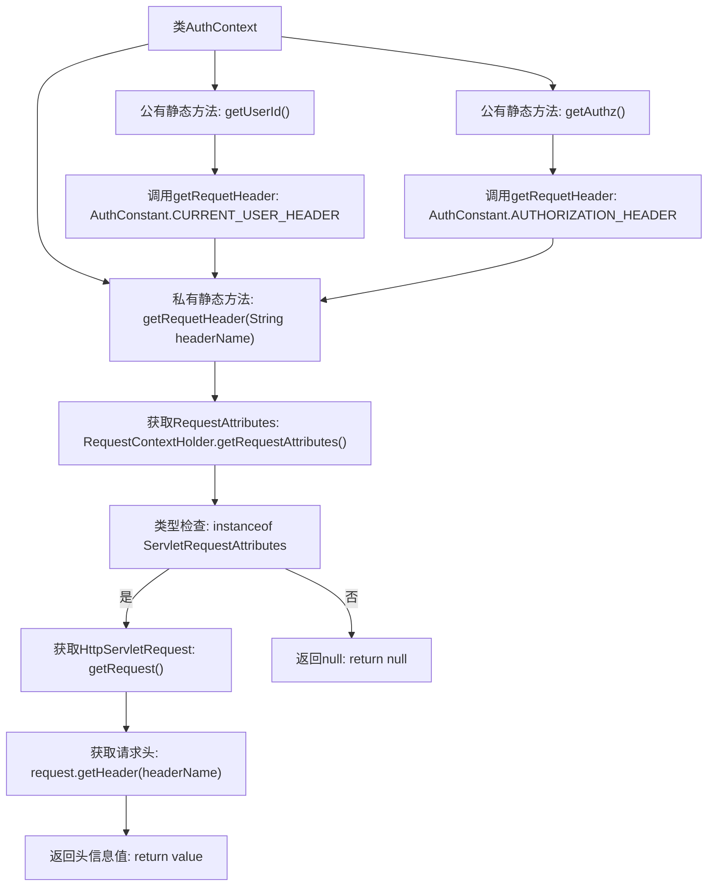

# 基础信息

|      |      |
|------|------|
| 名称 | AuthContext |
| 编码语言 | .java |
| 代码路径 | staffjoy/common-lib/src/main/java/xyz/staffjoy/common/auth/AuthContext.java |
| 包名 | xyz.staffjoy.common.auth |
| 依赖项 | ['org.springframework.util.StringUtils', 'org.springframework.web.context.request.RequestAttributes', 'org.springframework.web.context.request.RequestContextHolder', 'org.springframework.web.context.request.ServletRequestAttributes', 'javax.servlet.http.HttpServletRequest'] |
| 概述说明 | AuthContext类提供获取请求头和用户认证信息的方法。 |

# 说明

AuthContext类提供了静态方法获取HTTP请求头信息。getRequetHeader方法通过RequestContextHolder获取当前请求属性，若为ServletRequestAttributes则提取指定请求头值。getUserId和getAuthz方法分别调用getRequetHeader，获取用户ID和授权头信息，使用AuthConstant中定义的常量作为头名称。若请求属性无效则返回null。

# 类列表 Class Summary

| 名称   | 类型  | 说明 |
|-------|------|-------------|
| AuthContext | class | AuthContext类提供获取请求头中用户ID和授权信息的方法。 |

## 类 AuthContext

|      |      |
|------|------|
| 访问范围 | public |
| 类型 | class |
| 名称 | AuthContext |
| 说明 | AuthContext类提供获取请求头中用户ID和授权信息的方法。 |

### UML类图

这段类图展示了AuthContext工具类的静态方法结构及其依赖关系。AuthContext通过RequestContextHolder获取当前请求属性，若为ServletRequestAttributes类型则进一步获取HttpServletRequest对象读取请求头。它依赖AuthConstant提供的头部字段常量，封装了获取用户ID和授权信息的快捷方法。整个设计采用静态工具类模式，与Servlet API紧密耦合，适用于基于HTTP请求的认证上下文管理场景。

### 内部方法调用关系图

该流程图描述了AuthContext类的核心逻辑，主要包含三个静态方法：getRequetHeader是私有方法，通过RequestContextHolder获取当前请求头信息；getUserId和getAuthz是公有方法，分别调用getRequetHeader获取特定请求头。流程展示了从获取请求属性、类型检查到最终返回头信息的完整路径，以及两个公有方法对私有方法的调用关系。所有方法均采用静态方式实现，适用于全局身份验证上下文场景。

### 字段列表 Field List

| 名称  | 类型  | 说明 |
|-------|-------|------|

### 方法列表 Method List

| 名称  | 类型  | 说明 |
|-------|-------|------|
| getRequetHeader | String | 获取HTTP请求头的方法，若无则返回null。 |
| getUserId | String | 静态方法获取请求头中的用户ID。 |
| getAuthz | String | 获取请求头中的授权信息。 |

