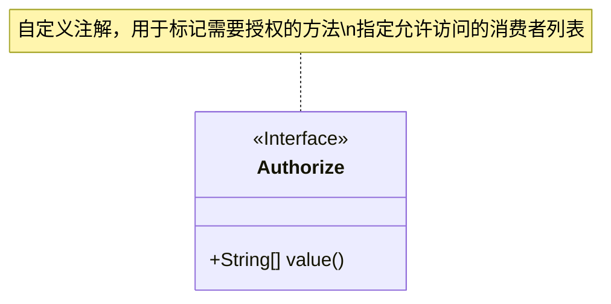
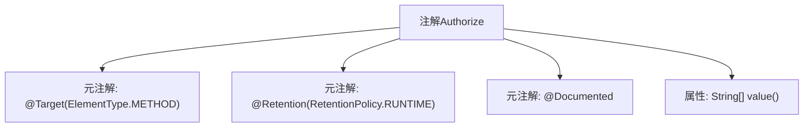

# 基础信息

|      |      |
|------|------|
| 名称 | Authorize |
| 编码语言 | .java |
| 代码路径 | staffjoy/common-lib/src/main/java/xyz/staffjoy/common/auth/Authorize.java |
| 包名 | xyz.staffjoy.common.auth |
| 依赖项 | ['java.lang.annotation'] |
| 概述说明 | Java注解Authorize定义运行时方法权限控制，含允许的消费者数组参数。 |

# 说明

这是一个Java注解定义，名为`Authorize`，用于标记方法级别的授权控制。注解使用`@Target(ElementType.METHOD)`指定其仅能应用于方法，`@Retention(RetentionPolicy.RUNTIME)`表示注解在运行时保留，`@Documented`说明该注解会被包含在Javadoc中。注解包含一个名为`value`的字符串数组参数，用于指定允许访问该方法的消费者列表。

# 类列表 Class Summary

| 名称   | 类型  | 说明 |
|-------|------|-------------|
| Authorize | annotation | Java注解@Authorize定义方法权限，指定允许的调用者列表。 |

## 类 Authorize

|      |      |
|------|------|
| 访问范围 | @Target(ElementType.METHOD);@Retention(RetentionPolicy.RUNTIME);@Documented;public |
| 类型 | annotation |
| 名称 | Authorize |
| 说明 | Java注解@Authorize定义方法权限，指定允许的调用者列表。 |

### UML类图

这段代码定义了一个名为Authorize的Java注解接口，用于方法级别的授权控制。该注解具有一个名为value的字符串数组属性，用于指定允许访问该方法的消费者列表。注解使用了@Target(ElementType.METHOD)表示它只能应用于方法上，@Retention(RetentionPolicy.RUNTIME)表示注解会在运行时保留，@Documented表示它应该被包含在Javadoc中。这个注解通常用于实现基于角色的访问控制(RBAC)或权限验证机制。

### 内部方法调用关系图

该流程图展示了Java注解`@Authorize`的结构定义，包含三个元注解（指定注解作用目标为方法、保留至运行时、包含在JavaDoc中）和一个可配置的字符串数组属性。这种注解通常用于权限控制场景，通过标注方法级别的访问权限要求，运行时可通过反射获取注解值进行鉴权逻辑判断。

### 字段列表 Field List

| 名称  | 类型  | 说明 |
|-------|-------|------|
| value | String[] | {{value[0]}} |

### 方法列表 Method List

| 名称  | 类型  | 说明 |
|-------|-------|------|

