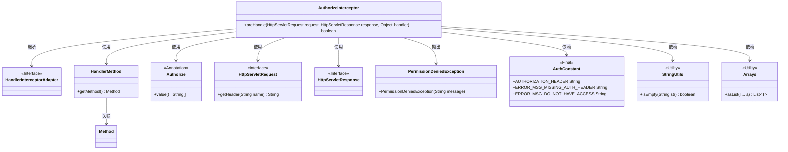
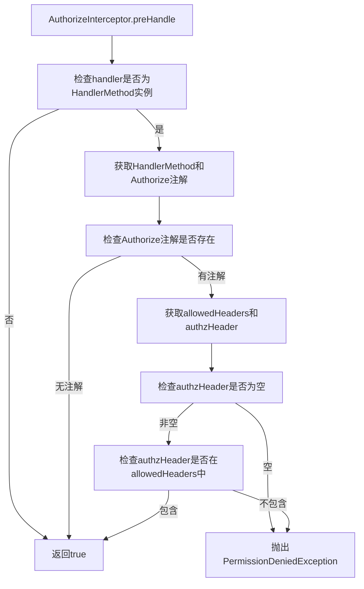

# 基础信息

|      |      |
|------|------|
| 名称 | AuthorizeInterceptor |
| 编码语言 | .java |
| 代码路径 | staffjoy/common-lib/src/main/java/xyz/staffjoy/common/auth/AuthorizeInterceptor.java |
| 包名 | xyz.staffjoy.common.auth |
| 依赖项 | ['org.springframework.util.StringUtils', 'org.springframework.web.method.HandlerMethod', 'org.springframework.web.servlet.handler.HandlerInterceptorAdapter', 'javax.servlet.http.HttpServletRequest', 'javax.servlet.http.HttpServletResponse', 'java.util.Arrays'] |
| 概述说明 | 拦截器检查授权头，无权限抛出异常。 |

# 说明

这是一个基于Spring框架的授权拦截器实现，继承自HandlerInterceptorAdapter类。该拦截器在请求处理前进行权限验证，主要逻辑在preHandle方法中。首先检查handler是否为HandlerMethod类型，否则直接放行。然后获取方法上的Authorize注解，若无注解也直接放行。接着从请求头获取授权信息，若缺失则抛出权限异常。最后验证请求头中的授权信息是否在注解允许的范围内，不在范围内同样抛出权限异常。验证通过则返回true继续后续处理。

# 类列表 Class Summary

| 名称   | 类型  | 说明 |
|-------|------|-------------|
| AuthorizeInterceptor | class | 拦截器检查授权头，缺失或无效则拒绝访问。 |

## 类 AuthorizeInterceptor

|      |      |
|------|------|
| 访问范围 | public |
| 类型 | class |
| 名称 | AuthorizeInterceptor |
| 说明 | 拦截器检查授权头，缺失或无效则拒绝访问。 |

### UML类图

这段代码展示了一个基于Spring拦截器的权限验证机制。AuthorizeInterceptor继承HandlerInterceptorAdapter，通过检查方法上的@Authorize注解和请求头中的Authorization字段进行权限控制。当缺少授权头或权限不匹配时抛出PermissionDeniedException。类图清晰地呈现了拦截器与Servlet API、工具类以及自定义常量的交互关系，体现了典型的AOP权限验证模式。

### 内部方法调用关系图

这段代码是一个Spring拦截器，用于处理授权逻辑。流程图展示了完整的授权验证流程：首先检查handler类型，然后获取方法上的Authorize注解，接着验证请求头中的授权信息是否匹配注解允许的值。任何验证失败都会抛出权限异常，全部通过则返回true允许请求继续。该流程确保了只有携带正确授权头的请求才能访问受保护的方法。

### 字段列表 Field List

| 名称  | 类型  | 说明 |
|-------|-------|------|

### 方法列表 Method List

| 名称  | 类型  | 说明 |
|-------|-------|------|
| preHandle | boolean | 检查请求授权头，无权限抛出异常。 |

