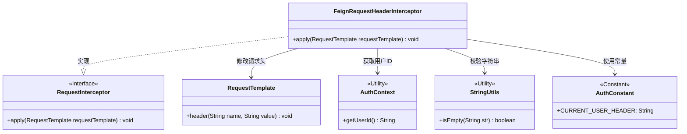
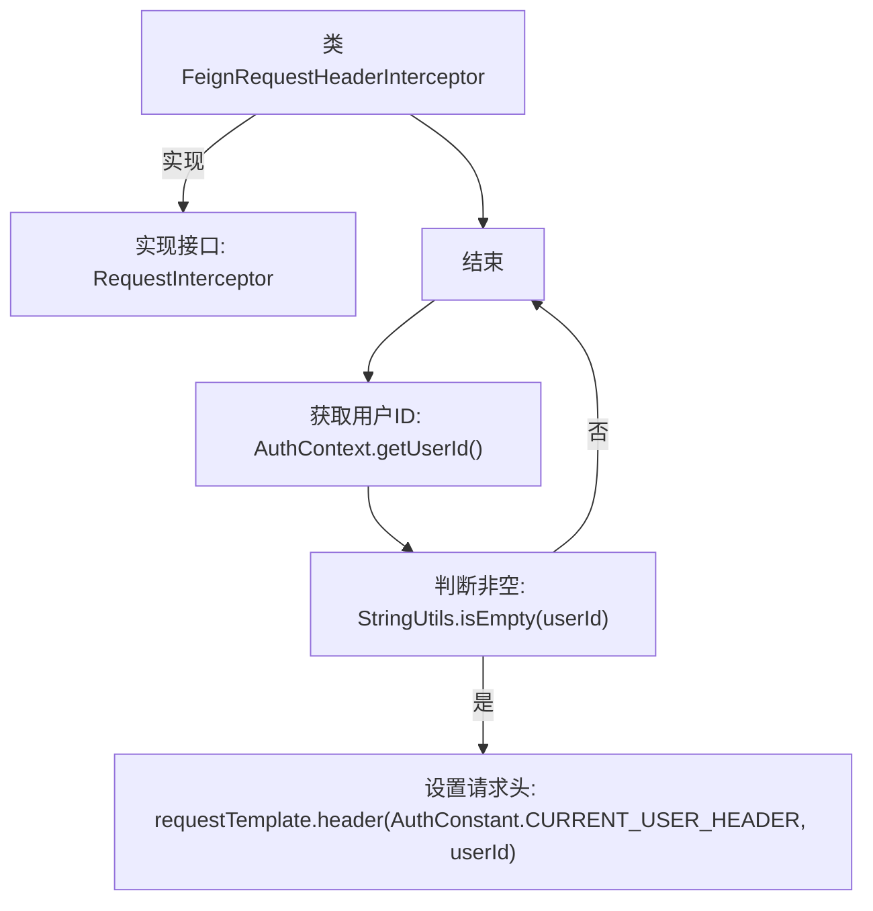

# 基础信息

|      |      |
|------|------|
| 名称 | FeignRequestHeaderInterceptor |
| 编码语言 | .java |
| 代码路径 | staffjoy/common-lib/src/main/java/xyz/staffjoy/common/auth/FeignRequestHeaderInterceptor.java |
| 包名 | xyz.staffjoy.common.auth |
| 依赖项 | ['feign.RequestInterceptor', 'feign.RequestTemplate', 'org.springframework.util.StringUtils'] |
| 概述说明 | Feign请求拦截器，添加用户ID到请求头。 |

# 说明

这段内容描述了一个名为FeignRequestHeaderInterceptor的Java类，实现了RequestInterceptor接口。该类的主要功能是在请求模板中添加用户ID头信息。具体逻辑是：通过AuthContext获取当前用户ID，若ID非空则将其添加到请求头中，使用的头字段名为AuthConstant.CURRENT_USER_HEADER。该拦截器用于在Feign客户端请求时自动传递用户身份信息。

# 类列表 Class Summary

| 名称   | 类型  | 说明 |
|-------|------|-------------|
| FeignRequestHeaderInterceptor | class | Feign请求拦截器，添加用户ID到请求头。 |

## 类 FeignRequestHeaderInterceptor

|      |      |
|------|------|
| 访问范围 | public |
| 类型 | class |
| 名称 | FeignRequestHeaderInterceptor |
| 说明 | Feign请求拦截器，添加用户ID到请求头。 |

### UML类图

这段代码展示了一个Feign请求头拦截器的实现。FeignRequestHeaderInterceptor类实现了RequestInterceptor接口，在apply方法中通过AuthContext获取当前用户ID，并使用StringUtils校验后，将用户ID添加到RequestTemplate的请求头中。类图清晰地展示了拦截器与工具类（AuthContext、StringUtils）、常量类（AuthConstant）以及Feign核心类（RequestTemplate）之间的协作关系，体现了典型的拦截器模式实现。

### 内部方法调用关系图

这段代码流程图展示了Feign请求头拦截器的核心逻辑。首先类实现了RequestInterceptor接口并重写了apply方法，在方法中通过AuthContext获取用户ID，当ID非空时将其添加到请求头中。该拦截器主要用于在Feign客户端调用时自动传递当前用户身份信息，实现了微服务间调用的用户上下文透明传递，典型应用于基于Token的认证体系。

### 字段列表 Field List

| 名称  | 类型  | 说明 |
|-------|-------|------|

### 方法列表 Method List

| 名称  | 类型  | 说明 |
|-------|-------|------|
| apply | void | 重写apply方法，为请求模板添加用户ID请求头。 |

