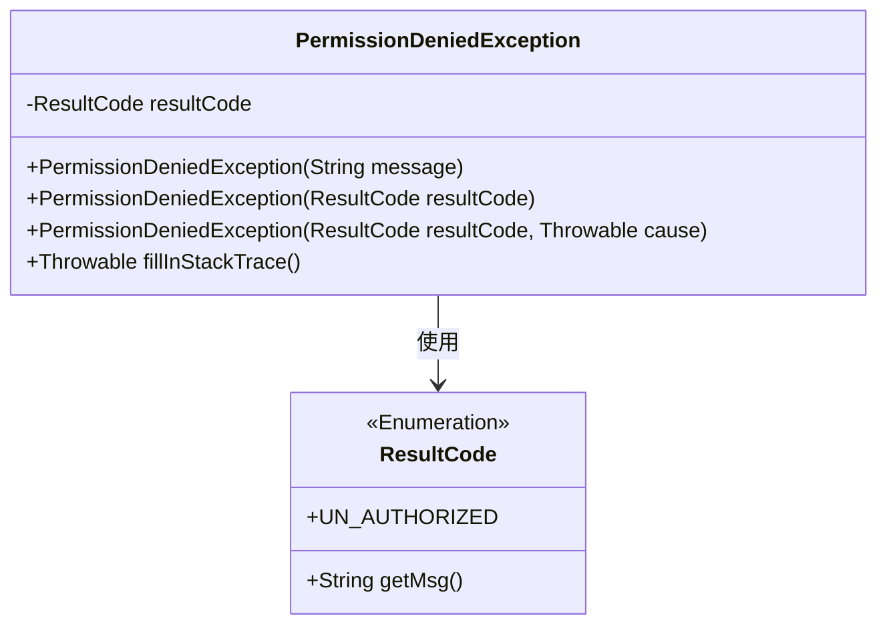
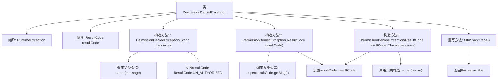

# 基础信息

|      |      |
|------|------|
| 名称 | PermissionDeniedException |
| 编码语言 | .java |
| 代码路径 | staffjoy/common-lib/src/main/java/xyz/staffjoy/common/auth/PermissionDeniedException.java |
| 包名 | xyz.staffjoy.common.auth |
| 依赖项 | ['lombok.Getter', 'xyz.staffjoy.common.api.ResultCode'] |
| 概述说明 | 权限拒绝异常类，继承运行时异常，含结果码属性，支持多种构造方式。 |

# 说明

这是一个名为PermissionDeniedException的自定义异常类，继承自RuntimeException。该类包含一个ResultCode类型的私有字段resultCode，并通过@Getter注解提供访问方法。提供了三个构造函数：第一个接受字符串message参数，默认设置resultCode为ResultCode.UN_AUTHORIZED；第二个接受ResultCode参数，使用其消息作为异常信息；第三个接受ResultCode和Throwable参数，将Throwable作为异常原因。重写了fillInStackTrace方法，直接返回当前异常实例而不填充堆栈跟踪。

# 类列表 Class Summary

| 名称   | 类型  | 说明 |
|-------|------|-------------|
| PermissionDeniedException | class | 权限异常类，继承运行时异常，含结果码，支持多种构造方式。 |

## 类 PermissionDeniedException

|      |      |
|------|------|
| 访问范围 | public |
| 类型 | class |
| 名称 | PermissionDeniedException |
| 说明 | 权限异常类，继承运行时异常，含结果码，支持多种构造方式。 |

### UML类图

这段代码定义了一个`PermissionDeniedException`异常类，继承自`RuntimeException`。该类包含一个`ResultCode`枚举类型的私有字段，提供了三种构造方法分别接受不同参数组合，并重写了`fillInStackTrace()`方法以优化性能。`ResultCode`是一个枚举类型，提供了错误码和消息的映射关系。该类主要用于处理权限不足时的异常情况，通过`ResultCode`可以精确标识异常类型。

### 内部方法调用关系图

这段代码定义了一个自定义异常类PermissionDeniedException，继承自RuntimeException。该类包含三个构造方法，分别用于不同场景的异常创建：仅包含错误消息、包含预定义的ResultCode枚举、以及包含ResultCode和原始异常原因。通过@Getter注解自动生成resultCode的getter方法，并重写了fillInStackTrace()方法以提高性能。流程图清晰展示了类继承关系、属性定义、构造方法逻辑和重写方法的调用路径。

### 字段列表 Field List

| 名称  | 类型  | 说明 |
|-------|-------|------|
| resultCode | ResultCode | 私有只读结果码字段。 |

### 方法列表 Method List

| 名称  | 类型  | 说明 |
|-------|-------|------|
| fillInStackTrace | Throwable | 重写fillInStackTrace方法，直接返回当前对象，不记录堆栈跟踪。 |

