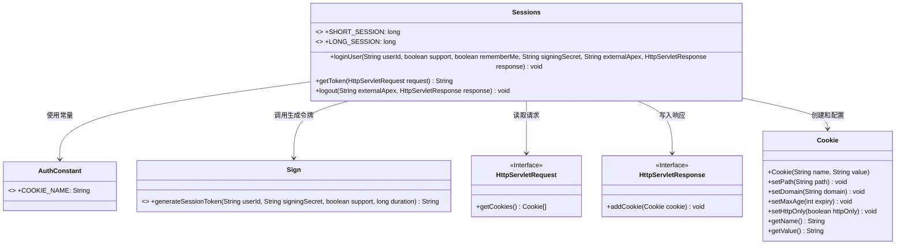
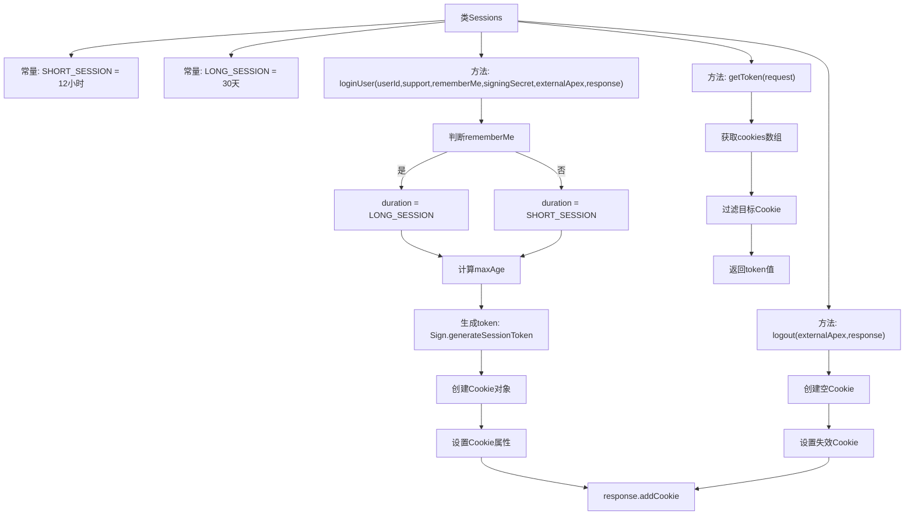

# 基础信息

|      |      |
|------|------|
| 名称 | Sessions |
| 编码语言 | .java |
| 代码路径 | staffjoy/common-lib/src/main/java/xyz/staffjoy/common/auth/Sessions.java |
| 包名 | xyz.staffjoy.common.auth |
| 依赖项 | ['xyz.staffjoy.common.crypto.Sign', 'javax.servlet.http.Cookie', 'javax.servlet.http.HttpServletRequest', 'javax.servlet.http.HttpServletResponse', 'java.util.Arrays', 'java.util.concurrent.TimeUnit'] |
| 概述说明 | 会话管理类，含登录、注销及令牌获取功能，支持长短会话设置。 |

# 说明

该代码定义了一个会话管理类Sessions，包含三个主要功能。首先定义了两个会话时长常量：SHORT_SESSION为12小时，LONG_SESSION为30天。loginUser方法根据rememberMe参数选择会话时长，生成加密令牌并设置HTTP-only的Cookie。getToken方法从请求中提取令牌。logout方法通过设置过期时间0来清除Cookie。所有Cookie操作都指定路径和域名。

# 类列表 Class Summary

| 名称   | 类型  | 说明 |
|-------|------|-------------|
| Sessions | class | 会话管理类，含登录、登出及令牌获取功能，支持长短会话设置。 |

## 类 Sessions

|      |      |
|------|------|
| 访问范围 | public |
| 类型 | class |
| 名称 | Sessions |
| 说明 | 会话管理类，含登录、登出及令牌获取功能，支持长短会话设置。 |

### UML类图

这段代码实现了一个会话管理系统，主要提供用户登录、令牌获取和注销功能。Sessions类包含三个核心方法：loginUser根据rememberMe标志设置不同时效的会话Cookie，getToken从请求中提取认证令牌，logout通过设置MaxAge=0使Cookie失效。类图中清晰展示了与Cookie、签名工具类以及HTTP请求/响应接口的交互关系，体现了会话管理的完整生命周期控制能力。

### 内部方法调用关系图

流程图描述了Sessions类的完整功能流程。loginUser方法根据rememberMe标志选择会话时长，生成加密token并设置Cookie；getToken方法从请求中提取认证Cookie；logout方法通过设置MaxAge=0使Cookie失效。所有操作都围绕HTTP Cookie管理展开，实现了用户会话的生命周期控制，包含12小时短期会话和30天长期会话两种模式。

### 字段列表 Field List

| 名称  | 类型  | 说明 |
|-------|-------|------|
| SHORT_SESSION = TimeUnit.HOURS.toMillis(12) | long | 定义12小时毫秒数的静态常量SHORT_SESSION。 |
| LONG_SESSION = TimeUnit.HOURS.toMillis(30 * 24) | long | 定义30天长会话的毫秒时长常量。 |

### 方法列表 Method List

| 名称  | 类型  | 说明 |
|-------|-------|------|
| loginUser | void | 用户登录方法，生成会话令牌并设置Cookie，支持记住我功能。 |
| getToken | String | 从HTTP请求的Cookies中获取指定名称的token值。 |
| logout | void | Java方法：清除指定域名的认证cookie。 |

