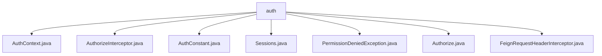

# 基础信息

|      |      |
|------|------|
| 名称 | auth |
| 编码语言 | .java |
| 代码路径 | staffjoy/common-lib/src/main/java/xyz/staffjoy/common/auth |
| 包名 | staffjoy.docs.common-lib.src.main.java.xyz.staffjoy.common.auth |
| 概述说明 | AuthContext类获取请求头信息。AuthorizeInterceptor实现权限验证。AuthConstant定义认证常量。Sessions管理会话。PermissionDeniedException自定义异常。Authorize注解控制方法权限。FeignRequestHeaderInterceptor添加用户ID头。 |

# 说明

# 授权认证模块总结

## 概述
该模块是一个基于Spring框架的授权认证系统，提供了一套完整的身份验证和权限控制解决方案。主要功能包括请求头信息提取、权限拦截验证、会话管理、Feign客户端请求头传递等。模块通过注解驱动的方式实现细粒度的权限控制，并定义了标准化的认证常量和异常处理机制。

## 主要业务场景
1. **请求头信息处理**：通过AuthContext类获取HTTP请求头中的用户ID和授权信息，为系统提供当前用户身份识别能力。
2. **权限拦截验证**：AuthorizeInterceptor实现请求预处理拦截，检查方法上的@Authorize注解并验证请求头中的授权信息是否匹配。
3. **会话管理**：Sessions类提供用户登录、令牌生成和会话时长管理功能，支持短期(12小时)和长期(30天)两种会话模式。
4. **Feign客户端集成**：FeignRequestHeaderInterceptor自动将用户ID添加到Feign客户端请求头中，实现微服务间的用户身份传递。
5. **权限异常处理**：PermissionDeniedException提供标准化的权限拒绝异常，支持自定义错误码和消息。
6. **注解驱动授权**：@Authorize注解支持方法级别的权限声明，可指定允许访问的消费者列表。
7. **统一常量定义**：AuthConstant集中管理认证相关的所有常量，包括请求头名称、服务标识和错误消息等。

### 包内部结构视图

该流程图展示了staffjoy/common-lib项目中auth目录下的文件结构关系。auth作为根节点，直接包含7个Java类文件，包括权限控制相关的上下文类、拦截器、常量定义、会话管理以及异常处理等核心组件。这些文件共同构成了项目的通用认证授权模块基础架构。

# 文件列表 File List

| 名称   | 类型  | 说明 |
|-------|------|-------------|
| [FeignRequestHeaderInterceptor.java](FeignRequestHeaderInterceptor.md) | file | Feign请求拦截器，添加用户ID到请求头。 |
| [Authorize.java](Authorize.md) | file | Java注解Authorize定义运行时方法权限控制，含允许的消费者数组参数。 |
| [PermissionDeniedException.java](PermissionDeniedException.md) | file | 权限拒绝异常类，继承运行时异常，含结果码属性，支持多种构造方式。 |
| [Sessions.java](Sessions.md) | file | 会话管理类，含登录、注销及令牌获取功能，支持长短会话设置。 |
| [AuthConstant.java](AuthConstant.md) | file | 认证常量类，定义Cookie名、用户ID头、授权头及各类服务认证标识和错误信息。 |
| [AuthContext.java](AuthContext.md) | file | AuthContext类提供获取请求头和用户认证信息的方法。 |
| [AuthorizeInterceptor.java](AuthorizeInterceptor.md) | file | 拦截器检查授权头，无权限抛出异常。 |

