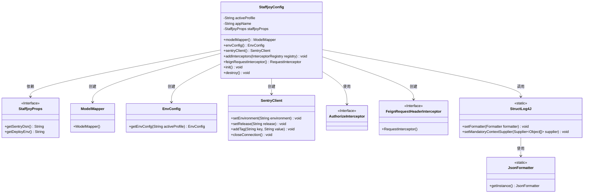
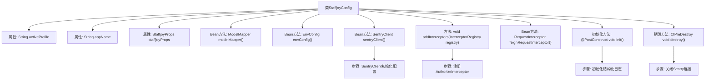

# 基础信息

|      |      |
|------|------|
| 名称 | StaffjoyConfig |
| 编码语言 | .java |
| 代码路径 | staffjoy/common-lib/src/main/java/xyz/staffjoy/common/config/StaffjoyConfig.java |
| 包名 | xyz.staffjoy.common.config |
| 依赖项 | ['com.github.structlog4j.StructLog4J', 'com.github.structlog4j.json.JsonFormatter', 'feign.RequestInterceptor', 'io.sentry.Sentry', 'io.sentry.SentryClient', 'org.modelmapper.ModelMapper', 'org.springframework.beans.factory.annotation.Autowired', 'org.springframework.beans.factory.annotation.Value', 'org.springframework.boot.context.properties.EnableConfigurationProperties', 'org.springframework.context.annotation.Bean', 'org.springframework.context.annotation.Configuration', 'org.springframework.web.servlet.config.annotation.InterceptorRegistry', 'org.springframework.web.servlet.config.annotation.WebMvcConfigurer', 'xyz.staffjoy.common.auth.AuthorizeInterceptor', 'xyz.staffjoy.common.auth.FeignRequestHeaderInterceptor', 'xyz.staffjoy.common.env.EnvConfig', 'javax.annotation.PostConstruct', 'javax.annotation.PreDestroy'] |
| 概述说明 | Spring配置类，含环境配置、Sentry初始化、拦截器及日志设置。 |

# 说明

这是一个名为StaffjoyConfig的Spring配置类，主要用于初始化应用程序的全局配置。它通过@EnableConfigurationProperties启用了StaffjoyProps配置属性类，并实现了WebMvcConfigurer接口。类中定义了多个Bean，包括ModelMapper用于对象映射、EnvConfig用于环境配置、SentryClient用于错误监控。它还配置了授权拦截器和Feign请求拦截器。在初始化阶段设置了结构化日志格式和全局日志字段，在销毁阶段关闭了Sentry连接。类中还注入了当前激活的配置文件和应用程序名称等属性。

# 类列表 Class Summary

| 名称   | 类型  | 说明 |
|-------|------|-------------|
| StaffjoyConfig | class | 配置类，含模型映射、环境配置、Sentry客户端、拦截器及日志初始化。 |

## 类 StaffjoyConfig

|      |      |
|------|------|
| 访问范围 | @Configuration;@EnableConfigurationProperties(StaffjoyProps.class);public |
| 类型 | class |
| 名称 | StaffjoyConfig |
| 说明 | 配置类，含模型映射、环境配置、Sentry客户端、拦截器及日志初始化。 |

### UML类图

该类图展示了Spring Boot配置类StaffjoyConfig的核心结构，它通过@EnableConfigurationProperties加载StaffjoyProps配置属性，实现了WebMvcConfigurer接口。图中包含8个主要类/接口，展示了配置类如何创建ModelMapper、EnvConfig等Bean，集成Sentry错误监控，以及初始化结构化日志系统StructLog4J的关系。StaffjoyConfig通过依赖注入使用StaffjoyProps，并在生命周期方法中管理SentryClient连接和日志系统配置。

### 内部方法调用关系图

这段代码是Spring Boot的配置类StaffjoyConfig，主要完成以下功能：通过@Bean注解注册多个组件（ModelMapper、EnvConfig、SentryClient等），实现WebMvcConfigurer接口添加拦截器，使用@PostConstruct初始化结构化日志系统，并通过@PreDestroy在销毁时关闭Sentry连接。类中还通过@Value注入配置属性，并依赖StaffjoyProps配置类获取Sentry的DSN等参数。整体实现了应用配置、日志监控和请求拦截等核心功能。

### 字段列表 Field List

| 名称  | 类型  | 说明 |
|-------|-------|------|
| appName | String | 应用名称变量，默认值NA。 |
| activeProfile | String | Spring配置：获取当前激活的profile，默认NA。 |
| staffjoyProps | StaffjoyProps | 自动注入StaffjoyProps配置属性 |

### 方法列表 Method List

| 名称  | 类型  | 说明 |
|-------|-------|------|
| init | void | 使用@PostConstruct初始化结构化日志，设置全局日志字段env和service。 |
| modelMapper | ModelMapper | 创建并返回一个ModelMapper实例。 |
| feignRequestInterceptor | RequestInterceptor | 创建Feign请求拦截器实例 |
| envConfig | EnvConfig | 定义Bean方法返回EnvConfig实例，基于activeProfile获取配置。 |
| sentryClient | SentryClient | 创建Sentry客户端，设置环境、版本和服务标签。 |
| addInterceptors | void | 重写方法添加授权拦截器到注册表。 |
| destroy | void | 销毁时关闭Sentry连接。 |

