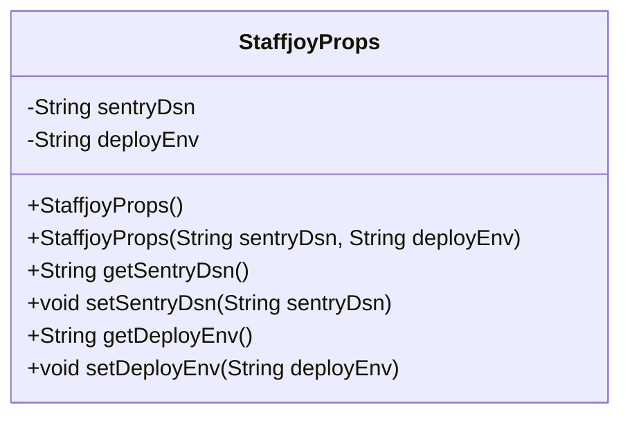
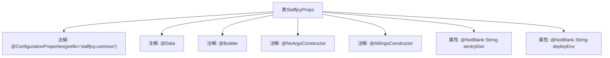

# 基础信息

|      |      |
|------|------|
| 名称 | StaffjoyProps |
| 编码语言 | .java |
| 代码路径 | staffjoy/common-lib/src/main/java/xyz/staffjoy/common/config/StaffjoyProps.java |
| 包名 | xyz.staffjoy.common.config |
| 依赖项 | ['lombok.AllArgsConstructor', 'lombok.Builder', 'lombok.Data', 'lombok.NoArgsConstructor', 'org.springframework.boot.context.properties.ConfigurationProperties', 'javax.validation.constraints.NotBlank'] |
| 概述说明 | 配置类StaffjoyProps，含sentryDsn和deployEnv字段，支持构建器和全参构造。 |

# 说明

这是一个名为StaffjoyProps的Java类，使用了Spring Boot的@ConfigurationProperties注解，前缀为"staffjoy.common"。类中包含两个非空字符串属性：sentryDsn用于Sentry错误监控，deployEnv由Kubernetes在部署时设置以识别代码版本。类使用了Lombok注解@Data、@Builder、@NoArgsConstructor和@AllArgsConstructor，自动生成getter/setter、构建器模式和无参/全参构造函数。

# 类列表 Class Summary

| 名称   | 类型  | 说明 |
|-------|------|-------------|
| StaffjoyProps | class | 配置类StaffjoyProps含sentryDsn和deployEnv字段，用于Sentry和K8s部署版本标识。 |

## 类 StaffjoyProps

|      |      |
|------|------|
| 访问范围 | @ConfigurationProperties(prefix="staffjoy.common");@Data;@Builder;@NoArgsConstructor;@AllArgsConstructor;public |
| 类型 | class |
| 名称 | StaffjoyProps |
| 说明 | 配置类StaffjoyProps含sentryDsn和deployEnv字段，用于Sentry和K8s部署版本标识。 |

### UML类图

这段代码定义了一个名为StaffjoyProps的配置属性类，使用了Lombok注解自动生成构造器、getter/setter和builder模式。类中包含两个私有字符串字段sentryDsn和deployEnv，分别用于存储Sentry错误监控系统的DSN连接字符串和部署环境标识。该类通过@ConfigurationProperties注解与配置文件中的staffjoy.common前缀属性绑定，适用于Spring Boot应用的配置管理场景，便于集中管理应用的基础配置参数。

### 内部方法调用关系图

这段代码定义了一个名为StaffjoyProps的配置属性类，使用了Lombok的@Data、@Builder、@NoArgsConstructor和@AllArgsConstructor注解来自动生成getter/setter、构建器模式和无参/全参构造方法。类上标注了@ConfigurationProperties注解，用于绑定配置文件中的staffjoy.common前缀属性。类包含两个非空字符串属性sentryDsn和deployEnv，后者用于Kubernetes部署时标识代码版本。该设计主要用于集中管理应用配置参数。

### 字段列表 Field List

| 名称  | 类型  | 说明 |
|-------|-------|------|
| deployEnv | String | Kubernetes部署时设置代码版本标识变量。 |
| sentryDsn | String | 私有字符串类型变量sentryDsn，非空约束。 |

### 方法列表 Method List

| 名称  | 类型  | 说明 |
|-------|-------|------|

