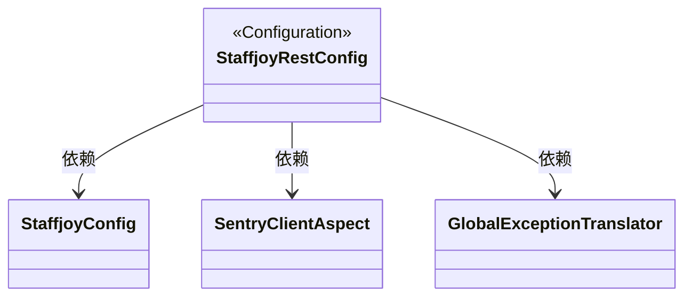
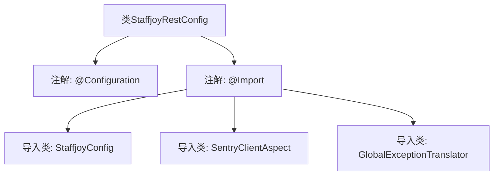

# 基础信息

|      |      |
|------|------|
| 名称 | StaffjoyRestConfig |
| 编码语言 | .java |
| 代码路径 | staffjoy/common-lib/src/main/java/xyz/staffjoy/common/config/StaffjoyRestConfig.java |
| 包名 | xyz.staffjoy.common.config |
| 依赖项 | ['org.springframework.context.annotation.Configuration', 'org.springframework.context.annotation.Import', 'xyz.staffjoy.common.error.GlobalExceptionTranslator', 'xyz.staffjoy.common.aop'] |
| 概述说明 | 配置类导入StaffjoyConfig、SentryClientAspect和GlobalExceptionTranslator组件。 |

# 说明

这是一个名为StaffjoyRestConfig的Java配置类，使用了@Configuration注解表明它是一个配置类。通过@Import注解导入了三个其他配置类：StaffjoyConfig、SentryClientAspect和GlobalExceptionTranslator。该配置类主要用于整合这些导入的配置组件，为应用程序提供统一的配置管理。

# 类列表 Class Summary

| 名称   | 类型  | 说明 |
|-------|------|-------------|
| StaffjoyRestConfig | class | 配置类导入StaffjoyConfig等组件 |

## 类 StaffjoyRestConfig

|      |      |
|------|------|
| 访问范围 | @Configuration;@Import(value = {StaffjoyConfig.class, SentryClientAspect.class, GlobalExceptionTranslator.class});public |
| 类型 | class |
| 名称 | StaffjoyRestConfig |
| 说明 | 配置类导入StaffjoyConfig等组件 |

### UML类图

这段类图展示了Spring Boot配置类StaffjoyRestConfig的结构及其依赖关系。作为配置类（标记为@Configuration），它通过@Import注解引入了三个组件：StaffjoyConfig（基础配置）、SentryClientAspect（Sentry客户端切面）和GlobalExceptionTranslator（全局异常处理器）。箭头表示StaffjoyRestConfig对这些组件存在编译期依赖，运行时将由Spring容器自动装配。该设计实现了配置模块化，将不同功能的配置分离到独立类中，符合单一职责原则。

### 内部方法调用关系图

这段流程图展示了Spring配置类StaffjoyRestConfig的结构。该类通过@Configuration注解声明为配置类，并通过@Import注解导入了三个关键组件：StaffjoyConfig（基础配置）、SentryClientAspect（Sentry监控切面）和GlobalExceptionTranslator（全局异常处理器）。这种配置方式集中管理了应用的核心依赖，体现了Spring Boot的模块化设计思想，总节点数控制在6个以内，层级关系清晰。

### 字段列表 Field List

| 名称  | 类型  | 说明 |
|-------|-------|------|

### 方法列表 Method List

| 名称  | 类型  | 说明 |
|-------|-------|------|

