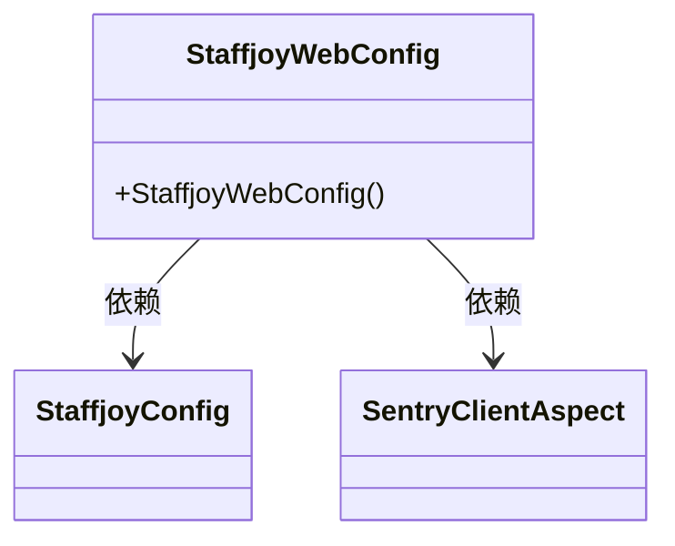
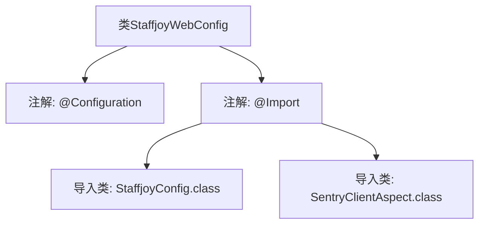

# 基础信息

|      |      |
|------|------|
| 名称 | StaffjoyWebConfig |
| 编码语言 | .java |
| 代码路径 | staffjoy/common-lib/src/main/java/xyz/staffjoy/common/config/StaffjoyWebConfig.java |
| 包名 | xyz.staffjoy.common.config |
| 依赖项 | ['org.springframework.context.annotation.Configuration', 'org.springframework.context.annotation.Import', 'xyz.staffjoy.common.aop.SentryClientAspect'] |
| 概述说明 | 配置类导入StaffjoyConfig和SentryClientAspect组件。 |

# 说明

该内容描述了一个名为StaffjoyWebConfig的Java配置类，使用了@Configuration注解表明这是一个配置类。通过@Import注解导入了两个其他配置类：StaffjoyConfig和SentryClientAspect。该配置类主要用于整合和加载相关配置组件，不包含具体实现代码。

# 类列表 Class Summary

| 名称   | 类型  | 说明 |
|-------|------|-------------|
| StaffjoyWebConfig | class | 配置类导入StaffjoyConfig和SentryClientAspect组件。 |

## 类 StaffjoyWebConfig

|      |      |
|------|------|
| 访问范围 | @Configuration;@Import(value = {StaffjoyConfig.class, SentryClientAspect.class,});public |
| 类型 | class |
| 名称 | StaffjoyWebConfig |
| 说明 | 配置类导入StaffjoyConfig和SentryClientAspect组件。 |

### UML类图

这段类图展示了Spring Boot配置类StaffjoyWebConfig的结构及其依赖关系。StaffjoyWebConfig通过@Import注解显式导入了StaffjoyConfig和SentryClientAspect两个配置类，表明它依赖于这两个类的功能实现。图中清晰呈现了类之间的单向依赖关系，其中StaffjoyWebConfig作为主配置类，需要整合另外两个配置类的功能。这种设计模式常见于Spring框架中，用于模块化配置管理。

### 内部方法调用关系图

该流程图展示了StaffjoyWebConfig类的结构，这是一个Spring配置类，通过@Configuration注解标记，并使用@Import注解导入了两个其他配置类StaffjoyConfig和SentryClientAspect。图中清晰地表示了类与注解之间的从属关系，以及@Import注解与其参数类之间的关联，层级结构简单明了，便于理解这个配置类的基本组成。

### 字段列表 Field List

| 名称  | 类型  | 说明 |
|-------|-------|------|

### 方法列表 Method List

| 名称  | 类型  | 说明 |
|-------|-------|------|

