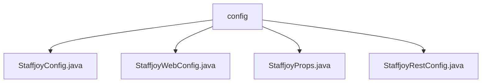

# 基础信息

|      |      |
|------|------|
| 名称 | config |
| 编码语言 | .java |
| 代码路径 | staffjoy/common-lib/src/main/java/xyz/staffjoy/common/config |
| 包名 | staffjoy.docs.common-lib.src.main.java.xyz.staffjoy.common.config |
| 概述说明 | Spring配置类StaffjoyConfig初始化全局配置，定义多个Bean并配置拦截器。StaffjoyWebConfig、StaffjoyRestConfig整合配置组件。StaffjoyProps包含Sentry和环境属性。 |

# 说明

## 概述
该代码模块是Staffjoy项目的通用配置模块，位于`staffjoy/common-lib`路径下，主要提供Spring应用程序的全局配置功能。模块包含多个配置类，负责初始化应用程序的基础设施组件、环境配置和错误监控等核心功能。这些配置类通过Spring的依赖注入和自动配置机制，为整个应用程序提供统一的配置管理。

## 主要业务场景
1. **全局配置初始化**：
   - 通过`StaffjoyConfig`类初始化应用程序的全局配置，包括对象映射(ModelMapper)、环境配置(EnvConfig)和错误监控(SentryClient)
   - 配置授权拦截器和Feign请求拦截器，处理服务间调用的认证和授权
   - 管理应用程序生命周期，包括初始化阶段的结构化日志设置和销毁阶段的资源清理

2. **属性配置管理**：
   - `StaffjoyProps`类使用`@ConfigurationProperties`绑定以"staffjoy.common"为前缀的配置属性
   - 管理Sentry错误监控的DSN连接字符串和部署环境标识

3. **配置组件整合**：
   - `StaffjoyWebConfig`和`StaffjoyRestConfig`作为整合类，通过`@Import`导入其他配置组件
   - 提供统一的配置入口，简化配置管理复杂度
   - 特别为Web应用和REST服务提供定制化配置支持

4. **错误监控与异常处理**：
   - 集成Sentry错误监控系统
   - 通过`SentryClientAspect`和`GlobalExceptionTranslator`提供全局异常捕获和转换功能

### 包内部结构视图

该流程图展示了Staffjoy公共库中配置模块的文件结构，根节点为config目录，包含四个配置类文件：StaffjoyConfig、StaffjoyWebConfig、StaffjoyProps和StaffjoyRestConfig。所有文件都直接位于config目录下，没有更深层级的子目录结构，呈现了典型的Java配置类集中存放的布局方式。

# 文件列表 File List

| 名称   | 类型  | 说明 |
|-------|------|-------------|
| [StaffjoyRestConfig.java](StaffjoyRestConfig.md) | file | 配置类导入StaffjoyConfig、SentryClientAspect和GlobalExceptionTranslator组件。 |
| [StaffjoyProps.java](StaffjoyProps.md) | file | 配置类StaffjoyProps，含sentryDsn和deployEnv字段，支持构建器和全参构造。 |
| [StaffjoyWebConfig.java](StaffjoyWebConfig.md) | file | 配置类导入StaffjoyConfig和SentryClientAspect组件。 |
| [StaffjoyConfig.java](StaffjoyConfig.md) | file | Spring配置类，含环境配置、Sentry初始化、拦截器及日志设置。 |

