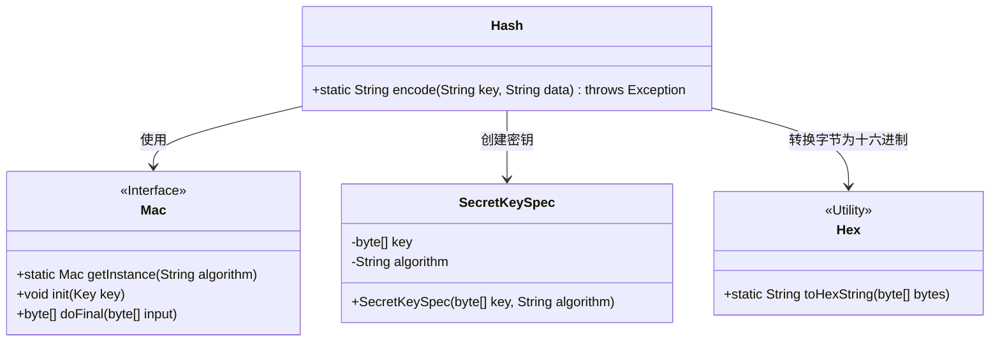
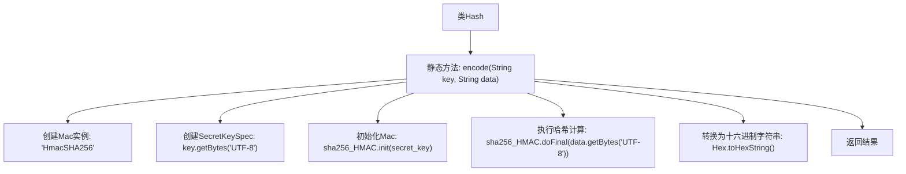

# 基础信息

|      |      |
|------|------|
| 名称 | Hash |
| 编码语言 | .java |
| 代码路径 | staffjoy/common-lib/src/main/java/xyz/staffjoy/common/crypto/Hash.java |
| 包名 | xyz.staffjoy.common.crypto |
| 依赖项 | ['org.bouncycastle.util.encoders.Hex', 'javax.crypto.Mac', 'javax.crypto.spec.SecretKeySpec'] |
| 概述说明 | Java类Hash实现HMAC-SHA256加密，输入密钥和数据返回哈希字符串。 |

# 说明

这段内容描述了一个名为Hash的类，其中包含一个静态方法encode。该方法接收两个字符串参数key和data，使用HmacSHA256算法生成消息认证码。首先初始化Mac实例，然后通过SecretKeySpec创建密钥，最后将data的字节数组进行加密处理并返回十六进制字符串结果。整个过程使用UTF-8编码处理字符串。

# 类列表 Class Summary

| 名称   | 类型  | 说明 |
|-------|------|-------------|
| Hash | class | Java类Hash提供HMAC-SHA256加密方法，输入密钥和数据返回哈希字符串。 |

## 类 Hash

|      |      |
|------|------|
| 访问范围 | public |
| 类型 | class |
| 名称 | Hash |
| 说明 | Java类Hash提供HMAC-SHA256加密方法，输入密钥和数据返回哈希字符串。 |

### UML类图

这段类图展示了HMAC-SHA256哈希计算的实现结构。核心类Hash提供静态编码方法，依赖Mac接口进行哈希运算，通过SecretKeySpec构造密钥，最后使用Hex工具类将二进制结果转为十六进制字符串。整个设计遵循单一职责原则，Mac接口实现了算法可替换性，SecretKeySpec封装了密钥数据，Hex处理格式转换，共同完成安全的哈希计算流程。

### 内部方法调用关系图

该流程图展示了HMAC-SHA256哈希算法的实现过程。从创建加密算法实例开始，通过密钥初始化、数据字节转换、执行哈希计算，最终将结果转换为十六进制字符串返回。整个过程严格遵循Java密码学架构规范，确保数据完整性和认证安全性。每个步骤都清晰标注了关键操作和参数处理方式，突出了UTF-8编码转换和密钥初始化的安全实践。

### 字段列表 Field List

| 名称  | 类型  | 说明 |
|-------|-------|------|

### 方法列表 Method List

| 名称  | 类型  | 说明 |
|-------|-------|------|
| encode | String | 使用HmacSHA256算法对数据和密钥进行加密编码。 |

