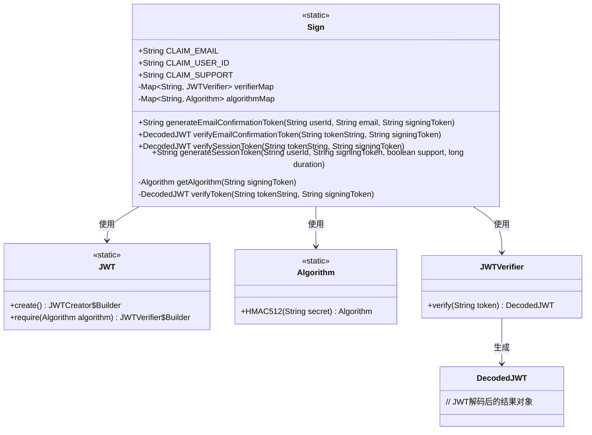
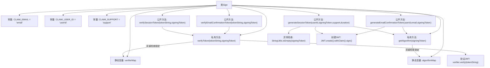

# 基础信息

|      |      |
|------|------|
| 名称 | Sign |
| 编码语言 | .java |
| 代码路径 | staffjoy/common-lib/src/main/java/xyz/staffjoy/common/crypto/Sign.java |
| 包名 | xyz.staffjoy.common.crypto |
| 依赖项 | ['com.auth0.jwt.JWT', 'com.auth0.jwt.JWTVerifier', 'com.auth0.jwt.algorithms.Algorithm', 'com.auth0.jwt.interfaces.DecodedJWT', 'org.springframework.util.StringUtils', 'xyz.staffjoy.common.error.ServiceException', 'java.util.Date', 'java.util.HashMap', 'java.util.Map', 'java.util.concurrent.TimeUnit'] |
| 概述说明 | JWT工具类，含生成和验证令牌方法，支持邮件和会话令牌。 |

# 说明

该代码定义了一个名为Sign的类，用于处理JWT令牌的生成和验证。类中包含三个公共常量声明，分别表示电子邮件、用户ID和支持状态的声明字段。类使用两个静态Map缓存算法和验证器实例，通过同步块确保线程安全。主要功能包括生成电子邮件确认令牌和会话令牌，以及验证这些令牌的有效性。生成令牌时支持设置过期时间，验证令牌时会检查签名算法的一致性。所有操作都基于HMAC512算法实现，签名密钥由外部传入。

# 类列表 Class Summary

| 名称   | 类型  | 说明 |
|-------|------|-------------|
| Sign | class | Sign类处理JWT生成和验证，支持邮件确认和会话令牌，使用HMAC512算法。 |

## 类 Sign

|      |      |
|------|------|
| 访问范围 | public |
| 类型 | class |
| 名称 | Sign |
| 说明 | Sign类处理JWT生成和验证，支持邮件确认和会话令牌，使用HMAC512算法。 |

### UML类图

类图描述：
该图展示了一个JWT令牌处理类Sign的结构及其关联类。Sign类包含静态常量声明、私有缓存映射表(verifierMap/algorithmMap)和核心方法：生成邮件确认令牌(generateEmailConfirmationToken)、生成会话令牌(generateSessionToken)以及验证令牌(verifyToken)等方法。通过依赖JWT、Algorithm和JWTVerifier等工具类实现JWT的创建与验证功能，采用双重检查锁模式缓存算法和验证器实例，有效提升性能。所有方法均为静态方法，适合作为工具类使用。

### 内部方法调用关系图

这段代码实现了一个JWT(JSON Web Token)的生成和验证工具类。流程图展示了Sign类的核心结构，包含3个常量定义、2个静态存储Map，以及5个主要方法。关键逻辑采用双重检查锁定模式管理Algorithm和JWTVerifier实例，确保线程安全。生成方法通过JWT.create()链式调用构建令牌，验证方法通过JWT.require()创建验证器。流程图清晰呈现了方法间的调用关系，特别是令牌生成/验证的公共方法最终都汇聚到私有核心方法的特点。

### 字段列表 Field List

| 名称  | 类型  | 说明 |
|-------|-------|------|
| CLAIM_EMAIL = "email" | String | 声明常量字符串CLAIM_EMAIL，值为"email"。 |
| CLAIM_USER_ID = "userId" | String | 声明用户ID常量字符串 |
| verifierMap = new HashMap<>() | Map<String, JWTVerifier> | 私有静态Map存储字符串到JWT验证器的映射。 |
| CLAIM_SUPPORT = "support" | String | 声明常量CLAIM_SUPPORT值为"support"。 |
| algorithmMap = new HashMap<>() | Map<String, Algorithm> | 私有静态哈希映射存储算法实例。 |

### 方法列表 Method List

| 名称  | 类型  | 说明 |
|-------|-------|------|
| verifySessionToken | DecodedJWT | 验证会话令牌并返回解码结果。 |
| verifyEmailConfirmationToken | DecodedJWT | 验证邮箱确认令牌，返回解码结果。 |
| generateEmailConfirmationToken | String | 生成用户邮箱确认令牌，含用户ID、邮箱和2小时有效期。 |
| getAlgorithm | Algorithm | 根据签名令牌获取算法，若无则同步创建并缓存HMAC512算法。 |
| verifyToken | DecodedJWT | 验证JWT令牌，使用HMAC512算法，确保线程安全。 |
| generateSessionToken | String | 生成会话令牌：验证签名令牌，用用户ID、支持标志和有效期创建JWT令牌。 |

