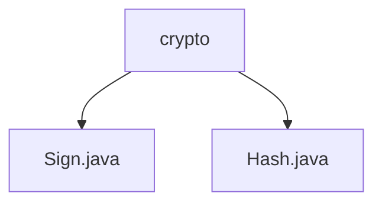

# 基础信息

|      |      |
|------|------|
| 名称 | crypto |
| 编码语言 | .java |
| 代码路径 | staffjoy/common-lib/src/main/java/xyz/staffjoy/common/crypto |
| 包名 | staffjoy.docs.common-lib.src.main.java.xyz.staffjoy.common.crypto |
| 概述说明 | Sign类处理JWT令牌生成验证，含声明字段和线程安全缓存。Hash类提供HmacSHA256加密方法。 |

# 说明

## 概述  
该代码模块属于`staffjoy/common-lib`，主要提供与加密和签名相关的功能，包括JWT令牌的生成与验证以及基于HmacSHA256算法的消息认证码生成。模块包含两个核心类：  
1. **`Sign`类**：专注于JWT令牌的生成和验证，支持电子邮件确认令牌和会话令牌的创建，并确保令牌的完整性和安全性。  
2. **`Hash`类**：提供静态方法`encode`，用于通过HmacSHA256算法生成消息认证码，适用于数据完整性校验的场景。  

## 主要业务场景  
1. **JWT令牌管理**（`Sign`类）：  
   - **生成令牌**：支持为电子邮件确认和用户会话生成带有过期时间的JWT令牌，声明字段包括电子邮件、用户ID和支持状态。  
   - **验证令牌**：检查令牌签名算法的一致性（基于HMAC512）及有效性，确保令牌未被篡改。  
   - **线程安全**：通过静态Map缓存算法和验证器实例，结合同步块避免多线程冲突。  

2. **消息认证码生成**（`Hash`类）：  
   - **数据加密**：接收密钥（`key`）和待加密数据（`data`），使用HmacSHA256算法生成十六进制字符串格式的消息认证码。  
   - **编码处理**：全程使用UTF-8编码处理字符串，适用于需要数据完整性验证或安全传输的场景（如API签名验证）。  

**模块特点**：  
- 依赖标准化加密算法（HMAC512、HmacSHA256），确保安全性。  
- 设计注重线程安全和性能优化（如缓存实例）。  
- 适用于身份验证（JWT）、数据防篡改（消息认证码）等安全相关需求。

### 包内部结构视图

该流程图展示了common-lib项目中crypto模块的层级结构，包含两个核心加密类文件：Sign.java用于签名相关操作，Hash.java处理哈希计算功能。这两个文件都直接隶属于crypto目录下，构成了该模块的基础加密功能组件。

# 文件列表 File List

| 名称   | 类型  | 说明 |
|-------|------|-------------|
| [Hash.java](Hash.md) | file | Java类Hash实现HMAC-SHA256加密，输入密钥和数据返回哈希字符串。 |
| [Sign.java](Sign.md) | file | JWT工具类，含生成和验证令牌方法，支持邮件和会话令牌。 |

