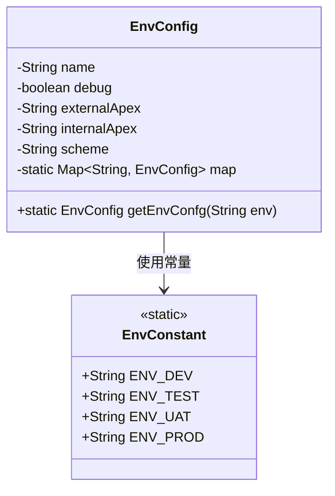
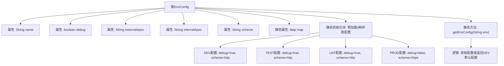

# 基础信息

|      |      |
|------|------|
| 名称 | EnvConfig |
| 编码语言 | .java |
| 代码路径 | staffjoy/common-lib/src/main/java/xyz/staffjoy/common/env/EnvConfig.java |
| 包名 | xyz.staffjoy.common.env |
| 依赖项 | [None, 'java.util.HashMap', 'java.util.Map'] |
| 概述说明 | EnvConfig类存储环境配置，包含开发、测试、UAT和生产环境的域名、调试模式和协议。 |

# 说明

EnvConfig类是一个使用@Data和@Builder注解的配置类，用于管理不同环境（开发、测试、UAT、生产）的配置参数。类包含name、debug、externalApex、internalApex和scheme等字段，并通过静态代码块初始化各环境的配置映射。开发环境和测试环境使用HTTP协议和本地域名，UAT环境默认启用调试模式并使用本地域名，生产环境禁用调试模式并使用HTTPS协议和正式域名。提供getEnvConfg方法根据环境名称获取对应配置，若未找到则返回开发环境配置。

# 类列表 Class Summary

| 名称   | 类型  | 说明 |
|-------|------|-------------|
| EnvConfig | class | EnvConfig类定义环境配置，包含开发、测试、预发和生产环境的参数，支持通过名称获取配置。 |

## 类 EnvConfig

|      |      |
|------|------|
| 访问范围 | @Data;@Builder;public |
| 类型 | class |
| 名称 | EnvConfig |
| 说明 | EnvConfig类定义环境配置，包含开发、测试、预发和生产环境的参数，支持通过名称获取配置。 |

### UML类图

EnvConfig类是一个环境配置类，使用Lombok的@Data和@Builder注解自动生成getter/setter和建造者模式方法。该类包含环境名称、调试标志、内外域名和协议等私有字段，并通过静态代码块初始化不同环境（开发/测试/UAT/生产）的配置映射。getEnvConfg方法根据环境名称获取对应配置，若不存在则返回开发环境配置。EnvConstant类提供环境名称常量，两者存在依赖关系。

### 内部方法调用关系图

该流程图展示了EnvConfig类的完整结构，包含5个成员变量和1个静态配置映射表。核心是静态初始化块预定义了DEV/TEST/UAT/PROD四种环境配置，其中UAT配置被注释掉一个版本。静态方法getEnvConfig实现配置查找逻辑，当指定环境不存在时自动返回DEV配置。所有配置通过Builder模式构建，体现了环境隔离和默认回退机制的设计思想。

### 字段列表 Field List

| 名称  | 类型  | 说明 |
|-------|-------|------|
| externalApex | String | 私有字符串变量externalApex。 |
| internalApex | String | 私有字符串变量internalApex。 |
| scheme | String | 私有字符串变量scheme。 |
| name | String | 私有字符串变量name。 |
| debug | boolean | 私有布尔型调试标志。 |
| map | Map<String, EnvConfig> | 私有静态映射表，无Getter/Setter方法。 |

### 方法列表 Method List

| 名称  | 类型  | 说明 |
|-------|-------|------|
| getEnvConfg | EnvConfig | 静态方法根据环境名获取配置，无则返回默认开发环境配置。 |

