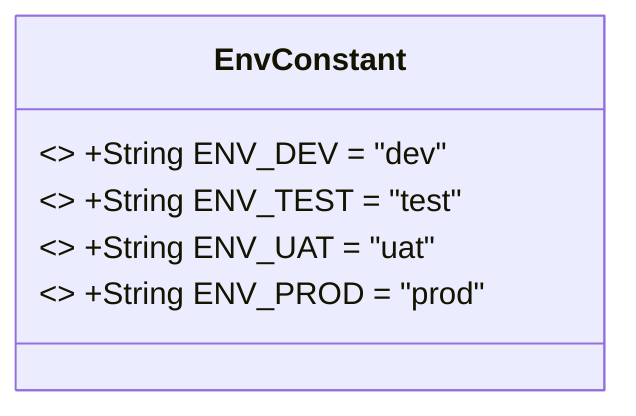
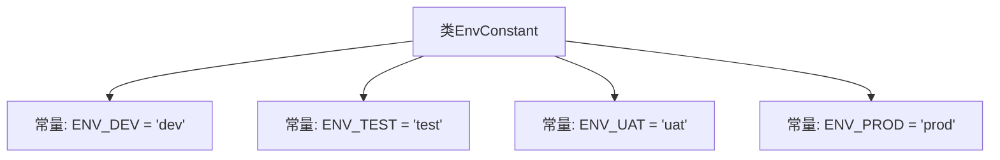

# 基础信息

|      |      |
|------|------|
| 名称 | EnvConstant |
| 编码语言 | .java |
| 代码路径 | staffjoy/common-lib/src/main/java/xyz/staffjoy/common/env/EnvConstant.java |
| 包名 | xyz.staffjoy.common.env |
| 依赖项 | [] |
| 概述说明 | 定义环境常量：开发、测试、预发布和生产。 |

# 说明

EnvConstant类定义了四个静态常量字符串，分别表示不同的环境类型：ENV_DEV对应开发环境"dev"，ENV_TEST对应测试环境"test"，ENV_UAT对应类生产环境"uat"（类似于预发布环境），ENV_PROD对应生产环境"prod"。这些常量用于标识和区分应用程序的不同运行环境。

# 类列表 Class Summary

| 名称   | 类型  | 说明 |
|-------|------|-------------|
| EnvConstant | class | 定义环境常量：开发、测试、预发布、生产。 |

## 类 EnvConstant

|      |      |
|------|------|
| 访问范围 | public |
| 类型 | class |
| 名称 | EnvConstant |
| 说明 | 定义环境常量：开发、测试、预发布、生产。 |

### UML类图

这段代码定义了一个名为`EnvConstant`的公共类，其中包含了四个静态不可变字符串常量，分别表示不同的环境类型：开发环境(DEV)、测试环境(TEST)、用户验收环境(UAT)和生产环境(PROD)。这些常量通常用于在应用程序中标识当前运行环境，便于进行环境相关的配置和逻辑处理。类图中使用`<<final>>`标记表示这些字段是不可修改的常量，且所有成员都是公开的静态常量，可以直接通过类名访问。

### 内部方法调用关系图

这段代码定义了一个名为EnvConstant的类，其中包含四个静态常量字符串，分别代表不同的环境类型：开发环境(ENV_DEV)、测试环境(ENV_TEST)、用户验收测试环境(ENV_UAT)和生产环境(ENV_PROD)。这些常量通常用于应用程序中区分不同运行环境，便于进行环境相关的配置管理。每个常量都被声明为public static final，表示它们是公开的、不可修改的类级别变量。

### 字段列表 Field List

| 名称  | 类型  | 说明 |
|-------|-------|------|
| ENV_DEV = "dev" | String | 定义开发环境常量"dev"。 |
| ENV_TEST = "test" | String | 定义测试环境常量"test"。 |
| ENV_UAT = "uat" | String | 静态常量ENV_UAT值为"uat"。 |
| ENV_PROD = "prod" | String | 定义常量ENV_PROD，值为"prod"，表示生产环境。 |

### 方法列表 Method List

| 名称  | 类型  | 说明 |
|-------|-------|------|

