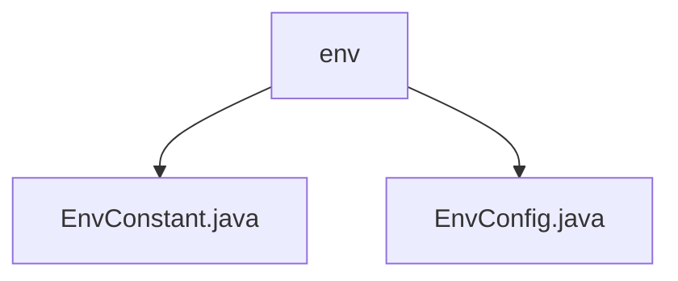

# 基础信息

|      |      |
|------|------|
| 名称 | env |
| 编码语言 | .java |
| 代码路径 | staffjoy/common-lib/src/main/java/xyz/staffjoy/common/env |
| 包名 | staffjoy.docs.common-lib.src.main.java.xyz.staffjoy.common.env |
| 概述说明 | EnvConstant类定义四种环境常量。EnvConfig类管理各环境配置，含协议、域名等字段，提供按环境获取配置方法。 |

# 说明

## 概述  
该代码模块主要用于管理和区分应用程序的不同运行环境（开发、测试、类生产环境、生产环境），并提供相应的环境配置。模块包含两个核心类：  
1. **EnvConstant**：定义静态常量字符串，标识不同环境类型（如开发环境 `dev`、测试环境 `test` 等）。  
2. **EnvConfig**：通过配置类管理各环境的参数（如调试模式、域名、协议等），支持根据环境名称动态获取配置。  

## 主要业务场景  
1. **环境标识与区分**：通过 `EnvConstant` 的常量明确划分开发、测试、UAT（预发布）、生产环境，避免硬编码环境名称。  
2. **动态环境配置**：  
   - 开发/测试环境：默认使用 HTTP 协议和本地域名，便于开发和调试。  
   - UAT 环境：默认启用调试模式，使用本地域名，模拟生产环境行为。  
   - 生产环境：强制禁用调试模式，使用 HTTPS 协议和正式域名，确保安全性。  
3. **配置兜底逻辑**：当未匹配到指定环境时，自动返回开发环境配置，防止因配置缺失导致运行时错误。  

该模块为多环境部署提供了统一的管理方案，确保环境切换时配置的灵活性和一致性。

### 包内部结构视图

该流程图展示了Staffjoy项目的common-lib模块中env包的结构关系。env作为父节点包含两个子文件：EnvConstant.java（环境常量定义）和EnvConfig.java（环境配置类），这两个文件共同构成该项目的环境配置基础组件，用于统一管理不同运行环境的配置参数和常量定义。

# 文件列表 File List

| 名称   | 类型  | 说明 |
|-------|------|-------------|
| [EnvConstant.java](EnvConstant.md) | file | 定义环境常量：开发、测试、预发布和生产。 |
| [EnvConfig.java](EnvConfig.md) | file | EnvConfig类存储环境配置，包含开发、测试、UAT和生产环境的域名、调试模式和协议。 |

