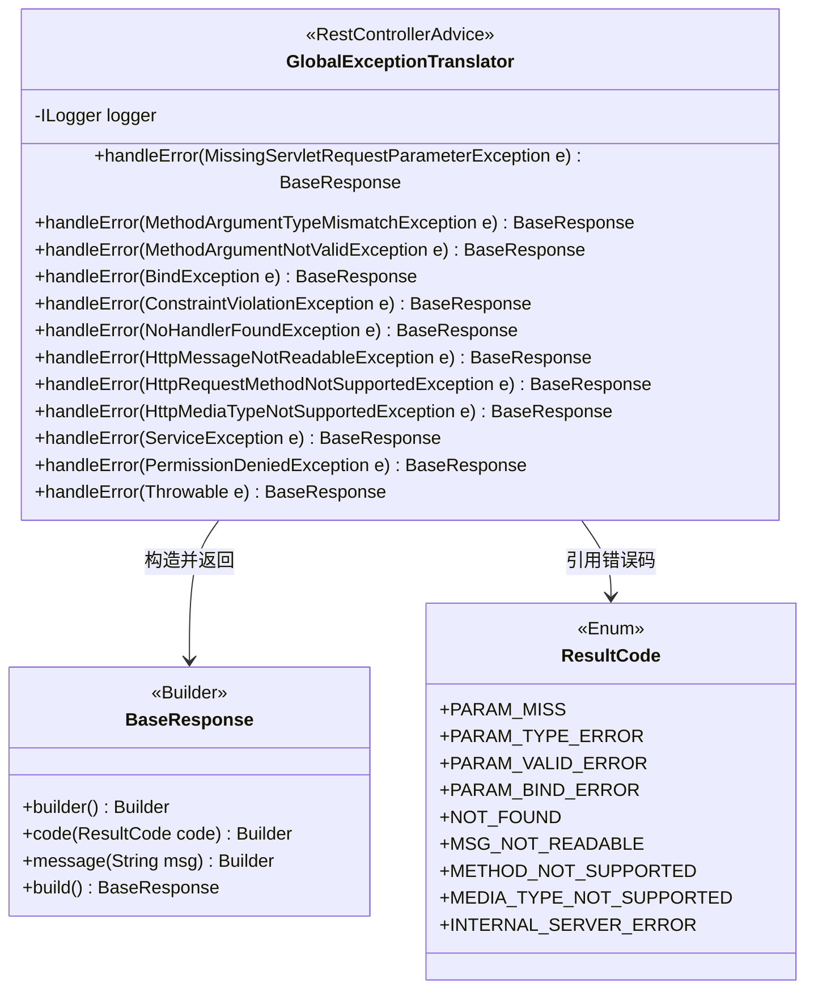

# 基础信息

|      |      |
|------|------|
| 名称 | GlobalExceptionTranslator |
| 编码语言 | .java |
| 代码路径 | staffjoy/common-lib/src/main/java/xyz/staffjoy/common/error/GlobalExceptionTranslator.java |
| 包名 | xyz.staffjoy.common.error |
| 依赖项 | ['com.github.structlog4j.ILogger', 'com.github.structlog4j.SLoggerFactory', 'org.hibernate.validator.internal.engine.path.PathImpl', 'org.springframework.http.converter.HttpMessageNotReadableException', 'org.springframework.validation.BindException', 'org.springframework.validation.BindingResult', 'org.springframework.validation.FieldError', 'org.springframework.web.HttpMediaTypeNotSupportedException', 'org.springframework.web.HttpRequestMethodNotSupportedException', 'org.springframework.web.bind.MethodArgumentNotValidException', 'org.springframework.web.bind.MissingServletRequestParameterException', 'org.springframework.web.bind.annotation', 'org.springframework.web.method.annotation.MethodArgumentTypeMismatchException', 'org.springframework.web.servlet.NoHandlerFoundException', 'xyz.staffjoy.common.api.BaseResponse', 'xyz.staffjoy.common.api.ResultCode', 'xyz.staffjoy.common.auth.PermissionDeniedException', 'javax.validation.ConstraintViolation', 'javax.validation.ConstraintViolationException', 'java.util.Set'] |
| 概述说明 | 全局异常处理类，捕获多种异常并返回统一响应格式。 |

# 说明

GlobalExceptionTranslator是一个全局异常处理类，使用RestControllerAdvice注解。它捕获并处理多种异常，包括参数缺失、类型不匹配、验证失败、绑定异常、约束违反、404未找到、消息不可读、请求方法不支持、媒体类型不支持、服务异常、权限拒绝以及未捕获的异常。每种异常都会记录日志，并返回包含错误代码和消息的BaseResponse响应。

# 类列表 Class Summary

| 名称   | 类型  | 说明 |
|-------|------|-------------|
| GlobalExceptionTranslator | class | 全局异常处理器，捕获多种异常并返回统一错误响应。 |

## 类 GlobalExceptionTranslator

|      |      |
|------|------|
| 访问范围 | @RestControllerAdvice;public |
| 类型 | class |
| 名称 | GlobalExceptionTranslator |
| 说明 | 全局异常处理器，捕获多种异常并返回统一错误响应。 |

### UML类图

这段代码定义了一个全局异常处理器`GlobalExceptionTranslator`，它是一个Spring的`@RestControllerAdvice`，用于集中处理控制器层抛出的各种异常。类中包含多个`@ExceptionHandler`方法，每个方法处理特定类型的异常，如参数缺失、类型不匹配、验证失败等，并返回统一的`BaseResponse`响应格式。`BaseResponse`通过建造者模式构建，包含错误码（来自`ResultCode`枚举）和错误信息。该设计实现了异常处理的标准化和统一响应格式，便于前端错误处理和日志记录。

### 内部方法调用关系图

```mermaid
graph TD
    A["类GlobalExceptionTranslator"]
    B["静态属性: ILogger logger"]
    C["方法: handleError(MissingServletRequestParameterException)"]
    D["方法: handleError(MethodArgumentTypeMismatchException)"]
    E["方法: handleError(MethodArgumentNotValidException)"]
    F["方法: handleError(BindException)"]
    G["方法: handleError(ConstraintViolationException)"]
    H["方法: handleError(NoHandlerFoundException)"]
    I["方法: handleError(HttpMessageNotReadableException)"]
    J["方法: handleError(HttpRequestMethodNotSupportedException)"]
    K["方法: handleError(HttpMediaTypeNotSupportedException)"]
    L["方法: handleError(ServiceException)"]
    M["方法: handleError(PermissionDeniedException)"]
    N["方法: handleError(Throwable)"]

    A --> B
    A --> C
    A --> D
    A --> E
    A --> F
    A --> G
    A --> H
    A --> I
    A --> J
    A --> K
    A --> L
    A --> M
    A --> N
```

该流程图展示了GlobalExceptionTranslator类的结构，这是一个Spring全局异常处理器。类包含1个静态日志记录器和12个异常处理方法，每个方法对应特定类型的异常（如参数缺失、类型不匹配、验证失败等）。所有方法都遵循相同模式：记录异常日志、构建包含错误代码和消息的BaseResponse对象。这种设计实现了统一的异常处理机制，将不同异常转换为标准化的错误响应格式。

### 字段列表 Field List

| 名称  | 类型  | 说明 |
|-------|-------|------|
| logger = SLoggerFactory.getLogger(GlobalExceptionTranslator.class) | ILogger | 静态日志记录器实例，用于GlobalExceptionTranslator类。 |

### 方法列表 Method List

| 名称  | 类型  | 说明 |
|-------|-------|------|
| handleError | BaseResponse | 处理参数绑定异常，记录日志并返回错误信息。 |
| handleError | BaseResponse | 处理404错误的异常处理器，记录日志并返回未找到响应。 |
| handleError | BaseResponse | 异常处理方法，处理约束违规异常，记录日志并返回参数错误响应。 |
| handleError | BaseResponse | 处理缺少请求参数的异常，记录日志并返回错误信息。 |
| handleError | BaseResponse | 异常处理：捕获消息不可读异常，记录日志并返回错误响应。 |
| handleError | BaseResponse | 处理不支持的HTTP请求方法异常，记录错误并返回错误码和消息。 |
| handleError | BaseResponse | 处理参数类型不匹配异常，记录日志并返回错误响应。 |
| handleError | BaseResponse | 处理参数校验异常，记录日志并返回错误信息。 |
| handleError | BaseResponse | 处理不支持的媒体类型异常，记录错误并返回响应码和消息。 |
| handleError | BaseResponse | 处理ServiceException异常，记录日志并返回错误响应。 |
| handleError | BaseResponse | 处理权限异常，记录错误并返回错误码和消息。 |
| handleError | BaseResponse | 异常处理：捕获Throwable，记录错误并返回内部错误响应。 |

