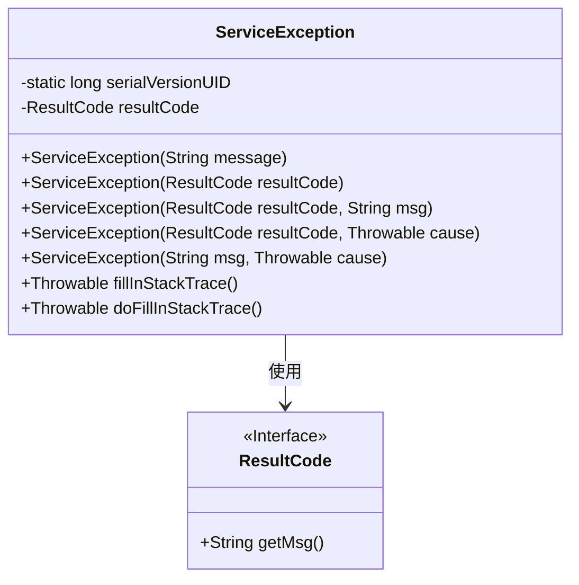
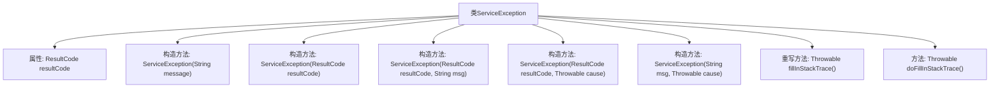

# 基础信息

|      |      |
|------|------|
| 名称 | ServiceException |
| 编码语言 | .java |
| 代码路径 | staffjoy/common-lib/src/main/java/xyz/staffjoy/common/error/ServiceException.java |
| 包名 | xyz.staffjoy.common.error |
| 依赖项 | ['lombok.Getter', 'xyz.staffjoy.common.api.ResultCode'] |
| 概述说明 | 自定义服务异常类，继承运行时异常，包含多种构造方法和结果码处理。 |

# 说明

该内容定义了一个名为ServiceException的自定义运行时异常类，继承自RuntimeException。该类包含一个ResultCode类型的私有字段resultCode，并通过@Getter注解提供访问方法。提供了多个构造方法，支持通过消息字符串、ResultCode枚举、异常原因等不同方式初始化异常实例。其中ResultCode用于封装错误码和消息，默认使用FAILURE枚举值。类重写了fillInStackTrace方法以提高性能，并提供了doFillInStackTrace方法保留原始堆栈填充功能。序列化版本号为2359767895161832954L。

# 类列表 Class Summary

| 名称   | 类型  | 说明 |
|-------|------|-------------|
| ServiceException | class | 自定义服务异常类，继承RuntimeException，包含多种构造方法和结果码处理。 |

## 类 ServiceException

|      |      |
|------|------|
| 访问范围 | public |
| 类型 | class |
| 名称 | ServiceException |
| 说明 | 自定义服务异常类，继承RuntimeException，包含多种构造方法和结果码处理。 |

### UML类图

这段代码展示了一个自定义异常类`ServiceException`，它继承自`RuntimeException`，主要用于封装业务异常信息。类中包含多个构造方法，支持通过`ResultCode`枚举、错误消息和异常原因来构建异常实例。特别值得注意的是它重写了`fillInStackTrace()`方法以提高性能，同时保留了`doFillInStackTrace()`方法用于需要完整堆栈的场景。该类通过`ResultCode`接口获取标准化的错误码和消息，体现了业务异常处理的标准化设计。

### 内部方法调用关系图

这段代码定义了一个自定义异常类`ServiceException`，继承自`RuntimeException`。类中包含5个不同参数的构造方法，用于初始化异常信息和结果码；重写了`fillInStackTrace()`方法以提高性能，并提供了`doFillInStackTrace()`方法保留原始堆栈跟踪功能。所有构造方法都会设置`resultCode`属性，未明确指定时默认使用`ResultCode.FAILURE`。

### 字段列表 Field List

| 名称  | 类型  | 说明 |
|-------|-------|------|
| resultCode | ResultCode | 私有final变量resultCode，使用@Getter注解生成getter方法。 |
| serialVersionUID = 2359767895161832954L | long | 私有静态长整型序列化版本UID。 |

### 方法列表 Method List

| 名称  | 类型  | 说明 |
|-------|-------|------|
| fillInStackTrace | Throwable | 重写fillInStackTrace方法，直接返回当前对象，不记录堆栈跟踪。 |
| doFillInStackTrace | Throwable | 重写doFillInStackTrace方法，直接调用父类实现。 |

