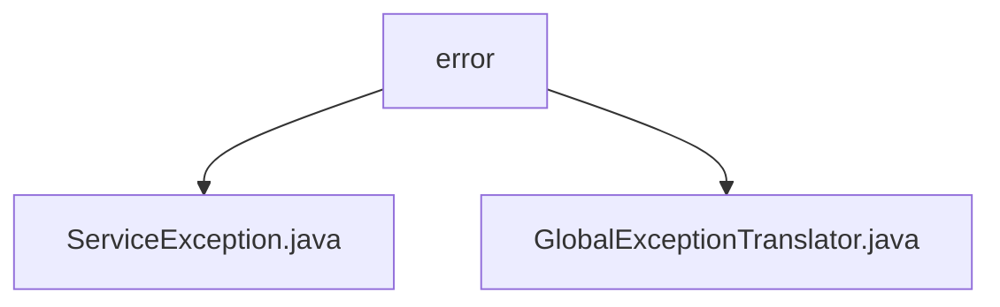

# 基础信息

|      |      |
|------|------|
| 名称 | error |
| 编码语言 | .java |
| 代码路径 | staffjoy/common-lib/src/main/java/xyz/staffjoy/common/error |
| 包名 | staffjoy.docs.common-lib.src.main.java.xyz.staffjoy.common.error |
| 概述说明 | ServiceException是自定义运行时异常，含错误码和消息。GlobalExceptionTranslator捕获多种异常并返回统一错误响应。 |

# 说明

## 概述  
该代码模块主要提供了一套统一的错误处理机制，包含自定义异常类 `ServiceException` 和全局异常处理器 `GlobalExceptionTranslator`。`ServiceException` 是一个自定义运行时异常，封装了错误码和消息，并优化了性能；`GlobalExceptionTranslator` 则负责捕获和处理多种类型的异常，返回标准化的错误响应。  

## 主要业务场景  
1. **自定义异常处理**：  
   - 通过 `ServiceException` 封装业务逻辑中的错误，支持多种初始化方式（如消息字符串、错误码枚举、异常原因等）。  
   - 默认使用 `FAILURE` 错误码，并优化了堆栈填充性能（通过重写 `fillInStackTrace` 方法）。  

2. **全局异常拦截与响应**：  
   - `GlobalExceptionTranslator` 捕获包括参数缺失、类型不匹配、验证失败、404未找到、权限拒绝等多种异常。  
   - 对每种异常记录日志，并返回统一的错误响应（`BaseResponse`），包含错误码和消息，便于前端或客户端处理。  

3. **标准化错误码管理**：  
   - 依赖 `ResultCode` 枚举（未在描述中详细展开）定义错误码和消息，确保错误信息的规范性和一致性。  

该模块适用于需要统一异常处理和错误响应的微服务或Web应用场景，尤其适合团队协作或前后端分离的项目。

### 包内部结构视图

该流程图展示了common-lib模块中error包的层级结构，包含两个异常处理类文件：ServiceException.java和GlobalExceptionTranslator.java。这两个文件都直接位于error包下，没有更深层级的子目录结构，体现了简洁的错误处理模块设计。

# 文件列表 File List

| 名称   | 类型  | 说明 |
|-------|------|-------------|
| [GlobalExceptionTranslator.java](GlobalExceptionTranslator.md) | file | 全局异常处理类，捕获多种异常并返回统一响应格式。 |
| [ServiceException.java](ServiceException.md) | file | 自定义服务异常类，继承运行时异常，包含多种构造方法和结果码处理。 |

