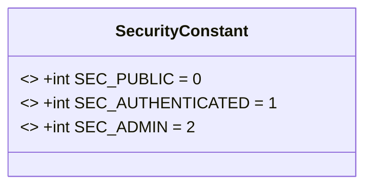
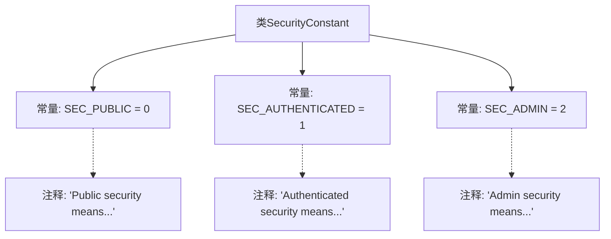

# 基础信息

|      |      |
|------|------|
| 名称 | SecurityConstant |
| 编码语言 | .java |
| 代码路径 | staffjoy/common-lib/src/main/java/xyz/staffjoy/common/services/SecurityConstant.java |
| 包名 | xyz.staffjoy.common.services |
| 依赖项 | [] |
| 概述说明 | 安全常量：公开0，需登录1，需管理员2。 |

# 说明

该代码定义了一个名为SecurityConstant的公共类，包含三个静态常量用于表示不同安全级别。SEC_PUBLIC表示公开安全级别，用户可登录或未登录；SEC_AUTHENTICATED表示认证安全级别，用户必须登录；SEC_ADMIN表示管理员安全级别，用户需登录且具有sudo标志。这些常量用于控制不同安全需求的访问权限。

# 类列表 Class Summary

| 名称   | 类型  | 说明 |
|-------|------|-------------|
| SecurityConstant | class | 定义三种安全级别：公开、需登录、需管理员权限。 |

## 类 SecurityConstant

|      |      |
|------|------|
| 访问范围 | public |
| 类型 | class |
| 名称 | SecurityConstant |
| 说明 | 定义三种安全级别：公开、需登录、需管理员权限。 |

### UML类图

这段类图展示了一个安全常量类SecurityConstant，它定义了三个公共静态常量：SEC_PUBLIC表示公开访问权限（值为0），SEC_AUTHENTICATED表示需要认证（值为1），SEC_ADMIN表示需要管理员权限（值为2）。这些常量用于标识不同级别的安全访问控制，适用于需要权限校验的系统场景。类图中使用<<final>>标记表示这些常量不可修改，且均为公有属性。

### 内部方法调用关系图

该流程图展示了SecurityConstant类的结构，包含三个安全级别常量（SEC_PUBLIC、SEC_AUTHENTICATED、SEC_ADMIN）及其对应的注释说明。每个常量通过虚线连接到其功能描述，清晰地呈现了不同安全级别的定义：公开访问（0）、需登录（1）和需管理员权限（2）。类作为容器节点，通过实线关联所有常量成员。

### 字段列表 Field List

| 名称  | 类型  | 说明 |
|-------|-------|------|
| SEC_PUBLIC = 0 | int | 公开静态常量SEC_PUBLIC值为0。 |
| SEC_AUTHENTICATED = 1 | int | 静态常量SEC_AUTHENTICATED值为1，表示认证状态。 |
| SEC_ADMIN = 2 | int | 静态常量SEC_ADMIN值为2。 |

### 方法列表 Method List

| 名称  | 类型  | 说明 |
|-------|-------|------|

