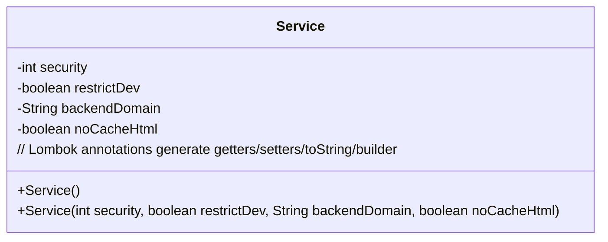
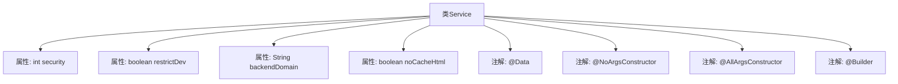

# 基础信息

|      |      |
|------|------|
| 名称 | Service |
| 编码语言 | .java |
| 代码路径 | staffjoy/common-lib/src/main/java/xyz/staffjoy/common/services/Service.java |
| 包名 | xyz.staffjoy.common.services |
| 依赖项 | ['lombok.AllArgsConstructor', 'lombok.Builder', 'lombok.Data', 'lombok.NoArgsConstructor'] |
| 概述说明 | 服务类定义：权限等级、开发限制、后端域名、HTML缓存控制。 |

# 说明

这是一个名为Service的类，用于定义服务的配置属性。类中包含四个主要字段：security表示服务的安全级别，可选值为Public、Authenticated或Admin；restrictDev是一个布尔值，若为true则在stage和prod环境中禁止该服务；backendDomain指定后端服务的查询域名；noCacheHtml也是一个布尔值，若为true则会为HTML响应添加禁止浏览器缓存的头部信息。该类提供了无参构造器、全参构造器以及Builder模式支持。

# 类列表 Class Summary

| 名称   | 类型  | 说明 |
|-------|------|-------------|
| Service | class | 服务类定义：权限等级、开发限制、后端域名、HTML缓存控制。 |

## 类 Service

|      |      |
|------|------|
| 访问范围 | @Data;@NoArgsConstructor;@AllArgsConstructor;@Builder;public |
| 类型 | class |
| 名称 | Service |
| 说明 | 服务类定义：权限等级、开发限制、后端域名、HTML缓存控制。 |

### UML类图

这段类图展示了一个使用Lombok注解的Service类，包含四个私有字段：security表示访问权限级别，restrictDev控制开发环境限制，backendDomain指定后端服务域名，noCacheHtml管理HTML缓存行为。通过@NoArgsConstructor和@AllArgsConstructor生成无参和全参构造函数，@Builder提供建造者模式支持，@Data自动生成getter/setter等方法。该设计简化了配置类实现，适用于微服务架构中的服务元数据管理。

### 内部方法调用关系图

这段代码定义了一个使用Lombok注解的Service类，包含四个属性：security表示访问权限级别，restrictDev控制开发环境限制，backendDomain指定后端服务域名，noCacheHtml管理HTML缓存行为。通过@Data自动生成getter/setter，@Builder提供建造者模式，@NoArgsConstructor和@AllArgsConstructor分别生成无参和全参构造器。该设计简化了配置类代码，适用于微服务架构中的权限和缓存控制场景。

### 字段列表 Field List

| 名称  | 类型  | 说明 |
|-------|-------|------|
| security | int | 私有整型变量security |
| restrictDev | boolean | 私有布尔变量限制开发 |
| backendDomain | String | 私有后端域名变量 |
| noCacheHtml | boolean | 私有布尔变量，控制HTML缓存禁用。 |

### 方法列表 Method List

| 名称  | 类型  | 说明 |
|-------|-------|------|

